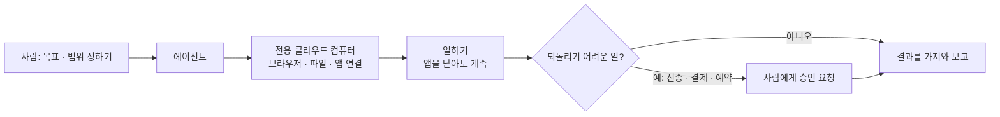

# 챗봇과 AI 에이전트는 무엇이 다른가

## 한 문장으로

챗봇은 **답을 주고**, 에이전트는 **일을 끝낸다.** 세 서비스의 공식 설명이 모두 같은 말을 한다.

> 「It doesn't just answer questions, it actually does the work.」 — Meta, Muse 발표
>
> 「A Bot = a single persistent, named agent or one AI teammate.」 — xAI, Grok Bot 문서

## 세 서비스의 공통 구조

| | 챗봇 (예: 일반 Grok · ChatGPT 대화) | 에이전트 (Grok Bot · Muse · Dots) |
|---|---|---|
| 하는 일 | 질문에 답, 글 · 코드 생성 | 브라우저 · 앱을 직접 써서 일을 끝까지 |
| 언제 일하나 | 내가 말할 때만 | 내가 없을 때도 계속 |
| 일하는 곳 | 대화창 | 각자의 클라우드 컴퓨터 |
| 기억 | 대화 단위 | 목표 · 역할을 계속 기억 |
| 위험 관리 | 답의 정확성 | **승인 경계** — 무엇을 혼자 해도 되나 |

## 오해하기 쉬운 점

- **이름에 「에이전트」가 붙었다고 에이전트는 아니다.** 실제로 브라우저 · 앱을 조작하고, 내가 없을 때도 일하는지로 판단한다
- **같은 회사의 무료 챗봇과 에이전트는 다른 제품이다.** Grok(무료)과 Grok Bot(유료)이 그 예다
- **에이전트의 품질은 「똑똑함」보다 승인 경계 설계가 좌우한다.** 무엇을 맡기고 무엇을 묻게 할지 사람이 정해야 한다 — CoMC · 캐치를 만들며 겪은 것과 같은 원리다
