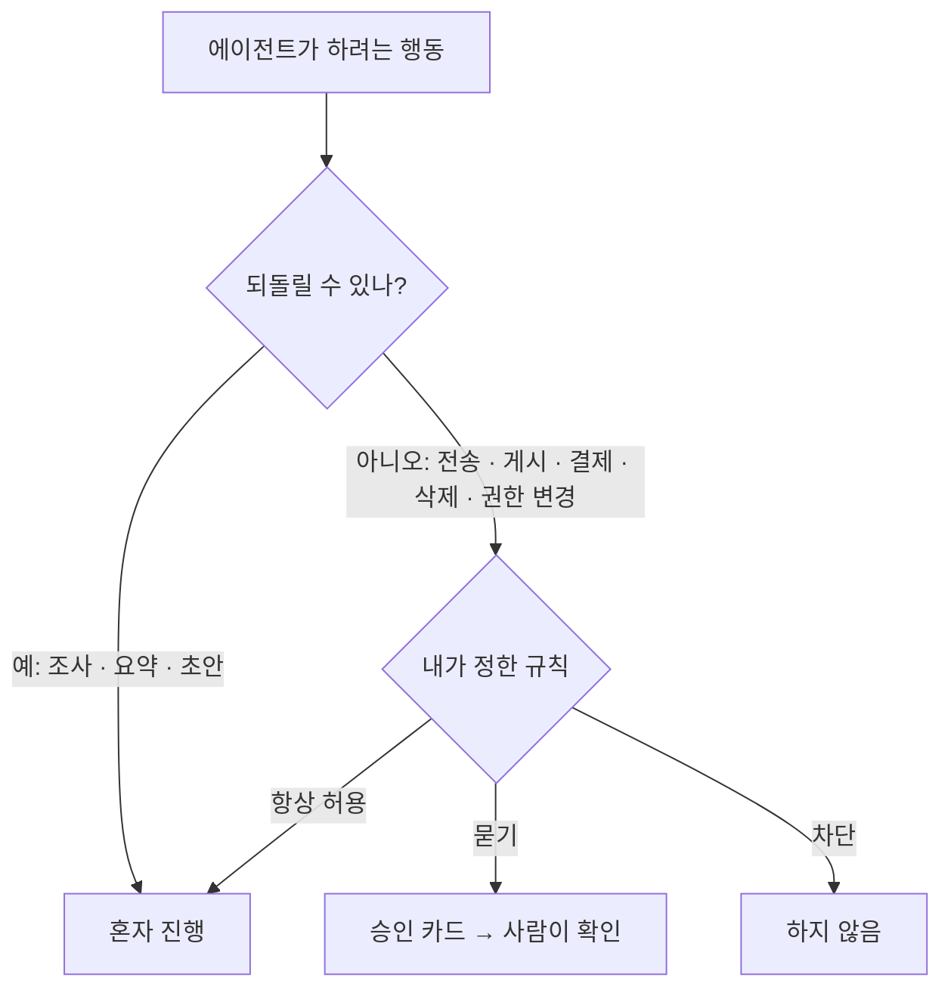

# 에이전트에게 무엇을 맡겨도 되나 — 승인 경계와 개인정보

## 왜 이것이 가장 중요한가

챗봇은 틀린 답을 줘도 내가 안 쓰면 그만이다. 에이전트는 **메일을 보내고, 결제하고, 지운다.** 그래서 세 회사 모두 「무엇을 혼자 해도 되고 무엇은 물어야 하는가」를 사용자가 정하게 해 두었다.

## 세 서비스의 승인 장치

| | Grok Bot | Muse | Dots |
|---|---|---|---|
| 승인 방식 | 승인 카드: 한 번 허용 · 항상 허용 · 거부 | 민감한 행동(메일 전송 · 구매) 전 승인 | 기본 규칙 + Custom Rules (허용 · 승인 · 차단) |
| 자동 검토 | Auto-review: 「먼저 묻기」 「자동 허용」 규칙 | 행동 기록(감사 기록)으로 사후 확인 | 계정 · 정보 공유에 영향 주는 행동을 자동 검토 |
| 비밀번호 | 사람이 직접 입력, 대화창에 쓰지 말 것 | 확인 필요 | 확인 필요 |
| 내 PC 접근 | 「매번 묻기 · 항상 · 안 함」 선택 | 해당 없음 (클라우드 VM) | 해당 없음 (클라우드 컴퓨터) |

> 「Do not approve an action whose target or effect you cannot identify.」 — xAI, Grok Bot 문서
>
> 「Avoid broad rules such as 'allow everything in the browser.'」 — xAI, Grok Bot 문서

## 개인정보 — 확인할 세 가지

| 질문 | Grok Bot | Muse | Dots |
|---|---|---|---|
| 내 데이터가 AI 학습에 쓰이나 | Cursor 계정 설정을 따름 | **기본 켜짐 → 끌 수 있음** | 개인 플랜은 선택, 비즈니스는 기본 미사용 |
| 광고에 쓰이나 | 확인 필요 | 광고 시스템과 공유 안 함 | 확인 필요 |
| 어디서 처리되나 | 계정당 클라우드 컴퓨터 | Meta 인프라의 개인 VM (사용자 키 암호화는 예정) | dot 마다 클라우드 컴퓨터 |

## M3 실습에서 지킬 것

- 가입 직후 **학습 사용 설정부터 확인**한다 — Muse 는 기본이 켜짐이다
- 처음엔 **앱 연결을 하지 않거나 최소로** 한다. 메일 · 캘린더 연결은 M4 에서 가상 데이터로만
- 「항상 허용」 같은 넓은 규칙은 쓰지 않는다
- 화면 캡처에서 이메일 · 계정명 · 알림을 가린다 (공개 레포)

## 이미 아는 것과의 연결

CoMC(라이브 방송 공동 진행 AI)와 캐치(상담 보조 AI)를 만들 때도 같은 원칙을 썼다 — **AI 가 제안하고 사람이 승인한 것만 밖으로 나간다.** 세 회사의 에이전트도 결국 이 구조를 제품으로 만든 것이다.
