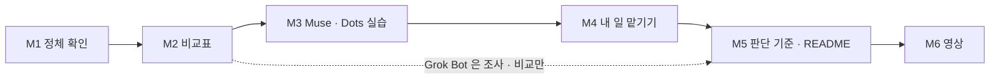

# AI-Agent-Apps-Compare 학습 로드맵

**생성일**: 2026-10-04
**방법론**: VibeLearn AI
**버전**: 1.0

---

## 📚 학습 개요

### Topic 소개
새로 나온 AI 에이전트 서비스 세 가지(Grok Bot · Muse · Dots)를 공식 자료로 조사 · 비교하고, 무료 플랜과 이미 쓰고 있는 구독(ChatGPT Pro)으로 쓸 수 있는 만큼 직접 설치해서 써 본다. 모든 작업이 끝나면 그 결과로 유튜브 영상을 만든다.

### 학습 목표
- [ ] 세 서비스가 각각 무엇인지(만든 회사 · 공식 페이지 · 핵심 기능) 공식 자료로 한 줄씩 설명할 수 있다
- [ ] 비교표를 만든다 — 무엇을 맡길 수 있나 · 무료 범위 · 설정 난이도 · 개인정보 · 내 일에 쓸 곳
- [ ] 쓸 수 있는 서비스(Muse 무료 · Dots — ChatGPT Pro)를 설치 · 사용해 보고 결과를 기록한다
- [ ] 「나는 무엇을 언제 쓸까」 판단 기준을 정한다
- [ ] 완료된 결과를 바탕으로 영상을 만든다 (Remotion · 이 Topic GitHub 폴더 QR 포함)

### 예상 학습 기간
1~2주 (10/4 Live #30 방송에서 M1 · M2 시작 → 주중 M3~M5 → 다음 주 M6 영상) — 사용자 확정: 「그대로 진행」

### 학습 환경
- OS: Windows 11 Home (i7-1355U · 16GB · GPU 없음)
- 도구: Chrome / Edge · iPhone · VS Code + Claude Code · Codex · Muse 무료 계정 · ChatGPT Pro(Dots) · Remotion (`AI/RemotionStudio/`)
- 사전 지식: ChatGPT · Claude · Claude Code 사용 경험 (권장: Chrome-Remote-Desktop Topic M6 · HITL 개념)

### 이 Topic 의 규칙 (모든 모듈 공통)

| 규칙 | 내용 |
|---|---|
| 새 결제 없음 | 새 결제 · 새 유료 플랜 가입 없음. 무료 플랜 + 이미 쓰는 구독(ChatGPT Pro)으로 실습. 그 밖의 유료 전용은 「조사 · 비교만」 (10/4 범위 조정: Dots 포함) |
| 지어내지 않기 | 확인 못 한 사실은 「확인 필요」로 표시. 이름이 같은 다른 제품과 섞지 않는다 |
| 출처 | 2026년 10월 기준 공식 문서 · 공식 발표. 문서마다 URL + 확인 날짜 |
| 공개 레포 | 계정 정보 · 개인 메일 · API 키 · 실제 할 일 · 고객 정보 금지. 실습은 가상 데이터로 |
| 계정 작업 | 가입 · 로그인 · 설치 · 권한 허용은 사용자가 직접. AI 는 안내만 |

---

## 🗺️ 전체 로드맵 구조

| 모듈  | 모듈명                  | 난이도 | 예상 시간 | 산출물 폴더                | 언제       |
| --- | -------------------- | --- | ----- | --------------------- | -------- |
| M1  | 세 서비스 정체 확인          | ⭐   | 1.5h  | 01-Identify-Services/ | 10/4 방송  |
| M2  | 비교표 만들기              | ⭐⭐  | 1.5h  | 02-Comparison-Table/  | 10/4 방송  |
| M3  | Muse · Dots 설치 · 첫 사용     | ⭐⭐  | 2h    | 03-Hands-On/     | 방송 또는 주중 |
| M4  | 내 일 하나 맡겨 보기         | ⭐⭐⭐ | 2.5h  | 04-Real-Task-Trial/   | 주중       |
| M5  | 판단 기준 · Topic README | ⭐⭐  | 1.5h  | 05-Decision-Guide/    | 주중       |
| M6  | Capstone — 결과 영상 제작  | ⭐⭐⭐ | 6h    | 06-Capstone-Video/    | 다음 주     |

**총 예상 시간**: 15시간 (버퍼 20% 포함)



---

## 📖 모듈별 상세 계획

### M1 - 세 서비스 정체 확인

**난이도**: ⭐
**예상 시간**: 1.5h
**산출물 폴더**: `01-Identify-Services/`

#### 학습 목표
- [ ] Grok Bot · Muse · Dots 각각의 만든 회사 · 공식 페이지 URL · 출시 시점을 공식 출처로 적을 수 있다
- [ ] 각 서비스를 한 줄로 설명할 수 있다 (「무엇을 맡기는 에이전트인가」)
- [ ] 이름이 같은 다른 제품을 최소 1개씩 찾아 「이것이 아니다」를 구분할 수 있다
- [ ] 확인된 사실과 「확인 필요」를 나눈 목록을 만든다

#### 주요 개념
1. **AI 에이전트 vs 챗봇**: 챗봇은 답을 주고, 에이전트는 브라우저 · 파일 · 앱을 써서 일을 끝까지 수행한다. 「에이전트」라는 이름만 붙은 챗봇도 있으니 실제 기능으로 판단한다.
2. **공식 출처**: 회사 공식 사이트 · 문서 · 발표 블로그. 뉴스 · SNS 요약은 보조 자료이고 사실 확인은 공식 출처로 한다.
3. **동명 제품 혼동**: 「Muse」 「Dots」처럼 흔한 이름은 다른 회사 제품이 많다. 회사명 + 출시 시점으로 묶어서 구분한다.
4. **확인 필요 표시**: 모르는 것을 그럴듯하게 채우지 않고 빈칸으로 남기는 것이 이 Topic 의 품질 기준이다.

#### 실습 과제

**실습 1: 공식 페이지 찾기** ⭐
- **목적**: 세 서비스의 「진짜」를 고정한다
- **단계**:
  1. 서비스마다 「이름 + AI agent + 회사 후보」로 검색한다 (Dots 는 OpenAI 발표 여부, Muse 는 9/29 언급 맥락부터)
  2. 공식 사이트 · 문서 · 발표문 URL 을 찾아 확인 날짜와 함께 적는다
  3. 9/4 Grok Bot 리서치의 공식 문서 링크가 지금도 살아 있는지 확인한다
- **예상 시간**: 30분
- **검증**: 세 서비스 모두 공식 URL 1개 이상, 또는 「공식 출처 못 찾음」 명시

**실습 2: 한 줄 카드 만들기** ⭐
- **목적**: 시청자가 바로 이해할 수 있는 정의를 만든다
- **단계**:
  1. 서비스마다 카드: 회사 · 공식 URL · 출시 · 한 줄 설명 · 접근 방법(웹/앱/데스크톱) · 무료 여부(1차)
  2. 동명 제품을 「이것이 아니다」 칸에 적는다
  3. 확인 못 한 칸에는 「확인 필요」를 쓴다
- **예상 시간**: 30분
- **검증**: 카드 3장, 모든 사실 칸에 출처 링크

#### 산출물
```
01-Identify-Services/
├── README.md              ← 학습 순서 안내 + 문서 링크
├── concepts/
│   └── agent-vs-chatbot.md
└── guides/
    └── service-cards.md   ← 세 서비스 카드 + 확인 필요 목록
```

#### Definition of Done
- [ ] 세 서비스 카드 작성 (회사 · 공식 URL · 한 줄 설명 · 접근 방법)
- [ ] 모든 사실에 공식 출처 + 확인 날짜
- [ ] 동명 제품 구분 표시
- [ ] 「확인 필요」 목록 정리
- [ ] 모듈 README 작성
- [ ] 🔴 README 링크 확인 (`python scripts/check_links.py`)
- [ ] WorkLog + Daily Retrospective 작성

#### Self-Assessment
**개념 이해**:
- [ ] 세 서비스를 각각 한 문장으로 설명할 수 있다
- [ ] 에이전트와 챗봇의 차이를 예시로 설명할 수 있다

**실무 활용**:
- [ ] AI 에게 「공식 출처만으로, 모르면 확인 필요」 조건의 조사를 시킬 수 있다
- [ ] AI 가 동명 제품을 섞었는지 판단할 수 있다

#### 예상 시간 배분
- 개념 학습: 15분
- 실습 1: 30분
- 실습 2: 30분
- 문서화: 15분
- **합계**: 1.5h (버퍼 포함)

#### 참조 자료
- [Grok Bot Overview (xAI)](https://docs.x.ai/grok-bot/overview): Grok Bot 공식 문서 — 9/4 기준, 재확인 필요
- [CRD M6 — Alternatives and Grok Bot](../../Chrome-Remote-Desktop/06-Alternatives-and-GrokBot/README.md): 이전 Topic 에서 정리한 Grok Bot 비교
- Muse · Dots 공식 페이지: M1 실습 1 에서 확인 후 이 칸에 추가

---

### M2 - 비교표 만들기

**난이도**: ⭐⭐
**예상 시간**: 1.5h
**산출물 폴더**: `02-Comparison-Table/`

#### 학습 목표
- [ ] 다섯 기준(맡길 수 있는 일 · 무료 범위 · 설정 난이도 · 개인정보 · 내 일에 쓸 곳)으로 비교표를 완성할 수 있다
- [ ] 무료 범위 · 플랜 조건을 공식 요금표로 확인하고, 실습 대상(Muse 무료 · Dots Pro)의 사용 조건을 확정할 수 있다
- [ ] 각 서비스의 개인정보 · 승인 방식(어떤 행동 전에 사람에게 묻는지)을 설명할 수 있다

#### 주요 개념
1. **무료 범위**: 「무료 체험」 「무료 플랜」 「대기자 명단」은 다르다. 카드 등록이 필요한 체험은 이 Topic 에서 유료로 본다.
2. **승인 경계 (HITL)**: 에이전트가 결제 · 전송 · 삭제처럼 되돌리기 어려운 일을 하기 전에 사람에게 묻는 구조. CoMC · 캐치에서 직접 만든 개념과 같다.
3. **데이터 처리**: 내가 맡긴 파일 · 로그인 세션이 어디(클라우드/내 PC)에서 처리되고 학습에 쓰이는지.
4. **설정 난이도**: 가입 → 연결 → 첫 작업까지 몇 단계인가로 잰다.

#### 실습 과제

**실습 1: 요금 · 무료 범위 확인** ⭐
- **목적**: M3 실습 대상을 정한다
- **단계**:
  1. 서비스마다 공식 요금 페이지에서 무료 플랜 유무 · 제한을 적는다
  2. Grok Bot 이 여전히 SuperGrok · Cursor 유료 전용인지 확인한다
  3. Dots 가 내 ChatGPT Pro 계정에 열렸는지(점진 출시) 확인한다
  4. 실습 대상 확정: Muse(무료) · Dots(Pro) — Grok Bot 은 「조사 · 비교만」
- **예상 시간**: 25분
- **검증**: 서비스별 「실습 가능(무료 / 기존 구독) / 불가」 판정 + 출처

**실습 2: 다섯 기준 비교표** ⭐⭐
- **목적**: 시청자가 한눈에 고를 수 있는 표를 만든다
- **단계**:
  1. 공식 문서에서 기능 · 승인 · 개인정보 항목을 읽어 표를 채운다
  2. 「내 일에 쓸 곳」은 유튜브 · 상담 · 일정 관리 · Builders Lounge 중에서 고른다
  3. 9/4 Grok Bot 리서치 · CRD M6 비교와 어긋나는 점이 있으면 「변경됨」으로 표시한다
- **예상 시간**: 40분
- **검증**: 3 × 5 표의 모든 칸이 출처 또는 「확인 필요」

#### 산출물
```
02-Comparison-Table/
├── README.md
├── guides/
│   └── comparison-table.md   ← 다섯 기준 비교표 + 실습 가능 판정
└── concepts/
    └── approval-and-privacy.md
```

#### Definition of Done
- [ ] 비교표 3 × 5 완성 (빈칸은 「확인 필요」)
- [ ] 실습 대상 확정 (Muse · Dots) · Dots 계정 노출 여부 확인
- [ ] 승인 · 개인정보 정리
- [ ] 모듈 README 작성
- [ ] 🔴 README 링크 확인 (`python scripts/check_links.py`)
- [ ] WorkLog + Daily Retrospective 작성

#### Self-Assessment
**개념 이해**:
- [ ] 무료 체험과 무료 플랜의 차이를 설명할 수 있다
- [ ] 각 서비스가 어떤 행동 전에 승인을 묻는지 말할 수 있다

**실무 활용**:
- [ ] 비교표만 보고 「이 일엔 이 서비스」를 고를 수 있다
- [ ] 새 에이전트 서비스가 나와도 같은 다섯 기준으로 평가할 수 있다

#### 예상 시간 배분
- 개념 학습: 20분
- 실습 1: 25분
- 실습 2: 40분
- 문서화: 15분
- **합계**: 1.5h (버퍼 포함)

#### 참조 자료
- [Grok Bot — Approvals, Security and Privacy](https://docs.x.ai/grok-bot/approvals-security-and-privacy): 승인 · 보안 공식 문서
- [CRD M6 비교표](../../Chrome-Remote-Desktop/06-Alternatives-and-GrokBot/guides/comparison-table.md): 이전 비교표 형식
- 각 서비스 공식 요금 페이지: M1 카드의 URL 사용

---

### M3 - Muse · Dots 설치 · 첫 사용

**난이도**: ⭐⭐
**예상 시간**: 2h
**산출물 폴더**: `03-Hands-On/`

#### 학습 목표
- [ ] Muse(무료)와 Dots(ChatGPT Pro)를 사용자가 직접 가입 · 설정하고 첫 작업을 성공시킬 수 있다
- [ ] 설치 단계를 시청자가 따라 할 수 있는 가이드로 쓸 수 있다
- [ ] 첫 사용에서 막힌 점과 해결을 기록할 수 있다

#### 주요 개념
1. **최소 권한**: 처음엔 연결 · 권한을 최소로 주고 필요할 때만 늘린다.
2. **첫 작업(Hello World)**: 개인 데이터가 없는 간단한 일(공개 웹 조사 · 요약)로 시작한다.
3. **스크린샷 위생**: 공개 레포에 올릴 화면은 이메일 · 계정명 · 알림을 가린다.

#### 실습 과제

**실습 1: 가입 · 설치** ⭐
- **목적**: Muse 무료 계정 · ChatGPT Pro 의 Dots 를 쓸 수 있는 상태로 만든다
- **단계**:
  1. AI 가 공식 설치 경로를 안내한다 — Muse: iOS · Android · muse.ai / Dots: ChatGPT 데스크톱 앱 또는 데스크톱 웹의 안내 화면
  2. 사용자가 직접 가입 · 로그인 · 설치한다
  3. 권한 요청 화면을 기록하고 최소 권한만 허용한다
- **예상 시간**: 30분
- **검증**: 서비스 첫 화면 진입 (스크린샷, 개인 정보 가림)

**실습 2: 첫 작업 맡기기** ⭐⭐
- **목적**: 에이전트가 실제로 「일」을 하는지 본다
- **단계**:
  1. 같은 과제를 Muse 와 Dots 에 맡긴다 — 예: 「이번 주 공개된 AI 에이전트 소식 3개를 출처와 함께 정리해 줘」
  2. 걸린 시간 · 단계 수 · 승인 요청 · 결과 품질을 기록한다
  3. 서비스 간 결과를 나란히 비교한다
- **예상 시간**: 45분
- **검증**: 서비스별 결과 기록 + 같은 과제 비교표

#### 산출물
```
03-Hands-On/
├── README.md
├── guides/
│   ├── setup-muse.md · setup-dots.md ← 서비스별 설치 가이드
│   └── first-task-results.md
└── troubleshooting/
    └── setup-issues.md        ← 막힌 것이 있을 때만
```

#### Definition of Done
- [ ] Muse · Dots 설치 · 첫 화면 진입 (Grok Bot 은 실습 제외 사유 기록)
- [ ] 같은 첫 과제 결과 비교 기록
- [ ] 설치 가이드 작성 (스크린샷 개인 정보 가림)
- [ ] 새 결제 · 카드 등록 없음 확인 (ChatGPT Pro 기존 구독만 사용)
- [ ] 모듈 README 작성
- [ ] 🔴 README 링크 확인 (`python scripts/check_links.py`) · 빈 폴더 없음
- [ ] WorkLog + Daily Retrospective 작성

#### Self-Assessment
**개념 이해**:
- [ ] 각 서비스가 요청한 권한이 무엇이었는지 말할 수 있다
- [ ] 같은 과제에서 결과가 달랐던 이유를 설명할 수 있다

**실무 활용**:
- [ ] 다른 사람에게 설치 과정을 안내할 수 있다
- [ ] 에이전트 결과의 출처가 맞는지 검증할 수 있다

#### 예상 시간 배분
- 개념 학습: 15분
- 실습 1: 30분
- 실습 2: 45분
- 문서화: 30분
- **합계**: 2h (버퍼 포함)

#### 참조 자료
- 각 서비스 공식 시작 가이드: M1 카드 URL
- M2 비교표 `02-Comparison-Table/`: 실습 대상 판정 (M2 완료 후 생성)

---

### M4 - 내 일 하나 맡겨 보기

**난이도**: ⭐⭐⭐
**예상 시간**: 2.5h
**산출물 폴더**: `04-Real-Task-Trial/`

#### 학습 목표
- [ ] 내 일(유튜브 · 상담 · 일정 관리 · Builders Lounge)에서 에이전트에게 맡길 과제 2개를 골라 실행할 수 있다
- [ ] 가상 데이터로 과제를 설계해 개인정보 없이 실습할 수 있다
- [ ] 결과를 「쓸 만함 / 고치면 쓸 만함 / 못 씀」으로 판정하고 이유를 쓸 수 있다

#### 주요 개념
1. **과제 설계**: 입력 · 기대 결과 · 성공 기준을 미리 정해야 비교가 공정하다.
2. **가상 데이터**: 실제 고객 · 일정 대신 꾸며낸 자료로 같은 구조를 재현한다 (캐치 시연의 가상 고객과 같은 방식).
3. **사람 검토 비용**: 에이전트 결과를 고치는 데 드는 시간까지 합쳐야 진짜 절약을 잴 수 있다.

#### 실습 과제

**실습 1: 과제 2개 설계** ⭐⭐
- **목적**: 내 일과 연결된 공정한 시험을 만든다
- **단계**:
  1. 후보: 라이브 방송 자료 조사 · 유튜브 설명문 초안 · 행사 일정 정리 · 커뮤니티 소식 요약
  2. 2개를 골라 입력(가상 데이터) · 기대 결과 · 성공 기준을 쓴다
- **예상 시간**: 30분
- **검증**: 과제 카드 2장

**실습 2: 서비스별 실행 · 판정** ⭐⭐⭐
- **목적**: 「내 일에 쓸 수 있나」를 결과로 판단한다
- **단계**:
  1. Muse · Dots 에 과제 2개씩 실행한다
  2. 걸린 시간 · 사람이 고친 시간 · 승인 횟수 · 결과 품질을 기록한다
  3. 판정 (쓸 만함 / 고치면 / 못 씀) + 이유
- **예상 시간**: 75분
- **검증**: 서비스 × 과제 판정표

#### 산출물
```
04-Real-Task-Trial/
├── README.md
├── examples/
│   └── task-cards.md          ← 과제 2개 (가상 데이터)
└── guides/
    └── trial-results.md       ← 판정표 + 이유
```

#### Definition of Done
- [ ] 과제 2개 설계 (가상 데이터만)
- [ ] Muse · Dots 실행 · 기록
- [ ] 판정표 완성
- [ ] 실제 고객 · 일정 · 개인정보 없음 확인
- [ ] 모듈 README 작성
- [ ] 🔴 README 링크 확인 (`python scripts/check_links.py`)
- [ ] WorkLog + Daily Retrospective 작성

#### Self-Assessment
**개념 이해**:
- [ ] 공정한 비교를 위한 과제 설계 조건을 말할 수 있다
- [ ] 사람 검토 비용을 포함한 절약 시간을 계산할 수 있다

**실무 활용**:
- [ ] 내 일 중 에이전트에게 맡길 일과 맡기지 않을 일을 구분할 수 있다
- [ ] 에이전트 결과에서 고쳐야 할 부분을 빨리 찾을 수 있다

#### 예상 시간 배분
- 개념 학습: 20분
- 실습 1: 30분
- 실습 2: 75분
- 문서화: 25분
- **합계**: 2.5h (버퍼 포함)

#### 참조 자료
- M3 첫 작업 결과 `03-Hands-On/`: 첫 사용 기록 (M3 완료 후 생성)
- 각 서비스 공식 문서의 사용 예시 페이지

---

### M5 - 판단 기준 · Topic README

**난이도**: ⭐⭐
**예상 시간**: 1.5h
**산출물 폴더**: `05-Decision-Guide/`

#### 학습 목표
- [ ] 「나는 무엇을 언제 쓸까」 판단 기준을 표 또는 흐름도로 만들 수 있다
- [ ] 실습 못 한 Grok Bot 은 조사 결과로만 판단하고 그 한계를 적을 수 있다
- [ ] Topic 최상위 README 를 써서 GitHub 방문자가 결과를 한눈에 보게 할 수 있다

#### 주요 개념
1. **판단 기준**: 일의 종류(조사 · 반복 · 내 PC 작업 · 외부 서비스 조작) × 위험도(되돌릴 수 있나)로 고른다.
2. **이미 쓰는 도구와의 관계**: Claude Code · Codex · CRD 와 겹치는 부분과 새로 생기는 부분.
3. **틀린 판단도 기록**: 처음 예상과 실제가 달랐던 점이 이 방법론의 값어치다.

#### 실습 과제

**실습 1: 판단 흐름도** ⭐⭐
- **목적**: 시청자가 따라 쓸 수 있는 고르는 법을 만든다
- **단계**:
  1. M2 비교표 · M4 판정표를 근거로 「이런 일 → 이 서비스」 규칙을 쓴다
  2. Mermaid 흐름도로 그린다
  3. 처음 예상 vs 실제 결과 표를 만든다
- **예상 시간**: 40분
- **검증**: 흐름도 + 근거 링크

**실습 2: Topic 최상위 README** ⭐
- **목적**: 공개 레포 첫 화면을 완성한다
- **단계**:
  1. 무엇을 다뤘고 무엇을 알아냈는지 요약
  2. 모듈 목록을 학습 순서대로 상대 경로 링크
  3. 확인 못 한 것 · 틀렸던 판단 적기
- **예상 시간**: 30분
- **검증**: `check_links.py` 통과

#### 산출물
```
05-Decision-Guide/
├── README.md
└── guides/
    └── which-agent-when.md    ← 판단 흐름도 + 예상 vs 실제
README.md                      ← Topic 최상위 (M5 에서 초안, M6 에서 영상 링크 추가)
```

#### Definition of Done
- [ ] 판단 흐름도 완성 (근거 링크 포함)
- [ ] 예상 vs 실제 표
- [ ] Topic 최상위 README 초안
- [ ] 모듈 README 작성
- [ ] 🔴 README 링크 확인 (`python scripts/check_links.py`) · 빈 폴더 없음
- [ ] WorkLog + Daily Retrospective + Module Retrospective 작성

#### Self-Assessment
**개념 이해**:
- [ ] 세 서비스의 쓰임새를 이미 쓰는 도구와 비교해 설명할 수 있다
- [ ] 판단 기준 두 축을 말할 수 있다

**실무 활용**:
- [ ] 새 에이전트 서비스가 나와도 이 기준으로 바로 판단할 수 있다
- [ ] Builders Lounge 멤버에게 고르는 법을 설명할 수 있다

#### 예상 시간 배분
- 개념 학습: 15분
- 실습 1: 40분
- 실습 2: 30분
- 문서화: 5분
- **합계**: 1.5h (버퍼 포함)

#### 참조 자료
- [Datacenter-Workforce-Programs README](../../Datacenter-Workforce-Programs/README.md): Topic 최상위 README 예시
- [YouTube-Channel-Revival-With-AI README](../../YouTube-Channel-Revival-With-AI/README.md): Topic 최상위 README 예시

---

### M6 - Capstone — 결과 영상 제작

**난이도**: ⭐⭐⭐
**예상 시간**: 6h
**산출물 폴더**: `06-Capstone-Video/`

#### 학습 목표
- [ ] M1~M5 결과로 영상 슬라이드 플랜을 쓰고 승인받을 수 있다
- [ ] 영상에서 말할 것(핵심 비교 · 판단 기준)과 문서로 보낼 것(상세 표 · 설치 단계)을 나눌 수 있다
- [ ] 이 Topic GitHub 폴더 QR 을 2회 이상 넣은 영상을 렌더링할 수 있다
- [ ] 완성 영상 링크를 Topic README 에 연결할 수 있다

#### 주요 개념
1. **remotion-video 3단계 승인**: 슬라이드 플랜 → 오디오 → 렌더링. 단계마다 사용자 승인 후 다음으로 간다.
2. **말할 것 vs 문서로 보낼 것**: 정보가 많은 비교 영상은 핵심만 말하고 상세는 QR 로 레포에 보낸다.
3. **QR 배치**: ①수치가 가장 조밀한 막의 끝 ②아웃트로 — 최소 2회, 주소는 실제로 열어서 확인.
4. **밝기 대역 · 음악**: 직전 영상과 다른 밝기 대역, 음악은 코드로 직접 합성한 원곡만.

#### 실습 과제

**실습 1: 슬라이드 플랜** ⭐⭐
- **목적**: 영상 구조를 확정한다
- **단계**:
  1. `remotion-video` 스킬을 호출하고 SKILL.md 지시를 따른다
  2. 흐름: 왜 에이전트인가 → 세 서비스 정체 → 비교표 → 실습 장면 → 고르는 법 → QR
  3. 사용자 승인
- **예상 시간**: 90분
- **검증**: 승인된 슬라이드 플랜

**실습 2: 오디오 · 렌더링** ⭐⭐⭐
- **목적**: 영상을 완성한다
- **단계**:
  1. edge-tts 초벌 → 승인 → 최종 음성
  2. 컴포넌트 · QR 2회 · 원곡 음악 반영
  3. 렌더링 → 사용자 검토 → README 에 영상 링크
- **예상 시간**: 3h
- **검증**: MP4 + QR 2회 슬라이드 존재 확인

#### 산출물
```
06-Capstone-Video/
├── README.md               ← 영상 링크 · 슬라이드 플랜 링크 · 제작 과정
└── guides/
    └── video-slide-plan.md ← 승인된 슬라이드 플랜 (제작 파일은 AI/RemotionStudio/)
```

#### Definition of Done
- [ ] 슬라이드 플랜 승인
- [ ] 오디오 승인
- [ ] 렌더링 완료 · 사용자 검토
- [ ] QR 2회 이상 실제 슬라이드로 존재 · 주소 열어서 확인
- [ ] 영상에 개인정보 · 계정 화면 없음
- [ ] Topic README 에 영상 링크 추가
- [ ] 🔴 README 링크 확인 (`python scripts/check_links.py`)
- [ ] Topic Final Retrospective 작성

#### Self-Assessment
**개념 이해**:
- [ ] 영상에서 말할 것과 문서로 보낼 것을 나눈 기준을 설명할 수 있다
- [ ] 3단계 승인 흐름을 설명할 수 있다

**실무 활용**:
- [ ] 다른 Topic 결과도 같은 방식으로 영상화할 수 있다
- [ ] AI 가 만든 슬라이드 플랜의 빠진 부분(QR 누락 등)을 찾을 수 있다

#### 예상 시간 배분
- 개념 학습: 20분
- 실습 1: 90분
- 실습 2: 3h
- 문서화: 50분
- **합계**: 6h (버퍼 포함)

#### 참조 자료
- `_Settings_/Skills/remotion-video/SKILL.md` (볼트): 영상 제작 워크플로 · QR 규칙 · 밝기 대역
- [Remotion 공식 문서](https://www.remotion.dev/docs/): 컴포넌트 · 렌더링

---

## 📝 WorkLog 작성 가이드

각 학습 세션마다 WorkLog를 작성하여 진행 상황을 추적합니다.

**파일명 규칙**: `vl_worklog/YYYYMMDD_MX_AI-Agent-Apps-Compare.md`
- 예: `vl_worklog/20261004_M1_AI-Agent-Apps-Compare.md`

**WorkLog 필수 섹션**:
1. 오늘의 학습 목표 (체크리스트)
2. 진행 내용 (실습별 상세 기록)
3. 문제 해결 로그
4. DoD 체크리스트 (모듈 완료 기준)
5. Daily Retrospective
6. 참조 및 산출물

> 라이브 방송 중 세션은 WorkLog 머리에 「Live #30 방송 중」을 적는다.

---

## 🔍 Retrospective 가이드

### Daily Retrospective (매일, 5-10분)
WorkLog 내에 작성:
- What went well?
- What could be improved?
- Insights
- Tomorrow's focus

### Module Retrospective (모듈 완료 시, 15-20분)
`vl_worklog/YYYYMMDD_MX_Retrospective.md`:
- 계획 대비 실제 비교
- 핵심 학습 내용
- 발생한 문제와 해결
- Roadmap 정확도 평가
- 다음 모듈 준비사항

### Topic Retrospective (전체 완료 시, 30-60분)
`vl_worklog/YYYYMMDD_AI-Agent-Apps-Compare_Final_Retrospective.md`:
- 전체 학습 여정 통계
- VibeLearn AI 방법론 효과성 평가
- 산출물 품질 평가
- 향후 학습 개선 사항

---

## 📂 전체 폴더 구조

```
AI-Agent-Apps-Compare/
├── README.md                  # 🔴 필수 — Topic 최상위 안내 (M5 초안 · M6 완성)
├── topic_starter.md
├── vl_prompts/
│   ├── roadmap_prompt.md
│   └── daily_learning_prompt.md
├── vl_roadmap/
│   └── 20261004_RoadMap_AI-Agent-Apps-Compare.md
├── vl_worklog/
├── vl_materials/              # 공식 페이지 · 요금표 요약 (URL + 확인 날짜)
├── 01-Identify-Services/
├── 02-Comparison-Table/
├── 03-Hands-On/
├── 04-Real-Task-Trial/
├── 05-Decision-Guide/
└── 06-Capstone-Video/
```

---

## 📊 학습 진행 상황 추적

| 모듈 | 시작일 | 종료일 | 상태 | DoD 달성률 | 비고 |
|------|--------|--------|------|-----------|------|
| M1 | 2026-10-04 | 2026-10-04 | ✅ | 100% | Live #30 — 무료는 Muse 하나, Dots 는 ChatGPT Pro 로 실습 |
| M2 | 2026-10-04 | 2026-10-04 | ✅ | 100% | Live #30 — 실습 Muse · Dots 확정 |
| M3 | | | ⏳ | 0% | |
| M4 | | | ⏳ | 0% | |
| M5 | | | ⏳ | 0% | |
| M6 | | | ⏳ | 0% | 영상 |

**범례**:
- ⏳ 대기
- 🔄 진행 중
- ✅ 완료

---

## 🎯 성공 기준

전체 Topic 완료 기준:
- [ ] 모든 모듈 완료 (DoD 100%)
- [ ] 최소 6개 산출물 폴더 생성
- [ ] Topic Retrospective 작성
- [ ] Self-Assessment 평균 ⭐⭐⭐⭐ 이상
- [ ] Capstone 영상 완성 · Topic README 에 링크

---

**생성자**: Claude with VibeLearn AI
**Roadmap 버전**: 1.0
**방법론 버전**: VibeLearn AI 2.0
