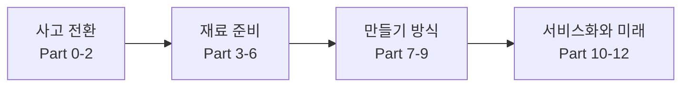
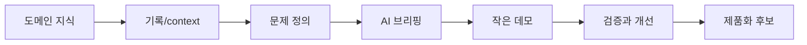
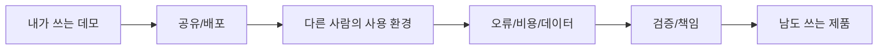

## Status

이 문서는 2026-07-19 M4 학습 진행으로 작성한 첫 영상의 slide plan과 visual asset map이다. M3 `video-brief.md`의 통합 소개형 구조를 기준으로, Build with AI 12부작 소개를 8-12분 영상 장면으로 변환했다.

## Video Frame

| 항목 | 결정 |
|---|---|
| Working title | 도메인 지식이 있다면, AI로 제품을 만들 수 있습니다: Build with AI 쉽게 보기 |
| Target viewer | 도메인 지식은 풍부하지만 컴퓨터·IT에는 익숙하지 않은 비개발자, 특히 시니어 도메인 전문가 |
| Core promise | Build with AI 12부작을 쉬운 말로 이해하고, 내 도메인 지식을 AI 제품으로 바꾸기 위해 무엇을 준비해야 하는지 큰 그림을 얻는다 |
| Tone | 존중 + 쉬운 설명 + 현실적 격려 |
| Length target | 8-12분 |

## Scene List

| Scene | Time | Narration Purpose | Visual Beat | Source / Asset |
|---|---:|---|---|---|
| 1. Opening Question | 0:00-0:40 | "코딩을 몰라도 내 경험을 앱이나 서비스로 만들 수 있을까?"라는 질문을 던진다. | 화면 왼쪽에는 `도메인 지식`, 오른쪽에는 `AI 제품화 가능성`을 배치하고 가운데에 질문 문장 표시. | 새 diagram |
| 2. Source Introduction | 0:40-1:20 | 송재희님의 Build with AI를 소개하고, 이 영상이 그 자료를 쉽게 풀어보는 것임을 밝힌다. | Build with AI 공식 사이트 또는 다운로드 페이지 화면, 자료 제목 강조. | `source-materials.md`, 공식 사이트/다운로드 페이지 캡처 필요 |
| 3. Target Viewer | 1:20-2:00 | 대상 시청자가 도메인 지식은 많지만 컴퓨터에는 익숙하지 않은 비개발자임을 명확히 한다. | `도메인 지식 많음 / 컴퓨터 익숙하지 않음 / AI로 제품화 가능` 3요소 카드. | 새 diagram |
| 4. Big Map of 12 Parts | 2:00-2:50 | Build with AI 12부작을 네 묶음으로 먼저 보여준다. | `사고 전환 -> 재료 준비 -> 만들기 방식 -> 서비스화와 미래` 흐름도. 각 묶음 아래 Part 번호 배치. | `easy-12-part-summary.md` |
| 5. Part 0-2: AI와 일하는 태도 | 2:50-4:00 | AI는 버튼이 아니라 협업자이며, 맡길 일과 사람이 확인할 일을 나눠야 한다고 설명한다. | `AI는 버튼이 아니라 협업자` 문장과 `맡길 일 / 확인할 일 / 결정할 일` 3분할 표. | Build with AI Part 0-2, 자막 검수 경험 |
| 6. Part 3-6: 재료와 브리핑 | 4:00-5:30 | 좋은 결과는 도구보다 문제, 맥락, 데이터, 프롬프트에서 나온다고 설명한다. | `도메인 지식 -> 기록/context -> 데이터 -> AI 브리핑` 흐름도. | Build with AI Part 3-6, `reading-notes.md` |
| 7. Part 7-9: 만드는 방식 | 5:30-7:00 | Agent, 바이브 코딩, 코드 어시스턴트가 비개발자에게 여는 가능성과 주의점을 설명한다. | `Agent / Vibe Coding / Code Assistant` 비교 표. 각 칸에 쉬운 설명 1줄. | Build with AI Part 7-9 |
| 8. Part 10-11: 남이 쓰는 제품의 벽 | 7:00-8:30 | 만들 수 있다는 것과 다른 사람이 안정적으로 쓰게 하는 것은 다르다고 설명한다. | `내가 쓰는 데모 -> 가족/고객도 쓰는 제품` 전환 체크리스트. | Build with AI Part 10-11, Voice Legacy 경험 |
| 9. Part 12: 도메인 지식의 해자 | 8:30-9:30 | 도구는 바뀌지만 도메인 지식과 AI 활용 능력은 오래 남는다고 정리한다. | `도메인 지식 + AI 활용 능력 + 기록 습관 = 해자` 조합도. | Build with AI Part 12 |
| 10. User Interpretation | 9:30-10:40 | 사용자의 관점: 기록/context, AI를 리드하는 능력, 필요 시 전문가 협업을 강조한다. | `배워서 리드하기`와 `전문가와 협업하기` 2갈래 선택지. | M3 `video-brief.md`, `reading-notes.md` |
| 11. Practical Next Step | 10:40-11:30 | 시청자가 자신의 도메인 지식을 제품화하기 위해 첫 단계로 할 일을 제안한다. | `내 문제 1개 쓰기 -> 관련 기록 모으기 -> AI에게 브리핑하기 -> 작은 데모 만들기 -> 검증하기` 단계도. | 새 diagram |
| 12. Close | 11:30-12:00 | "당신의 도메인 지식은 AI 시대의 자산"이라는 메시지로 닫는다. | 클로징 문장 단독 표시: `당신의 도메인 지식이 AI 시대의 해자입니다.` | 새 title slide |

## Core Diagram Candidates

### Diagram 1: Build with AI 12부 큰 지도

**용도**: 12부작을 모두 다루되 시청자가 길을 잃지 않게 하는 메인 지도.

### Diagram 2: 도메인 지식이 AI 제품이 되는 흐름

**용도**: 이 영상의 대상 시청자가 자기 지식을 어떻게 제품화로 옮길지 보여주는 핵심 도식.

### Diagram 3: 내가 쓰는 데모와 남이 쓰는 제품

**용도**: Part 10-11을 비개발자 대상 생활 언어로 설명하는 장면.

## Asset Map

| Asset | Type | Existing / New | Location or Candidate | Use | Source/Credit |
|---|---|---|---|---|---|
| Build with AI 공식 사이트 화면 | Source screen | Need capture | https://buildwithai.clearlyreqs.com/ko/ | Scene 2 출처 소개 | 송재희님 Build with AI 공식 사이트 |
| Build with AI 다운로드 페이지 화면 | Source screen | Need capture | https://buildwithai.clearlyreqs.com/ko/downloads/ | Scene 2 자료 구성 소개 | 송재희님 Build with AI 공식 사이트 |
| Build with AI 완전판 PDF/EPUB | Source material | Existing | `../vl_materials/build-with-ai-complete-ko.pdf`, `../vl_materials/build-with-ai-complete-ko.epub` | 원본 자료 확인, 필요 시 표지/목차 화면 | 송재희님 Build with AI |
| 쉬운 12부 요약 | Text/table | Existing | `../01-Source-Map/easy-12-part-summary.md` | Scene 4-9 설명 텍스트 | Codex 정리, 원문 기반 |
| 12부 네 묶음 지도 | Diagram | New | M4 diagram candidate | Scene 4 | 원문 구조 기반 자체 제작 |
| 도메인 지식→AI 제품화 흐름도 | Diagram | New | M4 diagram candidate | Scene 6, 11 | 사용자 해석 기반 자체 제작 |
| 데모→제품 전환 체크리스트 | Diagram/table | New | M4 diagram candidate | Scene 8 | Build with AI Part 10-11 기반 자체 제작 |
| 자막 검수 사례 | Example text | Existing/context | `reading-notes.md` Part 2 | Scene 5 이해 보조 | 사용자 경험 |
| Voice Legacy 앱 배포 사례 | Example text | Existing/context | `reading-notes.md` Part 10, BeYouLifeUpWithUs transcript link | Scene 8 이해 보조 | 사용자 경험, 내부 Vault 기록 |
| Builders Lounge/Bila AI Agent | Example text | Existing/context | `build-with-ai-source-map.md`, Bila AI Agent notes | Scene 10 후속 bridge | 내부 Vault 기록 |

## Capture / Creation To-Do

### Capture Needed

- [ ] Build with AI 한국어 홈 화면 캡처
- [ ] Build with AI 다운로드 페이지 캡처
- [ ] `build-with-ai-complete-ko.pdf` 표지 또는 목차 화면 캡처 가능 여부 확인

### New Visuals Needed

- [ ] 12부 네 묶음 지도
- [ ] Part별 한 줄 쉬운 설명 표
- [ ] 도메인 지식→AI 제품화 흐름도
- [ ] 내가 쓰는 데모→남도 쓰는 제품 체크리스트
- [ ] `맡길 일 / 확인할 일 / 결정할 일` 3분할 표

### Optional Visuals

- [ ] Voice Legacy 사례를 직접 화면으로 보여줄지, 텍스트 사례로만 둘지 결정
- [ ] Builders Lounge/Bila AI Agent는 이번 영상에서 로고/화면 없이 텍스트 bridge로만 처리할지 결정

## Copyright and Attribution Notes

- Build with AI는 송재희님의 자료이므로 공식 사이트와 다운로드 페이지를 화면에 보여줄 때 출처를 명확히 표시한다.
- 원문을 길게 인용하지 않고, 영상에서는 쉬운 요약과 해설 중심으로 사용한다.
- 사용자의 실제 경험 사례는 원문 주장을 이해시키는 보조 사례로만 사용한다.
- 내부 Vault 자료나 개인 프로젝트 화면은 공개 가능 여부를 별도 확인한 뒤 사용한다.

## Production Handoff List

다음 제작 단계로 넘길 핵심 자료:

- `../03-Video-Starter/video-brief.md`: narration structure
- `../01-Source-Map/easy-12-part-summary.md`: 12부 쉬운 설명 원고 재료
- `slide-plan.md`: scene list and visual asset map
- `../vl_materials/build-with-ai-complete-ko.pdf`: 원본 자료 화면 후보
- Build with AI 공식 사이트/다운로드 페이지 캡처: source setup 화면 후보

## M4 DoD Check

- [x] 8-12분 영상 기준 장면 목록이 작성되었다.
- [x] 각 장면의 시각 자료 후보가 있다.
- [x] diagram 후보가 최소 2개 이상 정리되었다.
- [x] 추가로 캡처/생성해야 할 자료가 분리되었다.
- [x] 출처 표시가 필요한 자료가 표시되었다.
- [x] 다음 제작 단계로 넘길 asset map이 있다.

**M4 완료 판단**: 완료. 다음 단계는 M5 `Capstone Video Production Package`에서 M1-M4 산출물을 하나의 제작 착수 패키지로 통합하는 것이다.
