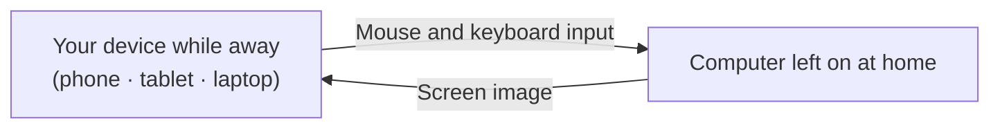

## In a sentence

**Remote access brings the screen of a distant computer to your device so you can control its mouse and keyboard.**

You use the computer at home while you are away. You are not moving files to your phone; the experience is much like sitting in front of that computer.

## A few terms to know

These terms appear throughout this guide. They are straightforward, so you only need to learn them once.

| Common term | Plain-language meaning here | What it means |
|---|---|---|
| Host | **The computer left on at home** | The computer you connect to. It must be on and awake. |
| Client | **The device you use while away** | A phone, tablet, or laptop that receives the screen and sends your controls. |
| Session | **The time you are connected** | The period of the connection. Disconnecting does not turn off the home computer. |
| PIN | **A second key** | A number requested at connection time, separate from your Google Account password. |
| Remote support | **Letting someone see your screen** | A feature that lets another person connect briefly with a one-time code. |

## What travels between the devices?

Remember this: **the screen goes out; your touches go in.**

- The home computer continually sends an image of the screen it is showing.
- When you tap your phone, that spot becomes a mouse click on the home computer.
- **Programs run on the home computer.** Your phone only displays the screen and sends input.

### Three common misunderstandings

1. **Files are not downloaded to your phone.** Even if you open and edit a document remotely, the file stays on the home computer and does not use your phone’s storage.
2. **Your phone’s processing power does not matter.** The home computer handles demanding work such as video editing. Your phone only receives the screen, so an older device can work too. **A slow internet connection can make the screen lag.**
3. **Disconnecting does not shut down the computer.** Ending a session means “stop viewing,” not “turn off the computer.” Any work already running continues. This matters for the second goal of this topic: checking on AI work while away.

## When would I use it?

| Situation | What remote access lets you do |
|---|---|
| You are away but need something on your home computer | View a document, photo, or setting right there |
| You started a long task before leaving | Check its progress and start the next task when it finishes |
| **You need to review or approve AI work** | Review the result and tell the AI “looks good” or “please change this,” while work continues on the computer |
| You left broadcast equipment at home | Check OBS status and settings remotely |

The last two uses are why this topic began. **A lot of working with AI means reviewing what it did and deciding whether to approve it. You do not need to sit in front of the computer for that.** If you can see the screen, you can keep work moving while away.

## What do you need?

| Requirement | Why |
|---|---|
| The home computer must be **on** | If it is off or asleep, there is nothing to connect to. (Sleep settings are covered in M3.) |
| **Internet** at both ends | The home computer and the device you are using both need a connection. |
| The **same Google Account** signed in | The account is how you find your computer. |
| A **PIN** | An additional check when connecting. |

You do **not** need to change router settings, call your internet provider, or buy a static IP address. The next document explains why.

→ Next: [why-no-router-setup.en.md](why-no-router-setup.en.md)

## Facts checked against official documentation (2026-09-20)

- Chrome Remote Desktop works with **Mac, Windows, and Linux** computers and **mobile devices** (with the dedicated app).
- Setup starts in Chrome at `remotedesktop.google.com/access`, where you select the download button. You may be asked for your computer password during installation.
- You must enter a **PIN** when connecting to another computer.
- Google states that **all remote desktop sessions are fully encrypted**.
- Someone granted access can reach **apps, files, email, documents, and browsing history** on that computer. Do not grant access casually; M3 covers security.
- A **remote support access code works only once**. If sharing continues, the service asks every **30 minutes** whether to continue.

Sources: [Chrome Remote Desktop Help](https://support.google.com/chrome/answer/1649523?hl=en) · [Access page](https://remotedesktop.google.com/access)
