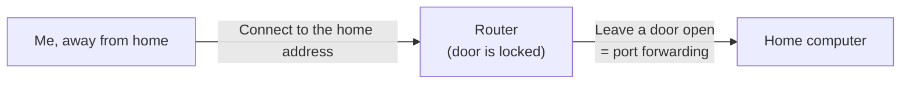
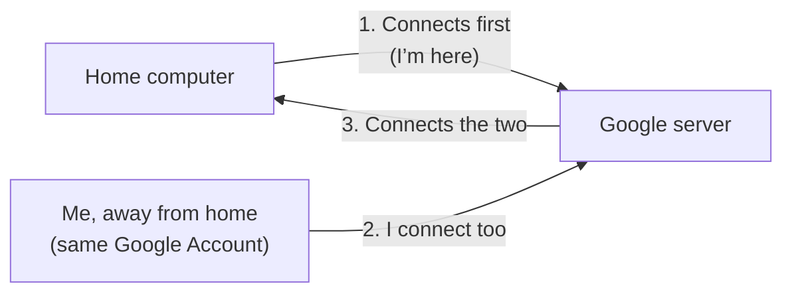

## The first question

Your computer is at home and you are somewhere else. How can you connect **without changing the router or calling your internet provider**?

If you know a little about remote access, you may have heard terms such as “port forwarding” or “static IP address.” Chrome Remote Desktop does not require them. The reason is **the connection starts in the opposite direction**.

## Instead of opening a door, the computer checks in first

### The older approach: connect from outside (open a door)

- You need to know the home internet address, which can change often. That can lead to needing a static IP address.
- You configure the router to “send anyone who enters this door to this computer.” That is port forwarding.
- **If you leave a door open, strangers can knock on it too.** A mistake in the settings can create a risk.

### Chrome Remote Desktop: the computer connects outward and waits

1. The program installed on the home computer **connects to Google’s servers first and waits**.
2. When you connect from away using the **same Google Account**, Google tells you that the computer is waiting.
3. Screen images and your input travel through that connection.

A connection going **out from your home** is normally allowed by a router, just like visiting a website. That is why you do not need to create a new opening in the router.

> **An analogy:** Instead of forcing open the door from outside, **someone at home calls first and waits**. When you call from outside using the same number, the operator (Google) connects you.

## So what is the key instead?

Not opening a router port does not automatically make everything safe. **The key has shifted from the router to your account.**

| What you had to protect with the older approach | What you need to protect now |
|---|---|
| Router settings and open ports | **Your Google Account**—if someone gets in, the computer is exposed |
| Exposure of the home IP address | **Your PIN**—a second barrier if the account is compromised |
| Firewall rules | Remember that the home computer **waits for connections while it is on** |

Google’s documentation says that someone granted access can reach **apps, files, email, documents, and browsing history** on the computer. This is access to the **whole computer**, not just a view of the screen.

### Three M3 security priorities

1. **Google Account two-step verification**—the first and most important door.
2. **A PIN** that is not your birthday or phone number.
3. **Check whether the home screen is locked when you disconnect.** Someone at home should not be left looking at an open session.

> ⚠️ “It’s made by Google, so it must be safe” is only half right. **The connection is encrypted** (Google says all sessions are fully encrypted), but encryption does not help if you give away the key.

## In one sentence

> Router setup is unnecessary because **the home computer connects outward and waits**. The things you need to protect are therefore **your Google Account and PIN**, rather than an open router port.

← Previous: [what-is-remote-access.en.md](what-is-remote-access.en.md)
→ Next: [../examples/my-setup-diagram.en.md](../examples/my-setup-diagram.en.md) · [../guides/choice-criteria.en.md](../guides/choice-criteria.en.md)

## Sources

- [Chrome Remote Desktop Help](https://support.google.com/chrome/answer/1649523?hl=en)—session encryption, access scope, and setup
- [Access page](https://remotedesktop.google.com/access)—the actual setup screen
