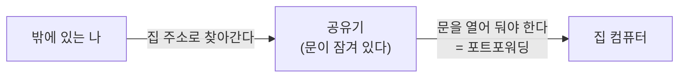
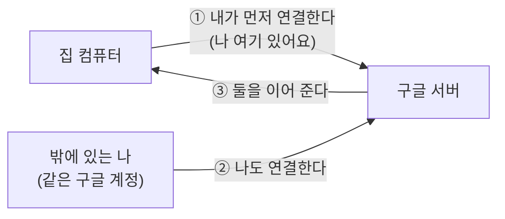

## 먼저 궁금한 것부터

집 컴퓨터는 집 안에 있고, 나는 밖에 있다. 그런데 **공유기를 건드리지도 않고, 인터넷 회사에 전화하지도 않고**, 어떻게 연결이 될까?

원격 접속을 조금 아는 사람이라면 「포트포워딩」이나 「고정 IP」 같은 말을 들어 봤을 수 있다. Chrome Remote Desktop 에서는 그게 필요 없다. 이유는 **연결을 거는 방향이 반대**이기 때문이다.

## 문을 뚫는 것이 아니라, 안에서 먼저 나오는 것

### 옛날 방식 — 밖에서 안으로 (문을 뚫는다)

- 집 인터넷 주소를 알아야 하고, 그 주소는 자주 바뀐다 → 고정 IP 가 필요해진다
- 공유기에 「이 문으로 들어오면 이 컴퓨터로 보내라」는 설정을 해야 한다 → 포트포워딩
- **문을 열어 두면 나쁜 사람도 그 문을 두드릴 수 있다** — 설정을 잘못하면 위험해진다

### Chrome Remote Desktop — 안에서 밖으로 (미리 나와 기다린다)

1. 집 컴퓨터에 설치한 프로그램이 **스스로 구글 서버에 먼저 연결해서 대기**한다
2. 내가 밖에서 **같은 구글 계정으로** 접속하면 구글이 「이 사람 컴퓨터가 여기 대기 중」이라고 알려 준다
3. 그 통로로 화면과 입력이 오간다

집에서 **바깥쪽으로 나가는 연결**은 공유기가 원래 허용한다 (웹사이트를 보는 것과 같은 방향이다). 그래서 문을 새로 뚫을 일이 없다.

> **비유**: 밖에서 집 문을 억지로 여는 것이 아니라, **집에 있는 사람이 먼저 전화를 걸어 놓고 기다리는 것**이다. 내가 밖에서 같은 번호로 전화하면 교환원(구글)이 둘을 연결해 준다.

## 그래서 대신 무엇이 열쇠인가

문을 안 뚫었다고 안전해진 것이 아니다. **열쇠가 공유기에서 계정으로 옮겨 간 것뿐이다.**

| 옛날 방식에서 지켜야 했던 것 | 지금 지켜야 하는 것 |
|---|---|
| 공유기 설정, 열어 둔 문 | **구글 계정** — 여기가 뚫리면 전부 열린다 |
| 집 IP 주소 노출 | **PIN** — 계정이 뚫려도 한 번 더 막아 준다 |
| 방화벽 규칙 | 집 컴퓨터가 **켜져 있는 동안 계속 대기 중**이라는 사실 |

공식 문서에도 이렇게 적혀 있다 — **접속 권한을 받은 사람은 그 컴퓨터의 앱·파일·이메일·문서·방문 기록에 모두 접근할 수 있다.** 화면을 보는 정도가 아니라 **컴퓨터 전체**다.

### 그래서 이 세 가지가 M3(보안 점검)의 핵심이 된다

1. **구글 계정 2단계 인증** — 첫 번째 문이자 가장 중요한 문
2. **PIN** — 생일·전화번호가 아닌 것으로
3. **세션을 끊으면 집 화면이 잠기는가** — 집에 있는 다른 사람이 그대로 보게 되면 안 된다

> ⚠️ 「구글이 만든 거니까 안전하겠지」는 절반만 맞다. **통로는 암호화돼 있지만**(공식: 모든 세션은 완전히 암호화됨), **열쇠를 흘리면 통로가 튼튼한 것은 소용이 없다.**

## 한 줄 정리

> 공유기 설정이 필요 없는 이유는 **집 컴퓨터가 먼저 나와서 기다리기 때문**이다.
> 그래서 지켜야 할 것도 공유기가 아니라 **구글 계정과 PIN** 으로 옮겨 갔다.

→ 이전: [what-is-remote-access.md](what-is-remote-access.md)
→ 다음: [../examples/my-setup-diagram.md](../examples/my-setup-diagram.md) · [../guides/choice-criteria.md](../guides/choice-criteria.md)

## 출처

- [Chrome 원격 데스크톱 도움말](https://support.google.com/chrome/answer/1649523?hl=ko) — 세션 암호화, 접속 권한의 범위, 설치 방법
- [접속 페이지](https://remotedesktop.google.com/access) — 실제 설정 화면
