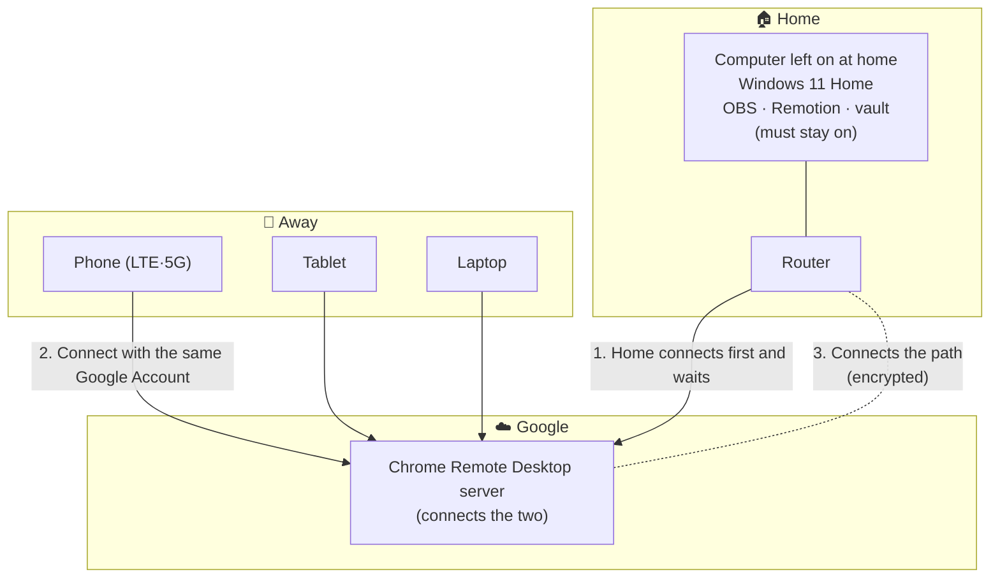

## Why draw a diagram?

When a connection fails, **if you do not know where to look, you end up suspecting everything**. A simple diagram helps you identify “it works up to here, then it gets stuck.”

## My setup (as of 2026-09-20)

### What travels between them?

| Direction | What travels | Amount |
|---|---|---|
| Home computer → your device | **Screen image** (updated continuously) | Large—the connection feels slow here if the internet is slow |
| Your device → home computer | **Mouse position and keystrokes** | Very small |

All programs run on the **home computer**. Your phone is just a window for viewing and controlling its screen.

## If something fails: five places to check

| # | Where in the diagram | Symptom | What to check |
|---|---|---|---|
| 1 | Home computer is off or asleep | Device list says **Offline** | Power and sleep settings (M3) |
| 2 | Home internet is down | Also shows Offline | Restart the router; see whether another device can reach the internet |
| 3 | Different Google Account | **The computer does not appear at all** | Check which account is signed in on your phone |
| 4 | Incorrect PIN | The computer appears, but will not connect | Check the PIN |
| 5 | Your internet is slow | It connects, but **the screen is slow** | Switch between LTE and Wi-Fi; reduce the screen size |

> Check in order. **“It does not appear” (1–3)** and **“it appears but is slow” (5)** have completely different causes. Items 1–3 mean there is no connection; item 5 means the connection exists but the network is slow.

## What must stay on?

| Item | Required state | Why |
|---|---|---|
| Home computer power | **On** | If it is off, there is nothing to connect to |
| Sleep mode | **Never** | If it sleeps, it goes offline (configured in M3) |
| Screen | **May turn off** | A dark screen is fine and can save power and screen life |
| Internet | Connected | |
| Chrome Remote Desktop host | Installed and waiting automatically | It keeps waiting while the computer remains signed in |

## To fill in later

- [ ] Actual device name (choose it in M2; ⚠️ do not use personal information)
- [ ] Measured connection results for each network (M4 device × network table)

← Previous: [../concepts/why-no-router-setup.en.md](../concepts/why-no-router-setup.en.md)
→ Next: [../guides/choice-criteria.en.md](../guides/choice-criteria.en.md)
