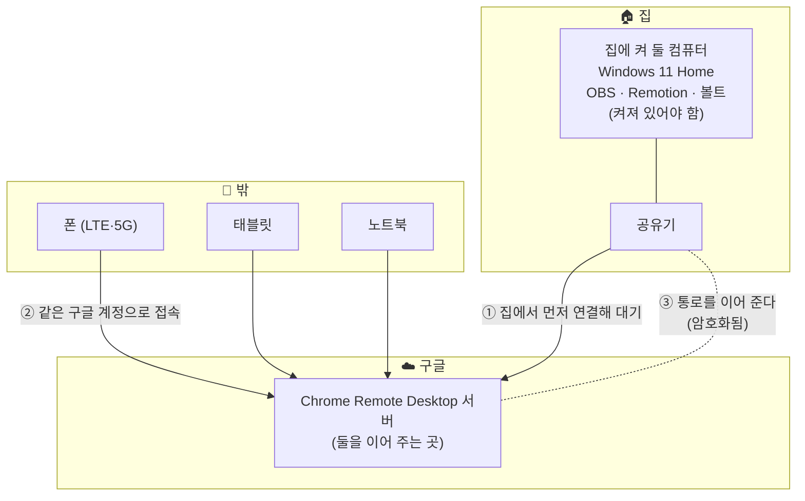

## 왜 그림을 그리나

연결이 안 될 때 **어디를 봐야 할지 모르면 전부를 의심하게 된다.** 그림 한 장이 있으면 「여기까지는 되고 여기서 막혔다」를 짚을 수 있다.

## 내 구성 (2026-09-20 기준)

### 오가는 것

| 방향 | 무엇이 | 크기 |
|---|---|---|
| 집 컴퓨터 → 내 기기 | **화면 그림** (계속 갱신) | 크다 — 인터넷이 느리면 여기서 느려진다 |
| 내 기기 → 집 컴퓨터 | **마우스 위치 · 키보드 글자** | 아주 작다 |

프로그램은 전부 **집 컴퓨터**에서 돈다. 내 폰은 화면을 받아 보는 창일 뿐이다.

## 막히면 어디를 보나 — 그림 위의 다섯 지점

| # | 그림의 지점 | 증상 | 확인할 것 |
|---|---|---|---|
| 1 | 집 컴퓨터가 꺼짐·절전 | 기기 목록에 **「오프라인」** | 전원·절전 설정 (M3) |
| 2 | 집 인터넷 끊김 | 역시 「오프라인」 | 공유기 재시작, 다른 기기로 인터넷 되는지 |
| 3 | 구글 계정이 다름 | **기기가 아예 안 보임** | 폰에서 로그인한 계정 확인 |
| 4 | PIN 틀림 | 목록엔 보이는데 못 들어감 | PIN 재확인 |
| 5 | 내 쪽 인터넷이 느림 | 들어가지긴 하는데 **화면이 느리다** | LTE ↔ Wi-Fi 바꿔 보기, 화면 크기 줄이기 |

> 순서대로 보면 된다. **「안 보인다」(1~3)** 와 **「보이는데 느리다」(5)** 는 원인이 완전히 다르다.
> 1~3 은 연결 자체가 안 된 것, 5 는 연결은 됐고 회선 문제다.

## 이 구성에서 「켜 둬야 하는 것」

| 항목 | 상태 | 왜 |
|---|---|---|
| 집 컴퓨터 전원 | **켜짐** | 꺼지면 들어갈 곳이 없다 |
| 절전 모드 | **안 함** | 잠들면 오프라인이 된다 (M3 에서 설정) |
| 화면 끄기 | **켜도 됨** | 화면만 꺼지는 것은 괜찮다. 오히려 전기·수명에 좋다 |
| 인터넷 | 연결 | |
| Chrome Remote Desktop 호스트 | 설치 후 자동 대기 | 로그인한 채로 두면 계속 대기한다 |

## 다음에 채울 것

- [ ] 실제 기기 이름 (M2 에서 정한 뒤 — ⚠️ 개인 정보 없는 이름으로)
- [ ] 회선별 실측값 (M4 의 기기 × 회선 표)

→ 이전: [../concepts/why-no-router-setup.md](../concepts/why-no-router-setup.md)
→ 다음: [../guides/choice-criteria.md](../guides/choice-criteria.md)
