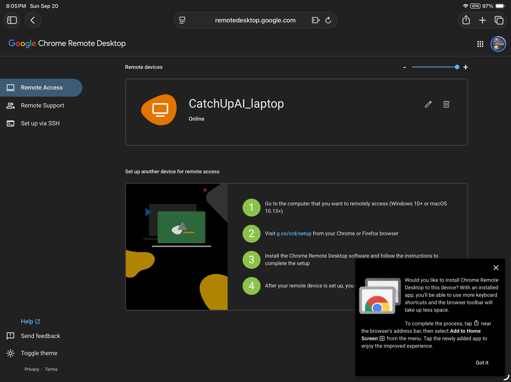
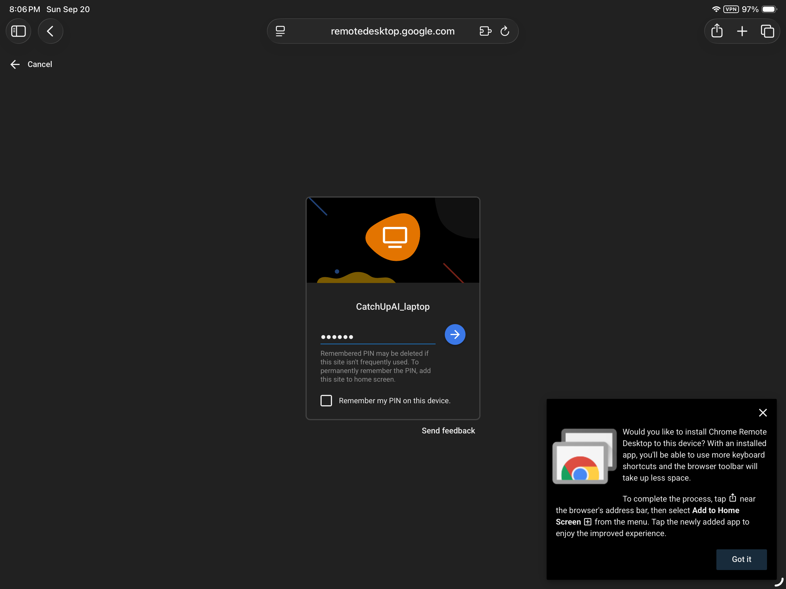
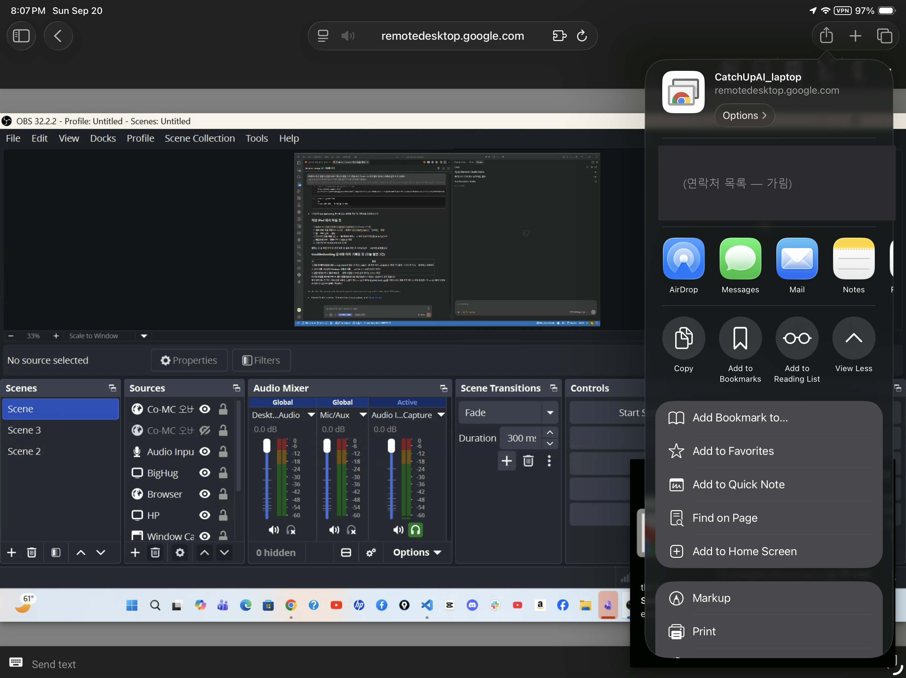
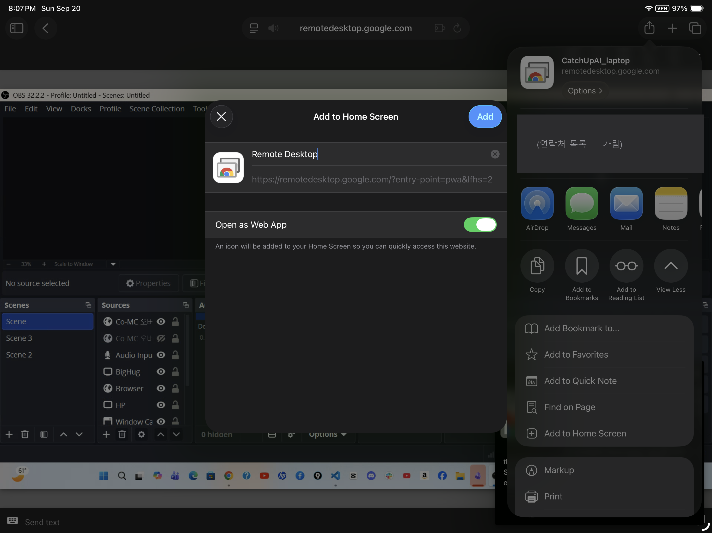

# Connect to Your Home Computer from a Phone or Tablet

**Time:** 15–20 minutes · **You need:** A phone or tablet, the **same Google Account** set up on the home computer, and the PIN

> If you finished installing the host software on your home computer in the [previous guide](install-host-windows.en.md), now set up the device you will use while away. On iPhone and iPad, use the app if available; otherwise open the web app in Safari.

## Before you start: check one important thing

**The Google Account signed in on your phone must be the same one set up on your home computer.**

If the accounts differ, the device list looks **completely empty**. It can look as if installation failed, but this is often the cause. Check especially if you have changed accounts before.

## Step 1 — The instructions depend on your device ⚠️

For detailed iPhone steps, see [Connect from iPhone](connect-from-iphone.en.md).

Google’s current iPhone and iPad help says to open the app, or, if the app is unavailable, go to `remotedesktop.google.com/access` in a browser. In this topic’s iPad test, the Safari web app worked instead of the App Store app. On iPhone, start with Safari rather than spending time searching for the app.

| Device | Method |
|---|---|
| **Android** phone or tablet | Install **Chrome Remote Desktop** from the **Play Store** (publisher: Google LLC) |
| **iPhone or iPad** | Use the app if available. Otherwise, open Safari, go to `remotedesktop.google.com/access`, and **Add to Home Screen** |

### Why Safari instead of Chrome on iPhone and iPad?

On iOS, **Safari is the browser that properly supports turning a website into a Home Screen app**. Adding the web app this way hides the address bar and gives the remote screen more room—an important difference on a small display. Google’s help also recommends adding it to the Home Screen.

#### iPhone and iPad setup

1. Open **Safari** (not Chrome).
2. Enter **`remotedesktop.google.com/access`** in the address bar.
3. Sign in to the **same Google Account** set up on your home computer.
4. Select **Remote Access**, tap your computer in the list, and enter the **PIN**.
5. After connecting, tap the **Share button `□↑`** at the bottom or top of the screen.
6. Scroll down and select **Add to Home Screen** → check the name → **Add**.
7. Open it from the new Home Screen icon to use the remote screen in **full screen**.

> Google’s official help also describes **Safari → Share → Add to Home Screen** as the way to get a full-screen view without the address bar.

> 💡 **The website may show you what to do.** In Safari, a prompt may appear in the lower-right corner: “Install this app on your device? Share button → Add to Home Screen.” Follow that prompt (shown at the lower right of Screen 1 below).

## Step 2 — Sign in and find your computer

1. In the app (Android) or Safari (iPad/iPhone), choose the Google Account set up on your home computer.
2. Seeing `CatchUpAI_laptop` (the name chosen for this computer) in the list means you are on the right track.
3. Its status must say **Online** before you can connect.

**If it is not there:**

- The account is different (most common) → switch accounts in the app or browser.
- The home computer is off or asleep → it appears as **Offline**.
- See [Cannot connect?](../troubleshooting/cannot-connect.en.md) for more checks.

*Screen 1 — iPad Safari. `CatchUpAI_laptop` is **Online**. The lower-right prompt suggests adding it to the Home Screen.*

## Step 3 — Connect

1. Tap the computer name **once**.
2. Enter the **PIN** created on the home computer (at least six digits).
3. There may be a **“Remember my PIN on this device”** checkbox.
   - ⚠️ Select it **only on your own device if it has a lock screen**. Never select it on a shared or public device.
   - Small text says a saved PIN may be removed if you do not use it often; adding the web app to the Home Screen can keep it saved. A Home Screen shortcut is therefore more than a convenience—it can create separate storage for the web app.
4. The home computer’s screen appears.

*Screen 2 — Enter the PIN. Six dots represent six digits. “Remember my PIN” is not selected.*

### Add to Home Screen: actual screens

*Screen 3 — While connected, tap Share `□↑`, then **Add to Home Screen** near the bottom. The home computer is visible behind the menu (OBS is open).*

*Screen 4 — The suggested name is “Remote Desktop.” Check that **Open as Web App** is on, then select Add. If it is off, this creates only a bookmark.*

> ⚠️ **Screenshot reminder:** The Share menu can show recent contacts’ names and photos. Hide them before using a screenshot in a document or video (as in the examples above).

## Step 4 — Learn the controls (this is the part to practice)

A phone has no mouse or physical keyboard. Use the **toolbar at the top or bottom of the screen** instead.

| What you want to do | How |
|---|---|
| **Zoom in or out** | Pinch with two fingers |
| **Move around the screen** | Drag with two fingers |
| **Left-click** | Tap once |
| **Right-click** | Tap with two fingers or press and hold |
| **Open the keyboard** | Tap the **keyboard icon** in the toolbar |
| **Use a physical keyboard** | Connect a Bluetooth keyboard to the iPad; it is much easier for long text and commands |
| **Change control style** | Switch between **trackpad mode** and **touch mode** |

### Trackpad mode vs. touch mode

| | Touch mode | Trackpad mode |
|---|---|---|
| When you touch the screen | **That spot is clicked** | The mouse pointer moves, like using a laptop trackpad |
| Most useful for | Large buttons | **Accurately selecting small items** |
| Can be tricky when | Menus or targets are small | You are new to the controls |

> 💡 **Use trackpad mode for small text and narrow menus.** It is much more precise. Learn this mode first if you plan to work from a phone.

## Step 5 — A real test: switch to LTE

Connecting over home Wi-Fi does **not** test the same conditions as being away. Simulate being away while you are still at home:

1. Turn **Wi-Fi off** on your phone so only LTE or 5G remains.
2. Open the app again and connect.
3. Open **Notepad** on the home computer and type something.
4. Try typing **Korean** too; mobile text input is a common stumbling block.
5. **Save** the text (Ctrl+S—open the keyboard from the toolbar first).

**If this works, you have confirmed that the basic connection works over mobile data.**

> 💡 If your iPad is Wi-Fi-only, connect it to your phone’s hotspot to create the same test conditions. This was tested successfully on 2026-09-20.

## Step 6 — Disconnect

- Select **Exit/Disconnect** in the toolbar.
- ⚠️ **The home computer stays on after you disconnect.** Work already running continues.
- ⚠️ Check in M3 whether the home screen locks when you disconnect. If it does not, someone at home may still see the open screen.

## Connection test record

| Item | Result |
|---|---|
| Device | **iPad** (2026-09-20, 8:05–8:07 p.m.). No Android device was available, so the app method is untested. |
| Connection method | Safari → `remotedesktop.google.com/access` → Add to Home Screen (Open as Web App enabled) |
| Home Screen shortcut | ✅ Name: “Remote Desktop” |
| Device status | ✅ `CatchUpAI_laptop` Online |
| PIN | ✅ Six digits; “Remember my PIN” left unchecked |
| Time to first connection | **About 2 minutes** (open page → enter PIN → screen appears) |
| Network during connection | VPN was on in the iPad status bar; VPN did not prevent the connection. |
| What appeared | The home computer’s OBS screen |
| Experience over **Wi-Fi** | **Fast** |
| Experience over **LTE/5G** | **Fast**—tested by connecting the iPad through a phone hotspot over LTE; no noticeable difference from home Wi-Fi |
| English input | ✅ |
| **Korean input** | ✅ **Works**—a concern, but no problem in this test |
| Save with Ctrl+S | ✅ |
| Trackpad mode | ✅ Used |

### What caused confusion

- **The app was not in the App Store.** The iOS app was discontinued in September 2025; using Safari solved it (see [Cannot connect?](../troubleshooting/cannot-connect.en.md)).
- The phone had recently switched accounts, so the Google Account was checked first. Once it matched, the computer appeared immediately.
- Korean input and LTE speed both worked better than expected. These results are from the iPad Safari web app and should **not** be assumed to apply to the Android app.

## Next

→ [Connect from another computer](connect-from-laptop.en.md)
→ [Cannot connect?](../troubleshooting/cannot-connect.en.md)
→ [M2 overview](../README.en.md)

## Source

- [Chrome Remote Desktop Help](https://support.google.com/chrome/answer/1649523?hl=en)
