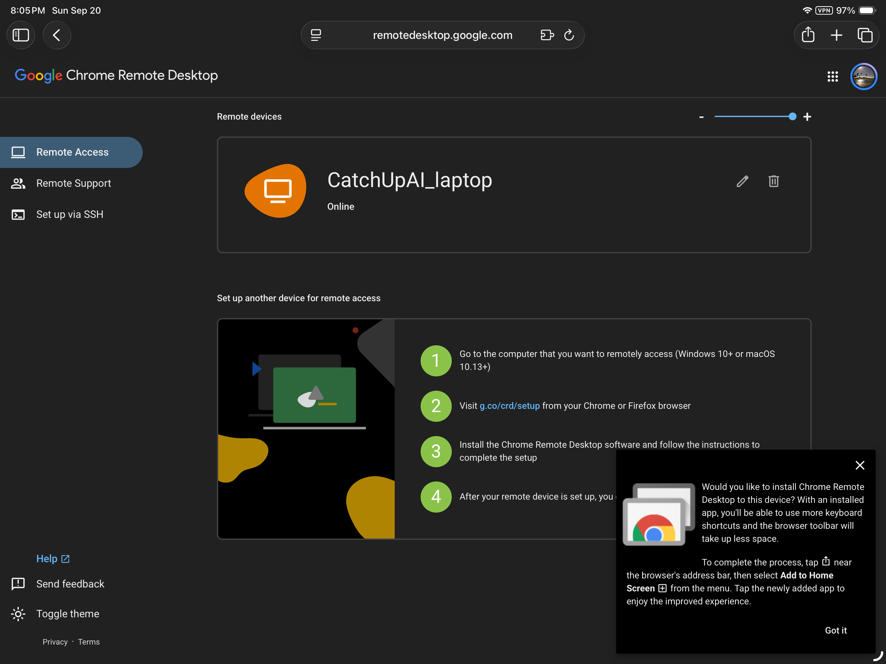
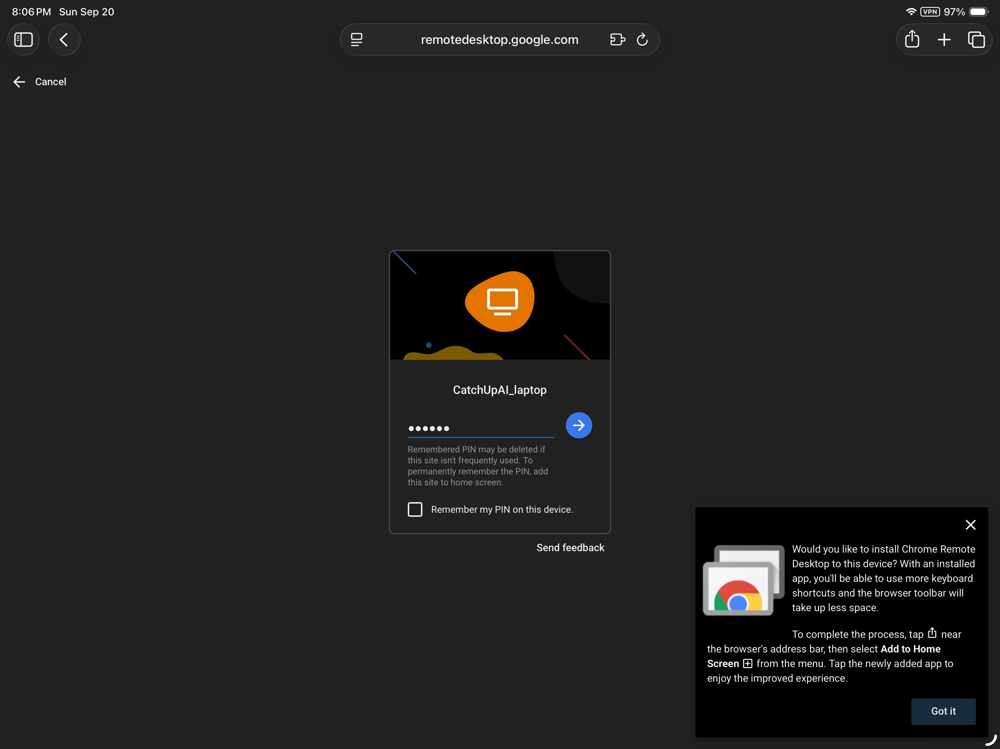
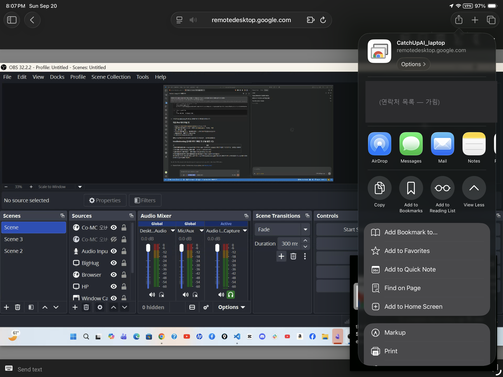
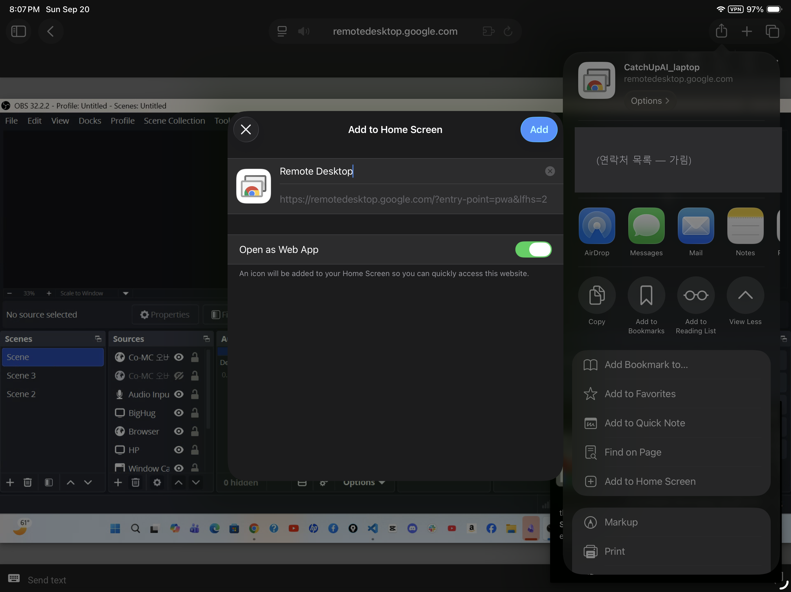

# 폰·태블릿에서 집 컴퓨터에 들어가기

**걸리는 시간**: 15~20분 · **준비물**: 폰 또는 태블릿, 집 컴퓨터에 설정한 **같은 구글 계정**, PIN

> 앞 문서([install-host-windows.md](install-host-windows.md))에서 집 컴퓨터에 설치를 마쳤다면,
> 이제 **밖에서 들어가는 쪽**을 준비한다. 폰에는 설치할 것이 앱 하나뿐이다.

## 시작 전에 — 꼭 확인할 것 하나

**폰에 로그인된 구글 계정이 집 컴퓨터에 설정한 계정과 같아야 한다.**

계정이 다르면 기기 목록이 **텅 비어 보인다.** 「설치가 잘못됐나?」 싶은 화면이 나오는데,
대부분 이 문제다. (계정을 바꾼 적이 있다면 특히 확인)

## 1단계 — 기기에 따라 방법이 다르다 ⚠️

**iPhone·iPad 는 App Store 에서 앱을 찾을 수 없다.** 없어진 것이 맞다 — 구글이 **2025년 9월에
iOS 앱을 폐지**하고 브라우저 방식으로 바꿨다. 아무리 검색해도 안 나오는 것이 정상이다.

| 기기 | 방법 |
|---|---|
| **Android** 폰·태블릿 | **Play 스토어**에서 **Chrome Remote Desktop** 앱 설치 (만든 곳: Google LLC) |
| **iPhone·iPad** | 앱 없음. **Safari** 로 `remotedesktop.google.com/access` 접속 → **홈 화면에 추가** |

### iPhone·iPad 에서 왜 Chrome 이 아니라 Safari 인가

iOS 에서 **「홈 화면에 추가」로 앱처럼 만드는 기능은 Safari 에서만** 제대로 동작한다.
이렇게 추가하면 **주소 표시줄이 사라져 원격 화면을 더 넓게** 쓸 수 있다 — 작은 화면에서는
이 차이가 크다. (구글 도움말도 홈 화면 추가를 권장한다)

#### iPad·iPhone 설정 순서

1. **Safari** 를 연다 (Chrome 아님)
2. 주소창에 **`remotedesktop.google.com/access`**
3. 집 컴퓨터에 설정한 **같은 구글 계정**으로 로그인
4. **Remote Access(원격 액세스)** → 목록에서 내 컴퓨터를 탭 → **PIN** 입력
5. 접속이 되면, 화면 아래(또는 위)의 **공유 버튼 `□↑`** 을 누른다
6. 아래로 스크롤해 **「홈 화면에 추가」** → 이름 확인 → **추가**
7. 이제 홈 화면 아이콘으로 실행하면 **전체 화면**으로 쓸 수 있다

> 💡 **사이트가 먼저 알려 준다.** Safari 로 열면 오른쪽 아래에 「이 기기에 설치하시겠어요? 공유 버튼 →
> Add to Home Screen」 안내가 뜬다. 이 안내를 따라가면 된다 (아래 화면 ① 오른쪽 아래).

## 2단계 — 로그인하고 내 컴퓨터 찾기

1. 앱(Android) 또는 Safari(iPad·iPhone)에서 구글 계정을 고른다 → **집 컴퓨터에 설정한 계정**
2. 목록에 `CatchUpAI_laptop`(내가 정한 이름)이 보이면 성공
3. 이름 아래가 **「온라인」**이어야 들어갈 수 있다

**안 보인다면**:
- 계정이 다르다 (가장 흔함) → 앱에서 계정 전환
- 집 컴퓨터가 꺼졌거나 잠들었다 → 「오프라인」으로 표시
- 자세한 것은 [../troubleshooting/cannot-connect.md](../troubleshooting/cannot-connect.md)

*화면 ① — iPad Safari. `CatchUpAI_laptop` 이 **Online**. 오른쪽 아래에 「홈 화면에 추가」 안내가 떠 있다*

## 3단계 — 들어가기

1. 기기 이름을 **한 번 누른다**
2. **PIN** 을 입력한다 (집 컴퓨터에서 정한 6자리 이상)
3. **「Remember my PIN on this device」** 체크란이 있다
   → ⚠️ **내 기기이고 잠금 화면이 있는 경우에만** 체크한다. 남의 기기·공용 기기에서는 절대 체크하지 않는다
   → 작은 글씨로 「자주 안 쓰면 기억한 PIN 이 지워질 수 있다. 계속 기억하려면 홈 화면에 추가하라」고 적혀 있다 —
     홈 화면 추가가 「편의」만이 아니라 **저장소가 따로 생기는 것**이라는 뜻이다
4. 집 컴퓨터 화면이 나타난다

*화면 ② — PIN 입력. 점 6개 = 6자리. 「Remember my PIN」은 체크하지 않았다*

### 홈 화면에 추가 — 실제 화면

*화면 ③ — 접속된 상태에서 공유 버튼 `□↑` → 메뉴 아래쪽 **Add to Home Screen**. 뒤에 보이는 것이 원격으로 들어간 집 컴퓨터(OBS 가 켜져 있다)*

*화면 ④ — 이름은 「Remote Desktop」으로 자동 제안. **「Open as Web App」이 켜져 있는지** 확인하고 Add. 이게 꺼져 있으면 그냥 즐겨찾기가 된다*

> ⚠️ **캡처 주의**: 공유 메뉴에는 **최근 연락처의 이름·사진**이 같이 뜬다. 문서·영상에 쓸 때는 반드시 가린다
> (위 화면은 가린 것).

## 4단계 — 조작 방법 익히기 (여기가 진짜 배울 것)

폰은 마우스도 키보드도 없다. **화면 아래·위의 도구 막대**로 대신한다.

| 하고 싶은 것 | 방법 |
|---|---|
| **화면 확대·축소** | 두 손가락으로 벌리기/오므리기 |
| **화면 이동** | 두 손가락으로 끌기 |
| **마우스 왼쪽 클릭** | 화면을 한 번 탭 |
| **마우스 오른쪽 클릭** | 두 손가락으로 탭 (또는 길게 누르기) |
| **키보드 띄우기** | 도구 막대의 **키보드 아이콘** |
| **물리 키보드 쓰기** | iPad 에 블루투스 키보드를 연결하면 훨씬 편하다 (긴 글·명령 입력에 유리) |
| **조작 방식 바꾸기** | **트랙패드 모드** ↔ **터치 모드** 전환 |

### 트랙패드 모드 vs 터치 모드 — 꼭 알아야 하는 차이

| | 터치 모드 | 트랙패드 모드 |
|---|---|---|
| 손가락을 대면 | **그 자리가 클릭**된다 | 노트북 터치패드처럼 **마우스 커서가 움직인다** |
| 편할 때 | 큰 버튼 누르기 | **작은 것을 정확히** 누르기 |
| 불편할 때 | 작은 메뉴를 놓친다 | 처음엔 어색하다 |

> 💡 **작은 글씨·좁은 메뉴를 다룰 때는 트랙패드 모드**가 훨씬 정확하다. 폰에서 일하려면 이것부터 익힌다.

## 5단계 — 진짜 시험: LTE 로 바꿔서 해 보기

집 Wi-Fi 로 연결하면 **밖에서와 조건이 다르다.** 집 안에서도 「밖에 있는 것처럼」 만들어 본다.

1. 폰에서 **Wi-Fi 를 끈다** (LTE·5G 만 사용)
2. 앱을 다시 열어 접속
3. 집 컴퓨터에서 **메모장**을 열고 글자를 입력한다
4. **한글도 입력해 본다** ← 모바일에서 자주 막히는 지점
5. **저장**까지 한다 (Ctrl+S — 키보드 아이콘으로 키보드를 띄운 뒤)

**이게 되면 밖에서도 된다.**

> 💡 iPad 가 Wi-Fi 전용 모델이면 **폰의 핫스팟**에 붙이면 같은 조건이 된다. 2026-09-20 실제로 이렇게 시험했고 잘 됐다.

## 6단계 — 끊기

- 도구 막대의 **나가기/연결 끊기**
- ⚠️ **끊어도 집 컴퓨터는 켜진 채**로 남는다. 돌던 작업은 계속 돈다
- ⚠️ 끊었을 때 **집 화면이 잠기는지**는 M3(보안)에서 확인한다 — 안 잠기면 집에 있는 사람이 그대로 본다

---

## 접속 기록 (실제로 한 결과)

| 항목 | 값 |
|---|---|
| 접속 기기 | **iPad** (2026-09-20 20:05~20:07). Android 기기는 보유하지 않아 앱 방식은 미검증 |
| 접속 방식 | Safari → `remotedesktop.google.com/access` → 홈 화면에 추가 (Open as Web App 켬) |
| 홈 화면 추가 (iPad) | ✅ 이름 「Remote Desktop」 |
| 목록에 「온라인」 | ✅ `CatchUpAI_laptop` Online |
| PIN 입력 | ✅ 6자리 · 「Remember my PIN」 체크 안 함 |
| 첫 접속까지 걸린 시간 | **약 2분** (페이지 열기 → PIN → 화면 표시) |
| 접속 중이던 회선 | iPad 상태 표시줄에 **VPN 켜진 상태**로 접속됨 — VPN 이 있어도 막히지 않았다 |
| 접속 후 보인 것 | 집 컴퓨터의 OBS 화면 그대로 |
| **Wi-Fi 에서** 체감 | **빠름** |
| **LTE·5G 에서** 체감 | **빠름** — 폰 핫스팟(LTE)으로 iPad 를 연결해 시험. 집 Wi-Fi 와 차이를 못 느낌 |
| 영문 입력 | ✅ |
| **한글 입력** | ✅ **된다** — 걱정했던 지점인데 문제 없었다 |
| 저장(Ctrl+S) | ✅ |
| 트랙패드 모드 사용 | ✅ |

### 막혔던 곳

- **App Store 에 앱이 없었다** → iOS 앱은 2025-09 폐지. Safari 방식으로 해결 (→ [../troubleshooting/cannot-connect.md](../troubleshooting/cannot-connect.md) #1)
- 계정 변경 직후라 폰 계정과 맞추는 것을 먼저 확인했다 — 맞춘 뒤엔 목록에 바로 보였다
- 한글 입력·LTE 속도 둘 다 **걱정했던 것보다 문제가 없었다.** 이 결과는 iPad Safari 웹앱에서 확인한 것이며, Android 앱에서도 같다고 일반화하지 않는다

---

## 다음

→ [connect-from-laptop.md](connect-from-laptop.md) — 노트북 브라우저에서 접속
→ [../troubleshooting/cannot-connect.md](../troubleshooting/cannot-connect.md) — 안 될 때
→ [../README.md](../README.md)

## 출처

- [Chrome 원격 데스크톱 도움말](https://support.google.com/chrome/answer/1649523?hl=ko)
