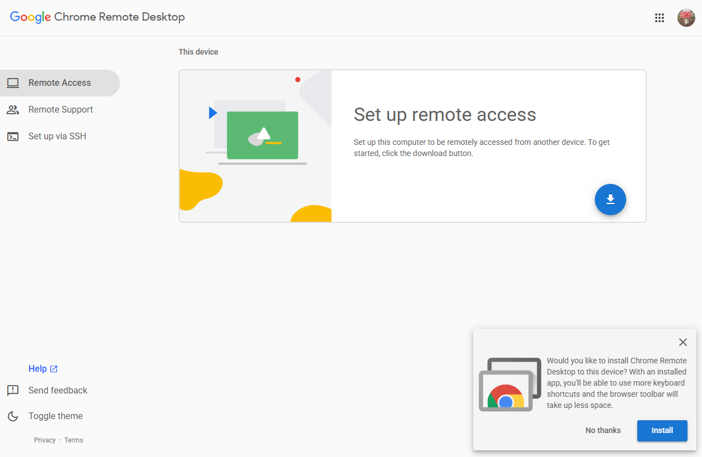
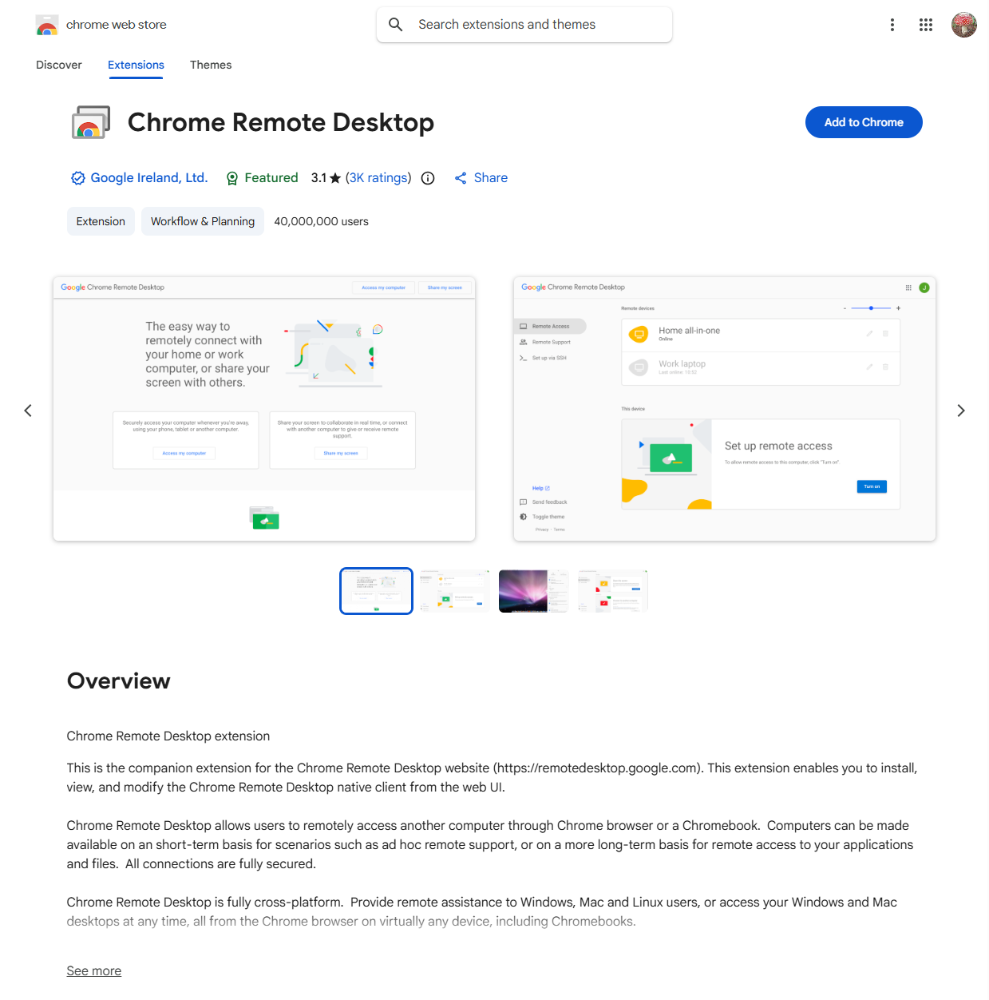
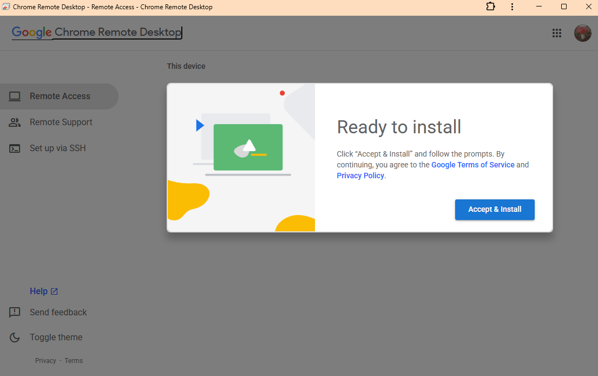
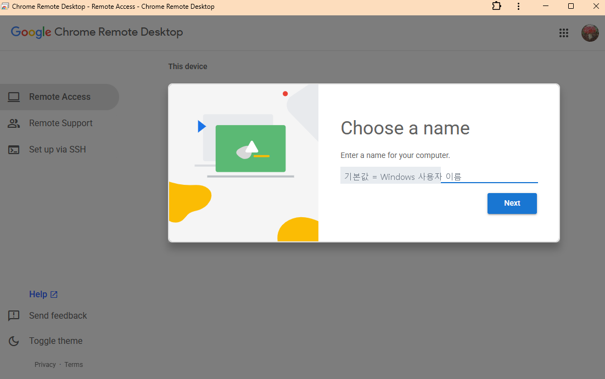
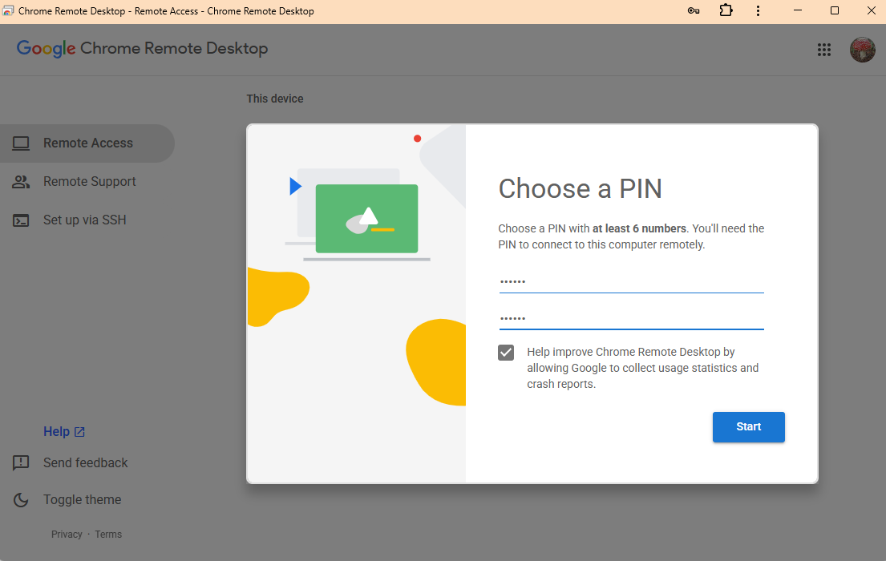
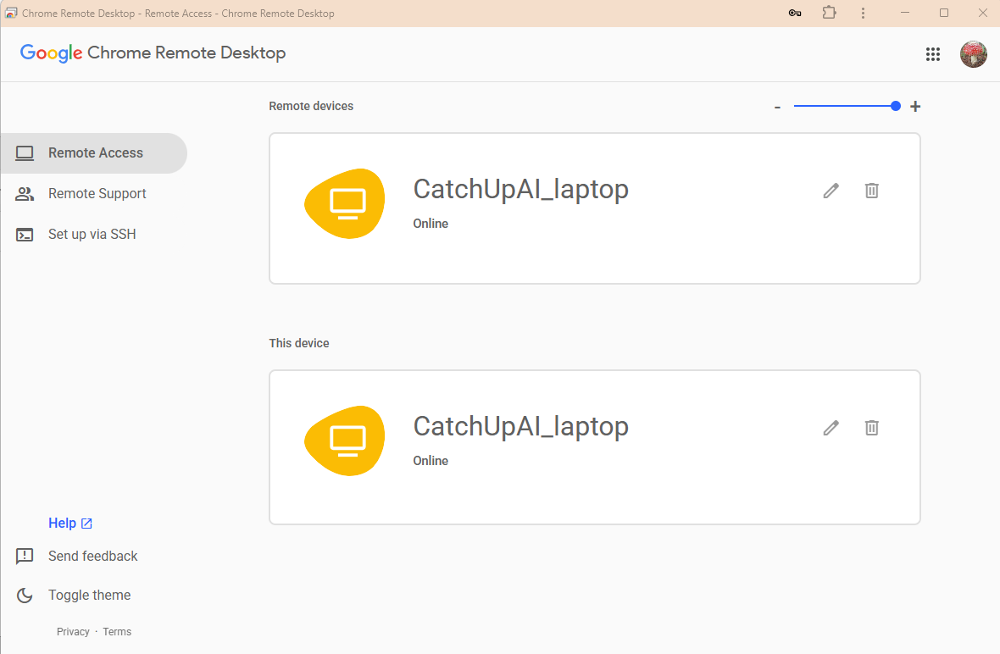

# Install on the Computer You Will Leave On (Windows)

**Time:** 10–15 minutes · **You need:** Chrome, a Google Account, and this computer’s Windows sign-in password

> This is how you create a door you can enter from away. Do these steps once on the computer you plan to leave at home.
> You do not install this host software on your phone or tablet. See [Connect from a phone or tablet](connect-from-phone.en.md).

## Before you start

| Check | Why |
|---|---|
| Chrome is installed | Setup starts in Chrome |
| You are signed in to your Google Account | This account becomes the “label” you use to find your computer |
| You know your Windows sign-in password | The installer may ask for it |
| This is the computer you plan to leave on at home | If so, continue |

## Step 1 — Open the setup page

1. Open Chrome.
2. Enter **`remotedesktop.google.com/access`** in the address bar and press Enter.
3. If Google asks you to sign in, use the account you normally use.

*Screen 1 — The first view at `remotedesktop.google.com/access`*

## Step 2 — Select “Set up remote access” and download

1. Select **“Set up remote access”** (or the blue download icon).
2. The **Chrome Web Store** opens and asks you to add an extension. Select **“Add to Chrome.”**
3. Next, download the installer, open it, and install it.
4. If Windows asks **“Do you want to allow this app to make changes to your device?”**, select **Yes**.
5. The installer may ask for the **computer password (your Windows sign-in password)**. Enter it.

> This is a two-part process, not one “download and install” step: **add the browser extension, then run the installer**. It is easy to wonder “Why is it asking me again?” the first time. This sequence was confirmed during an installation on 2026-09-20.

*Screen 2 — First add the extension from the Chrome Web Store.*

*Screen 3 — Accept and continue with installation.*

⚠️ The password requested here is **the Windows password for this computer**, not your Google Account password.

## Step 3 — Choose a name

When installation finishes, you will be asked to name this computer.

- The name helps you tell computers apart if you register more than one.
- ⚠️ **Do not use your home address, full name, or company name.** The name can appear when you share or capture the screen.
- Good examples: `home-desk`, `work-pc`, `main-studio`
- Avoid: `JaneSmithLaptop`, `MyOfficeAt123MainSt`

*Screen 4 — ⚠️ **The field may already be filled in.** Windows may put the Windows user name there by default. If you simply select Next, that name becomes the device name. This happened during the test; see “What happened in practice” below.*

## Step 4 — Choose a PIN (the second key)

**Why use one?** Even if someone gets into your Google Account, they cannot connect to the computer without the PIN. It gives you a second door.

1. Enter at least **six digits**. The setup screen explicitly says **“at least 6 numbers.”**
   (The Help page does not state the length, so M1 initially marked it “not specified”; it is shown in the setup screen.)
2. Enter the same number again to confirm.
3. Select **Start** or **Turn on**.

**Do not use:**

- A birthday (1225, 19700101, etc.)
- The last digits of a phone number
- Repeated digits (111111) or a sequence (123456)
- The **same number as your front-door code** (if one is exposed, both are exposed)

*Screen 5 — The numbers are hidden as dots, so this screen can be captured as-is. The setup screen explicitly says “Choose a PIN with at least 6 numbers.”*

## Step 5 — Check that it says “Online”

1. After installation, your computer appears in the list on the same page.
2. **Online** in green next to the name means setup worked.
3. If it says **Offline**, see [Cannot connect?](../troubleshooting/cannot-connect.en.md).

*Screen 6 — **Online** in green below the device name means setup worked.*

### A common source of confusion: why does the same computer appear twice?

The same computer can appear in two places. That does not mean you registered two devices.

| List | Meaning |
|---|---|
| **Remote devices** | “Computers I can connect to”—the view from away |
| **This device** | “The computer running this browser now”—where you change its settings |

**How to check:** Rename it in one place. If the name changes in the other place too, it is the same computer. This was confirmed on 2026-09-20.

Registering another computer adds another row under **Remote devices**.
⚠️ If you see an unfamiliar computer, remove it with the trash icon. It means an unexpected device is registered.

## Step 6 — Check once from another browser on the same computer (optional, 2 minutes)

To do a quick check, open `remotedesktop.google.com/access` in another browser on the same computer (such as Edge) and sign in to the same account. If the computer appears, installation worked.

> Try a real remote connection from your phone in the next guide: [Connect from a phone](connect-from-phone.en.md).

## Installation record (tested 2026-09-20)

| Item | Value |
|---|---|
| Installation date | 2026-09-20 (Sun), 3:17–3:26 p.m. |
| Windows edition | 11 Home |
| Chrome version | 153.0.8010.50 |
| Host version | **151.0.7922.13** |
| Install location | `C:\Program Files (x86)\Google\Chrome Remote Desktop\` ← it is under `(x86)` |
| Service | `chromoting`—**running · startup type: Automatic** |
| Processes | Two `remoting_host` processes |
| Settings file | `C:\ProgramData\Google\Chrome Remote Desktop\host.json` exists |
| Device name | `CatchUpAI_laptop` (channel/activity name plus device type) |
| PIN length | At least six digits (the number is not recorded) |
| “Online” check | ✅ |
| Time required | **About 9 minutes**, including screenshots |

> 💡 **How to tell that installation really worked:** Look for the `remoting_host` process in Task Manager, or check that the `chromoting` service is “Running” in the Services list. This checks the computer itself, not just a browser page.

## What happened in practice: the name field was already filled in

On the Step 3 “Choose a name” screen, the Windows user name (a real name) was already filled in by default. If you skip the instructions and select **Next**, the name is registered as-is. That happened during the test; it was noticed later while reviewing the device-list screenshot and then changed.

| Question | Answer |
|---|---|
| What is the issue? | The name appears as-is in screen shares, screenshots, and videos. |
| How do you change it? | Select the **pencil (✏️) icon** beside the name in the device list, enter a new name, and save. |
| What name was used? | `CatchUpAI_laptop`—a channel/activity name that is already public and distinguishes the device. |

> 📌 Avoid your full name, home address, or an internal company name. Use a name you would be comfortable showing publicly (a nickname, channel name, or generic label such as `home-desk`). If you have several computers, add a suffix such as `_laptop` or `_desk`.

### Where I got stuck

Nowhere—the installation itself went smoothly. I nearly missed one thing: the prefilled default name. It is also noted in [Cannot connect?](../troubleshooting/cannot-connect.en.md).

## Next

→ [Connect from a phone or tablet](connect-from-phone.en.md)
→ [M2 overview](../README.en.md)

## Sources

- [Chrome Remote Desktop Help](https://support.google.com/chrome/answer/1649523?hl=en)—installation, computer-password prompts, and PIN entry
- [Access page](https://remotedesktop.google.com/access)
