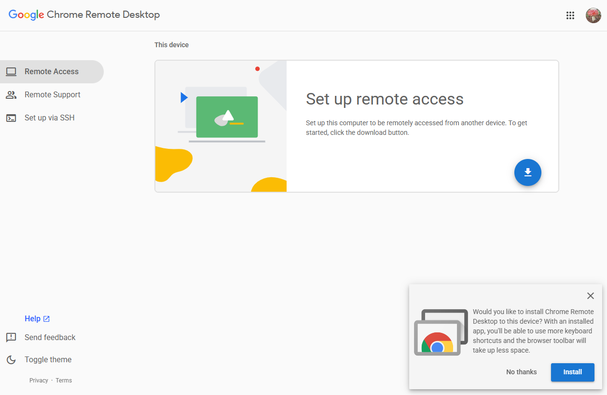
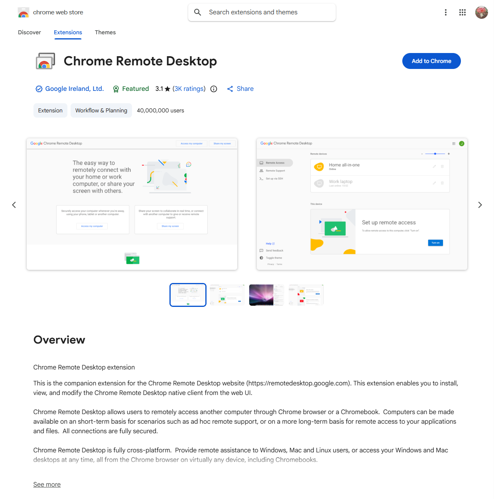
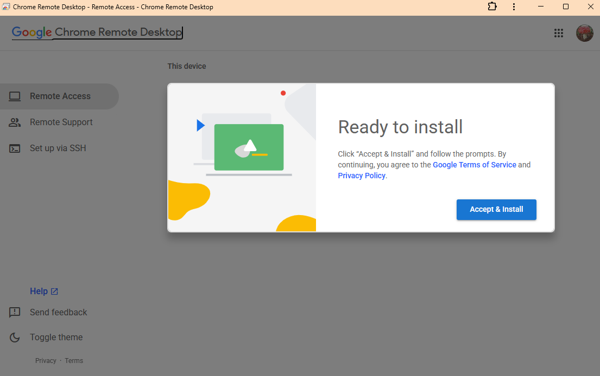
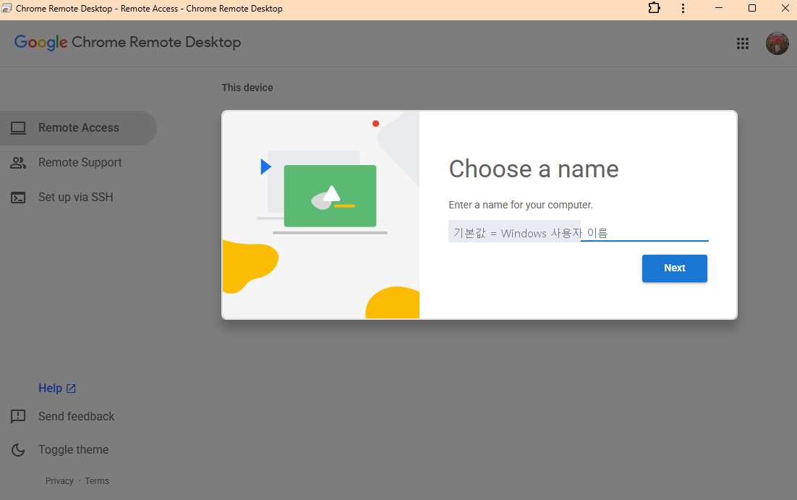
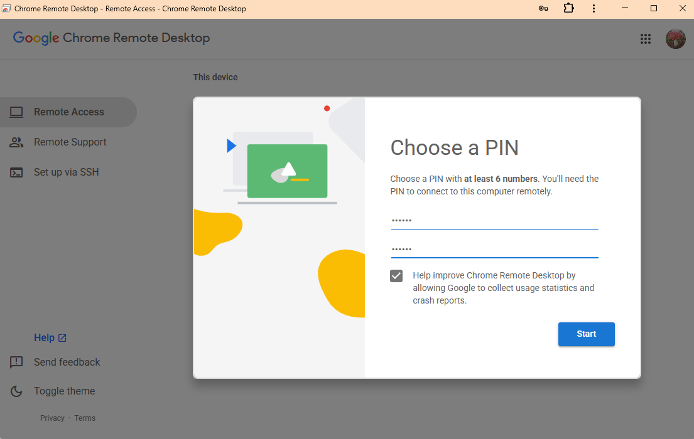
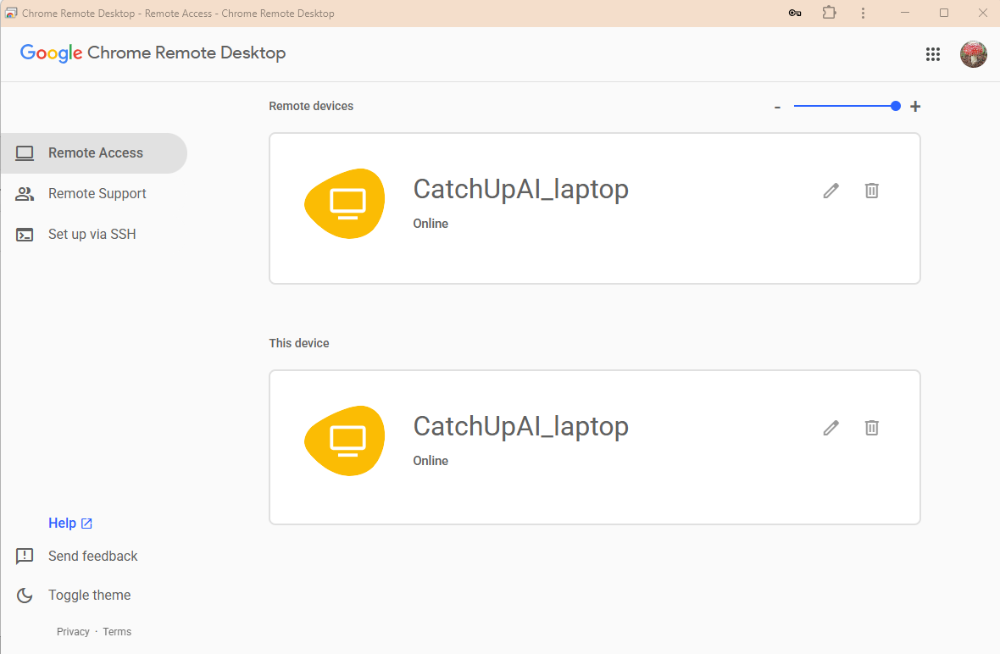

# 집에 켜 둘 컴퓨터에 설치하기 (Windows)

**걸리는 시간**: 10~15분 · **준비물**: Chrome 브라우저, 구글 계정, 이 컴퓨터의 Windows 로그인 비밀번호

> 이 문서는 **밖에서 들어올 문을 만드는** 과정입니다. 집에 두고 나갈 컴퓨터에서만 한 번 하면 됩니다.
> 폰이나 태블릿에는 이 설치가 필요 없습니다 (그쪽은 [connect-from-phone.md](connect-from-phone.md)).

## 시작 전에 확인할 것

| 확인 | 이유 |
|---|---|
| Chrome 이 설치돼 있다 | 설치가 Chrome 에서 시작된다 |
| 구글 계정에 로그인돼 있다 | 이 계정이 나중에 「내 컴퓨터를 찾는 이름표」가 된다 |
| Windows 로그인 비밀번호를 안다 | 설치 도중 물어볼 수 있다 |
| 이 컴퓨터를 **집에 두고 나갈 컴퓨터**로 쓸 것이다 | 맞다면 계속 |

## 1단계 — 설치 페이지 열기

1. Chrome 을 연다
2. 주소창에 **`remotedesktop.google.com/access`** 를 입력하고 Enter
3. 구글 계정 로그인 화면이 나오면 **평소 쓰는 계정**으로 로그인

*화면 ① — `remotedesktop.google.com/access` 첫 화면*

## 2단계 — 「원격 액세스 설정」 누르고 내려받기

1. 화면의 **「원격 액세스 설정」**(또는 파란 다운로드 아이콘)을 누른다
2. **Chrome 웹 스토어**가 열리며 확장 프로그램을 추가하라고 한다 → **「Chrome 에 추가」**
3. 이어서 설치 파일을 내려받고, 실행해 설치한다
4. Windows 가 **「이 앱이 장치를 변경하도록 허용하시겠습니까?」** 를 물으면 **예**
5. 설치 중 **컴퓨터 비밀번호(Windows 로그인 암호)를 물을 수 있다** — 입력한다

> 순서가 「다운로드 → 설치」 한 번이 아니라 **「확장 프로그램 추가 → 설치 파일 실행」 두 단계**다.
> 처음 하면 「왜 또 나오지?」 싶은 자리다 (2026-09-20 실제 설치에서 확인).

*화면 ② — Chrome 웹 스토어에서 확장 프로그램을 추가하는 단계가 먼저 나온다*

*화면 ③ — 동의하고 설치를 진행한다*

⚠️ 여기서 묻는 비밀번호는 **이 컴퓨터의 Windows 비밀번호**입니다. 구글 계정 비밀번호가 아닙니다.

## 3단계 — 이름 정하기

설치가 끝나면 **이 컴퓨터의 이름**을 정하라고 나온다.

- 여러 대를 쓰게 될 때 구분하는 용도다
- ⚠️ **집 주소 · 본명 · 회사 이름을 넣지 않는다.** 이 이름은 화면을 공유하거나 캡처할 때 그대로 보인다
- 좋은 예: `home-desk` · `작업용PC` · `main-studio`
- 피할 예: `홍길동노트북` · `서울시강남구집`

*화면 ④ — ⚠️ **칸이 이미 채워져 있다.** Windows 사용자 이름이 기본값으로 들어온다.
그냥 「Next」를 누르면 그 이름이 그대로 기기 이름이 된다 (실제로 그렇게 됐다 — 아래 「실제로 겪은 일」)*

## 4단계 — PIN 정하기 (두 번째 열쇠)

**왜 하나**: 구글 계정이 뚫려도, PIN 을 모르면 내 컴퓨터에는 못 들어온다. **문이 두 개**가 되는 것이다.

1. **6자리 이상** 숫자를 입력한다 — 설정 화면이 **「at least 6 numbers」** 라고 직접 요구한다
   (도움말 문서에는 길이 규칙이 없어서 M1 에서는 「명시 없음」으로 적었는데, **설치 화면에 있었다**)
2. 확인란에 같은 숫자를 한 번 더 입력
3. **시작** 또는 **사용 설정** 누르기

**쓰면 안 되는 PIN**:
- 생일 (1225, 19700101…)
- 전화번호 뒷자리
- 같은 숫자 반복 (111111) · 연속 (123456)
- 현관문 비밀번호와 **같은 번호** (하나가 털리면 둘 다 털린다)

*화면 ⑤ — 입력한 숫자는 점으로 가려지므로 이 화면은 그대로 캡처해도 된다.
화면에 **「Choose a PIN with at least 6 numbers」** 라고 최소 6자리가 명시돼 있다*

## 5단계 — 「온라인」인지 확인

1. 설치가 끝나면 같은 페이지에 내 컴퓨터가 목록에 나타난다
2. 이름 옆에 **「온라인」**(초록색)이면 성공이다
3. 「오프라인」이면 → [../troubleshooting/cannot-connect.md](../troubleshooting/cannot-connect.md)

*화면 ⑥ — 이름 아래 **「Online」**(초록색)이면 성공*

### 여기서 처음 보는 사람이 꼭 헷갈리는 것 — 왜 같은 컴퓨터가 두 번 보이나

목록에 **같은 이름이 두 칸**에 나온다. 기기가 두 대 등록된 것이 아니다.

| 칸 | 뜻 |
|---|---|
| **Remote devices** | 「내가 접속할 수 있는 컴퓨터 목록」 — **밖에서 볼 때의 시점** |
| **This device** | 「지금 이 브라우저가 돌고 있는 컴퓨터」 — 여기서 설정을 바꾼다 |

**확인 방법**: 한쪽 이름을 바꾸면 **다른 쪽도 같이 바뀐다.** 같이 바뀌면 같은 컴퓨터다.
(2026-09-20 실제로 확인함)

다른 컴퓨터를 추가로 등록하면 **Remote devices 에만 줄이 하나 더** 생긴다.
⚠️ 모르는 기기가 목록에 있으면 **휴지통 아이콘으로 지운다** — 남의 기기가 등록돼 있다는 뜻이다.

## 6단계 — 같은 컴퓨터에서 한 번 확인 (선택, 2분)

진짜 되는지 미리 보려면, **같은 컴퓨터의 다른 브라우저**(Edge 등)에서 `remotedesktop.google.com/access` 를 열고 같은 계정으로 로그인해 본다. 목록에 기기가 보이면 설치가 제대로 된 것이다.

> 실제 접속은 다음 문서에서 폰으로 해 본다 → [connect-from-phone.md](connect-from-phone.md)

---

## 설치 기록 (2026-09-20 실제로 한 결과)

| 항목 | 값 |
|---|---|
| 설치일 | 2026-09-20 (일) 15:17~15:26 |
| Windows | 11 Home |
| Chrome 버전 | 153.0.8010.50 |
| 호스트 버전 | **151.0.7922.13** |
| 설치 경로 | `C:\Program Files (x86)\Google\Chrome Remote Desktop\` ← **(x86) 쪽에 들어간다** |
| 서비스 | `chromoting` — **실행 중 · 시작 유형 자동** |
| 프로세스 | `remoting_host` 2개 |
| 설정 파일 | `C:\ProgramData\Google\Chrome Remote Desktop\host.json` 존재 |
| 기기 이름 | `CatchUpAI_laptop` (채널·활동명 + 기기 구분) |
| PIN 자릿수 | 6자리 이상 (숫자는 기록하지 않는다) |
| 「온라인」 확인 | ✅ |
| 걸린 시간 | **약 9분** (캡처 포함) |

> 💡 **설치가 됐는지 확실히 보는 법**: 작업 관리자에서 `remoting_host` 프로세스가 있는지,
> 또는 서비스 목록에서 `chromoting` 이 「실행 중」인지 본다. 브라우저 화면이 아니라
> **컴퓨터 자체에서 확인**하는 방법이라 더 확실하다.

## 실제로 겪은 일 — 이름 칸이 이미 채워져 있었다

3단계 「이름 정하기」 화면에 **Windows 사용자 이름(본명)이 기본값으로 미리 들어가 있었다.**
설명을 읽지 않고 「Next」를 누르면 **본명이 그대로 기기 이름**이 된다. 실제로 그렇게 등록됐고,
기기 목록 캡처를 확인하다가 발견해 바꿨다.

| 무엇이 문제인가 | 이 이름은 화면 공유·캡처·영상에 그대로 보인다 |
|---|---|
| 어떻게 고치나 | 기기 목록에서 이름 옆 **연필(✏️) 아이콘** → 새 이름 → 저장 |
| 무엇으로 바꿨나 | `CatchUpAI_laptop` — 채널·활동명이라 오히려 알려져도 좋고, 기기 구분도 된다 |

> 📌 **이름을 고를 때**: 본명·집 주소·회사 내부 이름은 피한다. 공개돼도 괜찮은 이름
> (별명·채널명·`home-desk` 같은 일반 명칭)이 좋다. 컴퓨터가 여러 대면 `_laptop` · `_desk` 처럼
> 뒤에 구분을 붙인다.

### 막혔던 곳

없음. 설치 자체는 막히지 않았고, **놓칠 뻔한 것**(기본값 이름)이 하나 있었다 →
[../troubleshooting/cannot-connect.md](../troubleshooting/cannot-connect.md) 에 정리

---

## 다음

→ [connect-from-phone.md](connect-from-phone.md) — 폰·태블릿에서 들어가 보기
→ [../README.md](../README.md)

## 출처

- [Chrome 원격 데스크톱 도움말](https://support.google.com/chrome/answer/1649523?hl=ko) — 설치 절차, 컴퓨터 비밀번호 요청, PIN 입력
- [접속 페이지](https://remotedesktop.google.com/access)
