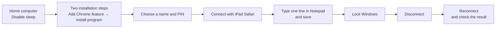

# Chrome Remote Desktop — Work on Your Computer While You’re Away

> This topic explains how people without IT experience can use Google Chrome Remote Desktop (CRD) to access a computer at home while away. The setup, real-world use, and security checks were tested and documented. It has two goals: ① use your work environment (documents, broadcasting, and video production) while away, and ② review AI work on your computer and send the next instruction while away.

| | |
|---|---|
| Dates | Roadmap started 2026-09-20 → in progress (two-week plan through about 10/4) |
| Status | ✅ M1 · M2 · M3 · M5 · M6 · M7 complete · 🟡 M4 real-world use 3/6 |
| 🎬 Guide video | **[English](https://youtu.be/G1WsQ_J2jxU)** · [한국어](https://youtu.be/Uj47SPD6owc) — from setup to locking, remote restart and checking AI tasks (about 15 minutes, published 2026-09-30) |
| Setup | Host: Windows 11 laptop at home · Away device: **iPad Safari** (iOS app ended in 2025; use the web) · Android app flow **not tested** because no Android device was available |
| Audience | Everyone, starting with people who have no IT background |
| Short result | **Leave the home computer on and disable sleep while it is plugged in; from a café, it took about 5 seconds to connect, type, and save. After a remote restart, it was possible to reconnect after 1–2 minutes.** Always lock Windows before leaving the session. |

## What We Learned

- **Think of it like a TV remote.** The home computer does the work; the iPad shows its screen and controls it. The home computer must be powered on and connected to the internet. Router configuration such as port forwarding is not needed. → [What remote access is](01-Concepts-and-Choice/concepts/what-is-remote-access.en.md) · [Why no router setup is needed](01-Concepts-and-Choice/concepts/why-no-router-setup.en.md)
- **Installation has two parts.** First add the Chrome feature, then install the computer program. This is where beginners often get confused. → [Install on Windows](02-Install-and-First-Connect/guides/install-host-windows.en.md)
- **There are two PIN/password steps.** The remote access PIN gets you into CRD; the Windows sign-in PIN unlocks the Windows lock screen. They are different. → [Connect from iPad or iPhone](02-Install-and-First-Connect/guides/connect-from-iphone.en.md)
- **Screen off does not mean computer asleep.** It is fine for the screen to turn off, but the computer will be unavailable remotely if it goes to sleep. → [Windows power and lock settings](03-Security-Checklist/guides/windows-power-and-lock.en.md)
- **Disconnect does not mean lock.** If you only disconnect, the home screen may remain open. Lock Windows first, then disconnect. → [Security checklist](03-Security-Checklist/README.en.md) · [Monthly checklist](03-Security-Checklist/examples/monthly-checklist.en.md)
- **It worked at a café (2026-09-27).** Over café Wi-Fi, connection took about 5 seconds by estimate; document reading, remote typing, locking, disconnecting, and reconnecting all worked, with results still present. → [Test log](05-Remote-AI-Review-Loop/examples/loop-session-log.en.md)
- **A remote restart worked twice on this laptop (2026-09-30).** From the remote screen: Start → Power → Restart. After 1–2 minutes, it was possible to reconnect to the lock screen and sign in remotely. The host program starts automatically with Windows. **One surprising detail:** the computer continued to show as “Online” in the list while restarting. Do not rely on that status; wait 1–2 minutes before trying again.
- **AI-tool remote access is a “window”; CRD is the “front door.”** A remote feature in an AI app such as Claude Code shows only that app. CRD shows the whole computer, so if an app’s remote feature stops working, you can open the computer, restart the app, or restart the computer. → [Tool comparison](06-Alternatives-and-GrokBot/guides/comparison-table.en.md)
- **Grok Bot is a different category.** AI works on the service provider’s cloud computer, not your home computer. CRD cannot repair that cloud computer. → [Two categories](06-Alternatives-and-GrokBot/concepts/two-categories.en.md) · [CRD vs. Grok Bot](06-Alternatives-and-GrokBot/guides/crd-vs-grokbot.en.md)
- **RustDesk installation was deferred.** The user chose not to add another app that consumes CPU and memory on a modest laptop. Reconsider if CRD problems recur. → [Backup-tool decision](06-Alternatives-and-GrokBot/guides/backup-tool-setup.en.md) · [When CRD fails](06-Alternatives-and-GrokBot/troubleshooting/when-crd-fails.en.md)

## Modules (Learning Order)

| # | Module | Status | Key deliverables |
|---|---|---|---|
| 1 | [What Is Remote Access? Concepts and Selection](01-Concepts-and-Choice/README.en.md) | ✅ 9/20 | [What remote access is](01-Concepts-and-Choice/concepts/what-is-remote-access.en.md) · [Selection criteria](01-Concepts-and-Choice/guides/choice-criteria.en.md) · [Setup diagram](01-Concepts-and-Choice/examples/my-setup-diagram.en.md) |
| 2 | [Installation and First Connection](02-Install-and-First-Connect/README.en.md) | ✅ 9/23 | [Windows installation](02-Install-and-First-Connect/guides/install-host-windows.en.md) · [Connect from iPad/iPhone](02-Install-and-First-Connect/guides/connect-from-iphone.en.md) · [Connect from another laptop](02-Install-and-First-Connect/guides/connect-from-laptop.en.md) · [Connect from a phone](02-Install-and-First-Connect/guides/connect-from-phone.en.md) · [Connection troubleshooting](02-Install-and-First-Connect/troubleshooting/cannot-connect.en.md) |
| 3 | [Security Checklist](03-Security-Checklist/README.en.md) | ✅ 9/23 | [What becomes risky](03-Security-Checklist/concepts/what-gets-risky.en.md) · [Power and lock](03-Security-Checklist/guides/windows-power-and-lock.en.md) · [Google Account checks](03-Security-Checklist/guides/google-account-checks.en.md) · [Remote support caution](03-Security-Checklist/guides/remote-support-caution.en.md) · [Monthly checklist](03-Security-Checklist/examples/monthly-checklist.en.md) · [Locked out or suspicious](03-Security-Checklist/troubleshooting/locked-out-or-suspicious.en.md) |
| 4 | [Real-World Use ① Work Away from Home](04-Real-Use-Work/README.en.md) | 🟡 3/6 | [Work on a small screen](04-Real-Use-Work/guides/working-on-small-screen.en.md) · [Session log](04-Real-Use-Work/examples/real-session-log.en.md) · [Device/network matrix](04-Real-Use-Work/examples/device-network-matrix.en.md) |
| 5 | [Real-World Use ② Review AI Work Away from Home](05-Remote-AI-Review-Loop/README.en.md) | ✅ 9/27 | [Approve while away](05-Remote-AI-Review-Loop/guides/approve-from-phone.en.md) · [Before you leave](05-Remote-AI-Review-Loop/guides/before-you-leave.en.md) · [What works away from home](05-Remote-AI-Review-Loop/examples/what-works-outside.en.md) · [Café test](05-Remote-AI-Review-Loop/examples/loop-session-log.en.md) · [When input fails](05-Remote-AI-Review-Loop/troubleshooting/typing-and-input.en.md) |
| 6 | [Alternatives and Grok Bot](06-Alternatives-and-GrokBot/README.en.md) | ✅ 9/27 | [Tool comparison](06-Alternatives-and-GrokBot/guides/comparison-table.en.md) · [Two categories](06-Alternatives-and-GrokBot/concepts/two-categories.en.md) · [CRD vs. Grok Bot](06-Alternatives-and-GrokBot/guides/crd-vs-grokbot.en.md) |
| 7 | [Capstone — A Guide Anyone Can Follow](07-Public-Guide-Video/README.md) | ✅ 9/30 | 🎬 [English video](https://youtu.be/G1WsQ_J2jxU) · [Korean video](https://youtu.be/Uj47SPD6owc) · [Slide plan v5](07-Public-Guide-Video/examples/slide-plan.md) — 28 slides · about 15 minutes · iPad walkthrough · PART 4: why CRD helps people who ask AI to work remotely |

If you are new, start with these three guides: [Install on Windows](02-Install-and-First-Connect/guides/install-host-windows.en.md) → [Connect from iPad or iPhone](02-Install-and-First-Connect/guides/connect-from-iphone.en.md) → [Windows power and lock settings](03-Security-Checklist/guides/windows-power-and-lock.en.md).

## One Practice Run

Try this sequence at home first, then do a short test at the place where you plan to use it, such as a café.

## What Has Not Been Verified

- **Android** — No Android device was available, so the app-based steps were not tested.
- **M4 real-world use** — Three items remain, including comparison with mobile data (LTE) and other connections.
- **Closing the laptop lid** — Behavior varies by device and was not generalized.
- **Restart recovery** — Tested twice on this laptop. A computer installing Windows updates or requiring a pre-boot password (BitLocker PIN) may behave differently.
- **RustDesk and other alternatives** — Compared using official materials; not installed for testing.

## Project Records

- Roadmap: [`vl_roadmap/20260920_RoadMap_Chrome-Remote-Desktop.md`](vl_roadmap/20260920_RoadMap_Chrome-Remote-Desktop.md)
- WorkLogs: [`vl_worklog/`](vl_worklog/) — M1 (9/20) · M2 (9/20, 9/23) · M3 · M4 (9/23) · M5 · M6 · M7 (9/27)
- Topic starter: [`topic_starter.md`](topic_starter.md)
- Method: [VibeLearn AI](https://github.com/solkit70/VibeLearn-AI)
