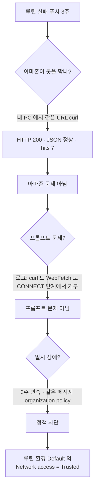

## 한 줄 요약

매주 월요일 amazon.jobs 를 확인하는 클라우드 루틴이 **9/7 · 9/14 · 9/21 세 번 연속 실패**했다. 원인은 프롬프트도 아마존도 아니고, **루틴이 도는 클라우드 환경의 네트워크 모드가 `Trusted`(패키지 저장소만 허용)** 라서 `amazon.jobs` 가 프록시에서 차단된 것이었다. 환경 설정을 바꾸자 그 자리에서 정상 실행됐고, **그 사이 놓쳤던 미국 기술직 공고 4건**이 첫 알림 메일로 나갔다.

## 이 루틴이 하는 일

| 항목 | 값 |
|---|---|
| 이름 | AWS WBLP 공고 주간 확인 |
| 일정 | 매주 월 08:00 PT (`0 15 * * 1` UTC) |
| 환경 | `Default` (anthropic_cloud) · 레포 없음 · 모델 claude-sonnet-5 |
| 도구 | WebFetch · WebSearch · Bash · Read · Write + **Gmail 커넥터** |
| 하는 일 | amazon.jobs 검색 JSON 4개를 읽고, **워싱턴주 공고 또는 미국 내 기술직 공고가 있을 때만** 한국어 메일 |
| 만든 날 | 2026-09-02 (Datacenter-Workforce-Programs Topic 에서) |

「조건 충족 시에만 메일」이라 **평소엔 아무 소식이 없는 게 정상**이다. 그래서 실패해도 조용했다.

## 실행 이력 (실측 — 세션 로그에서)

| 실행 | 결과 | 로그의 핵심 줄 |
|---|---|---|
| 9/7 (월) 08:07 | ❌ 4/4 쿼리 실패 → 푸시만 | `www.amazon.jobs:443 — connect_rejected (the egress proxy denied the CONNECT (organization policy))` |
| 9/14 (월) 08:07 | ❌ 동일 · 프록시 상태까지 조회 | `/__agentproxy/status` 의 허용 목록(noProxy)에 `api.anthropic.com · registry.npmjs.org · pypi.org …` 만 있음 |
| 9/21 (월) 08:07 | ❌ 동일 | WebFetch 도 `{"error_type":"EGRESS_BLOCKED","domain":"www.amazon.jobs"}` |
| **9/21 10:13 (복구 후 수동 실행)** | ✅ **4/4 HTTP 200** · 113초 | 미국 기술직 4건 발견 → **Gmail 발송** |

세 번 다 같은 자리에서 같은 이유로 죽었고, 루틴은 매번 「확인 못 했다」는 **푸시 알림만** 보냈다. 루틴의 판단은 옳았다 — 검색 엔진 스니펫(Indeed·Glassdoor)으로는 실제 공고 위치를 확인할 수 없으니 **메일을 안 보낸 것**이 맞다. 다만 그 푸시가 「루틴이 매주 실패한다」는 사실로 읽히기까지 3주가 걸렸다.

## 원인 진단 — 어떻게 좁혔나

결정적 증거 두 개:

1. **같은 URL 이 내 PC 에서는 200** — 아마존이 막는 게 아니다
2. 9/14 로그에서 루틴이 스스로 조회한 **프록시 허용 목록** — `Trusted` 모드는 패키지 저장소(npm · PyPI 등)와 Anthropic API 만 열어 둔다. WebSearch 만 됐던 이유도 여기 있다 — 검색 API 는 이 프록시를 안 거친다

## 해결 — 환경 설정 한 칸

설정은 **루틴이 아니라 환경**에 있다. 루틴 API(`schedule` 스킬의 `RemoteTrigger`)는 「어느 환경에서 돌릴지」만 고를 수 있고 환경의 네트워크 규칙은 못 건드린다. 사용자가 웹 UI 에서 직접 바꿨다.

| 단계 | 어디서 |
|---|---|
| 1 | https://claude.ai/code → **+ New** |
| 2 | 입력창 위 **`Default` 칩** 클릭 → 메뉴에서 **Cloud ›** |
| 3 | Default 환경 편집 (**Edit cloud environment** 창) |
| 4 | **Network access: Trusted ▾** → 허용 도메인에 `amazon.jobs` · `www.amazon.jobs` 추가 (또는 Full) |
| 5 | Save — 「새 세션부터 적용」 |

> 📌 처음엔 **Settings → Claude Code** 페이지에서 찾았는데 거기엔 없다. 그 페이지는 CLI·데스크톱 연결 관리용이고, 화면 아래에 *"Cloud sessions are managed separately. Go to Claude Code."* 라는 힌트만 있다. 환경 설정은 **앱 본체의 New 세션 패널** 안에 있다.

저장 직후 `RemoteTrigger run` 으로 수동 실행 → 4개 쿼리 전부 HTTP 200.

## 덤으로 잡힌 프롬프트 결함

복구된 실행에서 루틴이 **스스로** 발견했다: amazon.jobs API 는 `loc_query=Washington` 과 `country[]=USA` 를 **조용히 무시**한다 (응답의 `job_posting_search_request.location: null`). 그래서 쿼리 ②「워싱턴」은 ①과 같은 7건을, ④「fiber USA」는 스페인 공고를 돌려줬다. 3주 동안 결과가 없어서 티가 안 났을 뿐, 처음부터 틀린 URL 이었다.

내 PC 에서 검증한 뒤 루틴 프롬프트를 고쳤다:

| | 무시되는 파라미터 | 실제로 작동하는 파라미터 | 검증 결과 |
|---|---|---|---|
| 미국 한정 | `country[]=USA` | `normalized_country_code[]=USA` | 7건 → **5건 (스페인·일본 빠짐)** |
| 주 한정 | `loc_query=Washington` | `normalized_location[]=Washington, USA` | 0건 (정확 — WA 없음) |

프롬프트에는 「이 두 파라미터는 무시된다, 되돌리지 마라」와 「`filterFacets` 가 비어 있으면 필터가 안 먹은 것」을 명시했고, 기준선을 9/21 로 올려 **오늘 메일로 보낸 4건이 다음 주에 또 오지 않게** 했다.

## 결과

- 복구 실행에서 **WBLP Data Center Operations Technician** — Berwick PA ×2 (9/10) · Canton MS (9/8) · Boardman OR (6/5) — 발견 → 첫 알림 메일. 워싱턴은 여전히 0건
- 다음 정기 실행 9/28(월)부터 고친 프롬프트로 돈다
- Datacenter Topic 문서 3곳의 `country[]=USA` 도 같이 고쳤다

## 이 사례에서 배운 것 (영상용)

1. **「조건 충족 시에만 알림」 루틴은 실패도 조용하다.** 성공과 실패가 둘 다 「소식 없음」이면 사람은 구분 못 한다 → 실패는 반드시 다른 채널(푸시)로, 그리고 **월 1회는 실행 로그를 사람이 연다**
2. **환경과 루틴은 다른 층이다.** 루틴을 아무리 고쳐도 환경 정책은 안 바뀐다. 「클라우드에서 돈다」는 말은 「내 PC 와 다른 네트워크 규칙 아래서 돈다」는 뜻
3. **내 PC 에서 같은 요청을 한 번 해 보는 것**이 가장 빠른 진단이다 — 200 이 나오면 상대방 문제가 아니다
4. **API 가 파라미터를 조용히 무시할 수 있다.** 결과가 「없음」일 때 그게 진짜 없음인지 필터가 안 먹은 건지, 응답에 찍힌 실제 검색 조건으로 확인한다

## 관련

- [../troubleshooting/routine-did-not-run.md](../troubleshooting/routine-did-not-run.md) — 루틴이 안 돌았을 때 확인 순서 (이 사례로 만든 것)
- 실물 루틴: https://claude.ai/code/routines (AWS WBLP 공고 주간 확인)
- 원래 설계: `Datacenter-Workforce-Programs/08-Application-Execution/guides/application-checklist.md`
