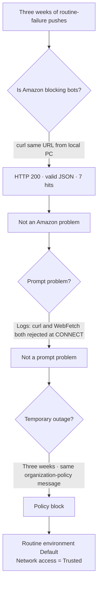

## In one sentence

The cloud routine that checks amazon.jobs every Monday failed three times in a row—Sep 7, 14, and 21. The cause was neither the prompt nor Amazon: the network mode of the cloud environment running the routine was `Trusted` (only package repositories allowed), so the proxy blocked `amazon.jobs`. Changing the environment settings let it run normally right away, and the first alert email included **four U.S. technical jobs missed in the meantime**.

## What this routine does

| Item | Value |
|---|---|
| Name | AWS WBLP weekly job-posting check |
| Schedule | Mondays at 08:00 PT (`0 15 * * 1` UTC) |
| Environment | `Default` (`anthropic_cloud`); no repository; model `claude-sonnet-5` |
| Tools | WebFetch, WebSearch, Bash, Read, Write, plus **Gmail connector** |
| Task | Read four amazon.jobs search JSON endpoints and email in Korean only when Washington postings or technical jobs in the U.S. match |
| Created | 2026-09-02 in the Datacenter-Workforce-Programs topic |

Because it emails only when conditions are met, **silence is normal most weeks**. That also made failures quiet.

## Run history (observed in session logs)

| Run | Result | Key log line |
|---|---|---|
| Sep 7, Mon 08:07 | ❌ All 4/4 queries failed; push only | `www.amazon.jobs:443 — connect_rejected (the egress proxy denied the CONNECT (organization policy))` |
| Sep 14, Mon 08:07 | ❌ Same; proxy status also checked | Allowlist (`noProxy`) at `/__agentproxy/status` included only `api.anthropic.com`, `registry.npmjs.org`, `pypi.org`, etc. |
| Sep 21, Mon 08:07 | ❌ Same | WebFetch returned `{"error_type":"EGRESS_BLOCKED","domain":"www.amazon.jobs"}` |
| **Sep 21, 10:13 (manual run after recovery)** | ✅ **4/4 HTTP 200**, 113 seconds | Found four U.S. technical jobs → **sent through Gmail** |
| **Sep 28, Mon 08:13 (first scheduled run after recovery)** | ✅ **4/4 HTTP 200**, 42 seconds, 7 turns | Found new **Frederick, Maryland — WBLP Data Center Operations Technician (posted Sep 21)** → sent Gmail email titled “AWS WBLP Job Alert — Frederick, Maryland” and a push. Zero Washington jobs. |

All three failures stopped at the same point for the same reason. Each time the routine sent only a push saying it could not check. Its decision was correct: search snippets from Indeed/Glassdoor could not verify the location of the actual job, so it was right not to email a job alert. But it took three weeks to recognize the push as evidence that the routine was failing every week.

## Diagnosis — how the cause was isolated

Two pieces of evidence were decisive:

1. **The same URL returned HTTP 200 on the local PC**—Amazon was not blocking it.
2. The routine’s own proxy allowlist check in the Sep 14 log showed `Trusted` allowed only package repositories (npm, PyPI, etc.) and Anthropic API. WebSearch still worked because the search API did not use this proxy.

## Fix — one environment setting

The setting belongs to the **environment, not the routine**. The routine API (`RemoteTrigger` in the `schedule` skill) selects which environment to use but cannot change its network rules. The user changed this in the web UI.

| Step | Location |
|---|---|
| 1 | Go to https://claude.ai/code → **+ New** |
| 2 | Click the **`Default` chip** above the input → choose **Cloud ›** |
| 3 | Edit the Default environment (the **Edit cloud environment** window) |
| 4 | **Network access: Trusted ▾** → add `amazon.jobs` and `www.amazon.jobs` to allowed domains (or choose Full) |
| 5 | Save; the change applies to new sessions |

> 📌 The setting was initially sought under **Settings → Claude Code**, but it is not there. That page manages CLI/desktop connections and only shows the hint, “Cloud sessions are managed separately. Go to Claude Code.” Environment settings are in the app’s **New session panel**.

Immediately after saving, a manual `RemoteTrigger run` returned HTTP 200 for all four queries.

## An additional prompt defect found during recovery

The recovered run discovered that the amazon.jobs API silently ignored `loc_query=Washington` and `country[]=USA` (the response had `job_posting_search_request.location: null`). As a result, query ② “Washington” returned the same seven jobs as query ①, while query ④ “fiber USA” returned jobs in Spain. These URLs had been wrong from the start; three weeks with no results had hidden the problem.

After checking locally, the routine prompt was corrected:

| Filter | Ignored parameter | Parameter that works | Verified result |
|---|---|---|---|
| U.S. only | `country[]=USA` | `normalized_country_code[]=USA` | 7 jobs → **5** (Spain and Japan removed) |
| State only | `loc_query=Washington` | `normalized_location[]=Washington, USA` | 0 jobs (correct; no WA result) |

The prompt now says not to revert those parameters and that empty `filterFacets` means a filter did not apply. The baseline was advanced to Sep 21 so the four jobs emailed during recovery would not be sent again the following week.

## Results

- The recovery run found four **WBLP Data Center Operations Technician** postings—Berwick, PA ×2 (Sep 10), Canton, MS (Sep 8), and Boardman, OR (Jun 5)—and sent the first alert email. Washington remained at zero.
- The corrected prompt was used from the next scheduled run, Sep 28.
- `country[]=USA` was also corrected in three Datacenter topic documents.

## First scheduled run after recovery — Monday, 2026-09-28

**The first scheduled run after the environment fix succeeded without human intervention.** Session `cse_01RYovkjpfhd1umJMb7T3H85` began at 08:13:48 (scheduled 08:12), then finished in 42 seconds and 7 turns. All four queries returned HTTP 200 and `filterFacets` was populated, confirming the corrected `normalized_country_code[]` and `normalized_location[]` parameters.

| Query | Result |
|---|---|
| ① Work-based learning · U.S. | 6 jobs; **2 new**: Frederick, MD data-center operations technician (posted Sep 21) and Canton, MS logistics (Sep 24). Baseline of 4: Berwick, PA technical; Canton, MS technical; Boardman, OR technical; New Albany, OH logistics. |
| ② Work-based learning · Washington | 0 |
| ③ Data center technician · Washington | 0 |
| ④ Fiber technician · U.S. | 0 |

The routine treated Frederick, MD as a technical job not in the baseline and sent an alert under condition ②. Canton, MS logistics was excluded by the rule not to alert on logistics. The user confirmed the email in the inbox on Sep 29 (capture). One of the two Berwick, PA technical roles in the baseline was no longer listed; the routine noted it appeared closed.

~~**Remaining risk:** The prompt baseline stopped at Sep 21, so if Frederick, MD remained open the following week, it might be sent again.~~ ✅ **Resolved Sep 29** at the user’s request (“Add the 9/28 results to the baseline”). `RemoteTrigger update` changed only one baseline sentence to **“Baseline as of 2026-09-28”**: Frederick, MD technical (posted Sep 21; emailed Sep 28); Berwick, PA (2 on Sep 21 → 1 on Sep 28); Canton, MS; Boardman, OR technical; Canton, MS (Sep 24); and New Albany, OH logistics. Schedule (`0 15 * * 1`), Gmail connector, tools, and all other prompt content stayed as they were. The next run was Monday, Oct 5 at 08:12 PDT.

> 💡 A baseline written into the prompt must be updated manually every week. The routine could instead use Gmail to find the last alert email and treat it as the baseline. Since this runs once a week, manual updates are sufficient for now.

## What this case taught us (for the video)

1. A routine that notifies only when conditions match can fail silently too. If success and failure both look like “no news,” people cannot tell them apart. Send failures through another channel (push), and have a person inspect the run log at least once a month.
2. The environment and routine are different layers. Editing a routine does not change environment policy. “Runs in the cloud” also means “runs under network rules different from my PC.”
3. Trying the same request once from the local PC is the fastest diagnosis. If it returns 200, the remote site is not the problem.
4. An API can silently ignore parameters. When results say “none,” use the actual search conditions returned in the response to check whether there truly were no results or whether the filter failed.

## Related

- [Troubleshooting sequence](../troubleshooting/routine-did-not-run_en.md), written from this case
- Live routine: https://claude.ai/code/routines (AWS WBLP weekly job search)
- Original design: `Datacenter-Workforce-Programs/08-Application-Execution/guides/application-checklist.md`

[Korean original](wblp-routine-audit.md) · [M4 overview](../README_en.md)
