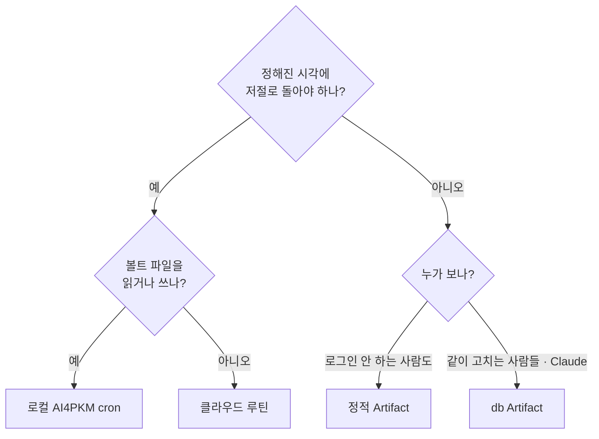

## 이 문서

Claude 로 **공유 페이지(Artifact)** 나 **자동 작업(Routine)** 을 만들기 전에 여는 한 장이다. 2026-09-01~09-27 에 직접 만들고 고치며 확인한 것만 담았다. 기능 규칙은 runtime contract 0.2.60 과 Claude Code 공식 문서(research preview) 기준이라 바뀔 수 있다. 이 문서가 M6 영상 대본의 뼈대다.

## 1. 무엇을 만들까 — 세 질문

## 2. Artifact 만들 때

**기능 고르기** — 「누가 볼 수 있어야 하나」로 고른다. 전체 표 → [기능 선택표](../../03-Artifacts-Capabilities-Lab/concepts/capability-selection-table.md)

| 하고 싶은 일 | 기능 |
|---|---|
| 링크 하나로 누구에게나 | 정적 페이지 (capability 없음) |
| 여러 사람이 같이 고치고 Claude 가 읽기 | `db` (+ 누가 바꿨나는 `user`) |
| 이미지 · 배치도 · PDF | `assets` |
| 문단마다 의견 · Claude 에게 보내기 | `comments` (`composer_only`) |
| 나만 기억하면 되는 것 (탭 위치) | 브라우저 저장 |

**체크리스트**

- [ ] 공유 대상에 로그인 안 하는 사람이 있으면 **정적 스냅샷을 따로** 만든다 (패턴 1 · 안티패턴 2)
- [ ] 스냅샷을 고칠 때 **「언제 것」 표시도** 고친다 (안티패턴 4)
- [ ] 이미지는 HTML 에 넣지 말고 **assets** 로 (안티패턴 9)
- [ ] Claude 세션이 데이터를 고칠 땐 **`if_version`** (패턴 2)
- [ ] 여러 사람이 올리는 숫자를 페이지에서 「읽고 +1」로 만들지 않는다 (패턴 2)
- [ ] 고친 뒤 공유 버전은 **Latest**, 확인은 **시크릿 창** (패턴 6 · 안티패턴 1)
- [ ] 만든 날 **URL 을 볼트에** 적는다 (안티패턴 3)
- [ ] 「이 계정에서 안 된다」는 결론은 **최소 예제로 실측한 뒤에만** (안티패턴 10)

## 3. Routine 만들 때

**어디서 돌릴까** — 볼트를 쓰면 로컬, 외부만 보면 클라우드. 전체 표 → [판단표](../../04-Routines-Lab/concepts/local-vs-cloud.md)

**체크리스트**

- [ ] 알림은 **조건부 / 항상** 중 목적으로 고르고, 조건부면 **실패를 다른 채널로** (패턴 3 · 안티패턴 5)
- [ ] 외부 사이트를 읽으면 환경의 **Network access** 에 도메인 추가 — 커넥터(Gmail · 캘린더)는 필요 없음 (패턴 5)
- [ ] 외부 API 파라미터는 **내 PC 에서 먼저** 적용되는지 확인 (안티패턴 6)
- [ ] 커넥터는 **필요한 것만** 남긴다 — 포함된 커넥터는 쓰기도 묻지 않는다
- [ ] 시각은 정각을 피해 `:07` 처럼 — 그래도 1분 안팎 늦을 수 있다
- [ ] 만들면 **Run now 나 가까운 일회성 실행**으로 바로 확인 — 다음 주를 기다리지 않는다
- [ ] 실행 목록의 초록색을 믿지 말고 **로그를 연다** (`list_runs` → `get_run_log`), 월 1회는 사람이
- [ ] 안 돌았으면 → [루틴이 안 돌았을 때](../../04-Routines-Lab/troubleshooting/routine-did-not-run.md)

## 4. 실물 — 따라 해 볼 예시

| 실물 | 무엇을 보여 주나 | 공개 범위 |
|---|---|---|
| [db 카운터](https://claude.ai/artifact/8p4xaEhHXB6PQyzDZfy3os) | 페이지 ↔ 세션 db 왕복 · `if_version` | 비공개 (작성자만) |
| [누가 보고 있나](https://claude.ai/artifact/2ofKVvCX9eW1dyoXYcPpdD) | `user` — 보는 사람 이름 · 권한 | 비공개 |
| [이미지 보관함](https://claude.ai/artifact/EXRfAfWCLDNE89HG5jqc6s) | `assets` — 세션 업로드 → 페이지 표시 | 비공개 |
| [댓글 받는 문서](https://claude.ai/artifact/AaVvLju4haYcDktsR9StFA) | `comments` — 문단 댓글 · Send to Claude | 비공개 |
| [파일 나눠 발행](https://claude.ai/artifact/J5KcHHynLoAd3MRkorftTR) | HTML · CSS · JSON 을 함께 발행 | 비공개 |
| [Builders Lounge 입장 안내](https://claude.ai/artifact/Vs9GEkCtEXsyRdT5kvyF7s) | 공유용 정적 페이지 · 버전 Latest | 공개 공유 중 |
| [WBLP 주간 확인](https://claude.ai/code/routines/trig_01LKgvHWt4ZfJbTqJgn5KvVT) | 반복 · 외부 웹 · 조건부 알림 | 작성자만 |
| [내일 일정 미리보기](https://claude.ai/code/routines/trig_01TyCwrfL1H3vsmdkmcDS8xk) | 일회성 · 커넥터만 · 항상 알림 | 작성자만 |

> 실습 예제는 모두 **비공개**로 두었다 — 다른 사람에게 보이려면 작성자가 Share 메뉴에서 공유해야 한다. db · user · assets 를 쓰는 셋은 조직 안에서만 공유된다.

## 더 읽기

[패턴 카드 6장](patterns.md) · [안티패턴 10개](anti-patterns.md) · M3 [db 왕복 실측](../../03-Artifacts-Capabilities-Lab/guides/db-roundtrip.md) · M4 [WBLP 3주 실패 진단](../../04-Routines-Lab/guides/wblp-routine-audit.md)
