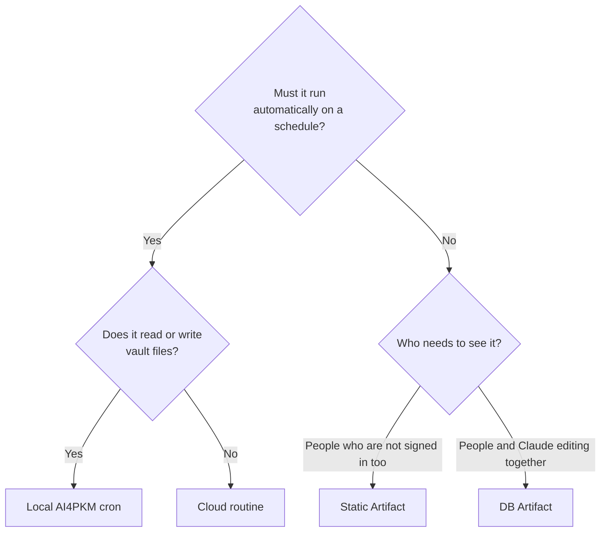

## About this document

This is a one-page guide to open before making a **shared page (Artifact)** or an **automated task (Routine)** with Claude. It includes only what was built, changed, and checked directly between 2026-09-01 and 2026-09-27. Capability rules follow runtime contract 0.2.60 and Claude Code official documentation (research preview), so they may change. This document is the backbone of the M6 video script.

## 1. What should you build? Ask three questions

## 2. When building an Artifact

**Choose capabilities based on who needs to see the data.** See the full [capability selection table](../../03-Artifacts-Capabilities-Lab/concepts/capability-selection-table_en.md).

| Need | Capability/approach |
|---|---|
| One link that anyone can view | Static page (no capability) |
| Several people edit together and Claude reads it | `db` (add `user` to track who changed it) |
| Images, floor plans, or PDFs | `assets` |
| Comments on sections and sending comments to Claude | `comments` (`composer_only`) |
| Remember something only for myself (such as tab position) | Browser storage |

**Checklist**

- [ ] If viewers include people who will not sign in, create a **separate static snapshot** (pattern 1; anti-pattern 2).
- [ ] When updating a snapshot, also update its **“as of” date/label** (anti-pattern 4).
- [ ] Put images in **assets**, not in the HTML (anti-pattern 9).
- [ ] Use **`if_version`** when a Claude session edits data (pattern 2).
- [ ] Do not implement a shared counter by “read, add 1, write” in the page (pattern 2).
- [ ] After editing, set the shared version to **Latest** and check in an **incognito window** (pattern 6; anti-pattern 1).
- [ ] Record the **URL in the vault on the day you create it** (anti-pattern 3).
- [ ] Do not conclude that something is “unavailable on this account” until you test a **minimal example** (anti-pattern 10).

## 3. When creating a Routine

**Where should it run?** Local if it uses the vault; cloud if it only needs external services. See the full [local vs. cloud decision table](../../04-Routines-Lab/concepts/local-vs-cloud_en.md).

**Checklist**

- [ ] Choose **conditional or always-send** notifications based on purpose. For conditional notifications, route failures through another channel (pattern 3; anti-pattern 5).
- [ ] If it reads an external website, allow its domain under the environment’s **Network access**. Connectors (Gmail/Calendar) do not need this (pattern 5).
- [ ] Verify external API parameters on the **local PC first** (anti-pattern 6).
- [ ] Keep only **necessary connectors**; included connectors may perform writes without asking again.
- [ ] Avoid scheduling exactly on the hour; try `:07`, but it may still start about a minute late.
- [ ] Test immediately with **Run now or a nearby one-time run**; do not wait until next week.
- [ ] Do not trust the green icon in the run list; **open the log** (`list_runs` → `get_run_log`). A person should inspect it monthly.
- [ ] If it did not run, follow [When a routine does not run](../../04-Routines-Lab/troubleshooting/routine-did-not-run_en.md).

## 4. Real examples to follow

| Example | What it demonstrates | Sharing |
|---|---|---|
| [DB counter](https://claude.ai/artifact/8p4xaEhHXB6PQyzDZfy3os) | Page ↔ session DB round trip; `if_version` | Private (author only) |
| [Who is viewing?](https://claude.ai/artifact/2ofKVvCX9eW1dyoXYcPpdD) | `user`: viewer name and permissions | Private |
| [Image library](https://claude.ai/artifact/EXRfAfWCLDNE89HG5jqc6s) | `assets`: session upload → page display | Private |
| [Document with comments](https://claude.ai/artifact/AaVvLju4haYcDktsR9StFA) | `comments`: comments on sections; Send to Claude | Private |
| [Publishing multiple files](https://claude.ai/artifact/J5KcHHynLoAd3MRkorftTR) | Publish HTML, CSS, and JSON together | Private |
| [Builders Lounge event entry guide](https://claude.ai/artifact/Vs9GEkCtEXsyRdT5kvyF7s) | Static page for sharing; version set to Latest | Publicly shared |
| [Weekly WBLP check](https://claude.ai/code/routines/trig_01LKgvHWt4ZfJbTqJgn5KvVT) | Recurring schedule, external web, conditional notification | Author only |
| [Tomorrow’s calendar preview](https://claude.ai/code/routines/trig_01TyCwrfL1H3vsmdkmcDS8xk) | One-time schedule, connectors only, always notifies | Author only |

All lab examples are **private**. The author must share them from the Share menu before others can see them. The examples using `db`, `user`, or `assets` can only be shared within an organization.

## Read more

[Six pattern cards](patterns_en.md) · [Ten anti-patterns](anti-patterns_en.md) · M3 [database round-trip test](../../03-Artifacts-Capabilities-Lab/guides/db-roundtrip_en.md) · M4 [WBLP three-week failure diagnosis](../../04-Routines-Lab/guides/wblp-routine-audit_en.md)

[Korean original](artifacts-routines-playbook.md) · [M5 overview](../README_en.md)
