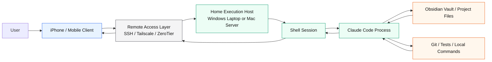
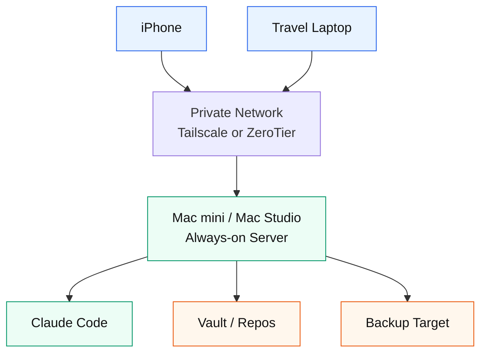

# 실행 흐름 다이어그램

## 기본 구조

## 실행 위치 해석

| 흐름 | 사용자가 보는 것 | 실제 위치 |
|---|---|---|
| 명령 입력 | iPhone에서 텍스트 입력 | 모바일 |
| 원격 전달 | SSH/VPN 연결을 통해 터미널에 입력 전달 | 네트워크 계층 |
| shell 실행 | PowerShell, Bash, Zsh 등 | 집 머신 |
| Claude Code 실행 | `claude` interactive session 또는 CLI 명령 | 집 머신 |
| 파일 읽기/쓰기 | vault/repo 변경 | 집 머신의 파일 시스템 |
| 결과 표시 | 모바일 화면에 출력 표시 | 집 머신 출력이 모바일로 전달 |

## 홈서버 확장 구조

이 구조에서는 맥미니 또는 맥 스튜디오가 상시 실행 호스트가 되고, iPhone과 노트북은 모두 클라이언트 역할을 한다. 장점은 작업 위치가 한 곳으로 모인다는 점이고, 단점은 서버 운영, 백업, 절전, 원격 접속 보안을 지속적으로 관리해야 한다는 점이다.
