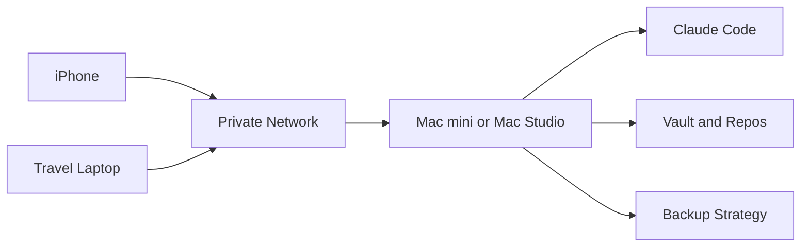

# 맥미니 vs 맥 스튜디오 홈서버 도입 판단표

## 전제

목표는 집에 상시 실행 호스트를 두고, iPhone과 노트북에서 접속해 Claude Code 작업을 이어가는 것이다. 노트북은 이동 작업기, 홈서버는 실제 실행 호스트가 된다.

이번 단계에서는 실제 구매를 결정하지 않는다. 현재 Windows 노트북 1차 실험 후, 상시 서버가 필요한지 확인한 뒤 도입 여부를 판단한다.

## 역할 비교

| 항목 | 맥미니 홈서버 | 맥 스튜디오 홈서버 | 현재 Windows 노트북 유지 |
|---|---|---|---|
| 초기 비용 | 중간 | 높음 | 없음 |
| 상시 전력/소음 | 유리 | 상대적으로 불리 | 노트북 사용 패턴에 따라 불안정 |
| Claude Code 서버 | 충분할 가능성 높음 | 충분하지만 과함 | 검증용으로 충분 |
| Remotion 렌더링 | 가능, 규모 확인 필요 | 유리 | 가능하나 이동/절전 영향 |
| 저장공간 확장 | 외장 SSD/NAS 전략 필요 | 외장 SSD/NAS 전략 필요 | 기존 구조 유지 |
| 원격 접속 | macOS Remote Login/SSH | macOS Remote Login/SSH | Windows OpenSSH |
| 노트북 이동 작업기 분리 | 좋음 | 좋음 | 분리 안 됨 |
| 운영 난이도 | 중간 | 중간 | 낮음-중간 |
| 추천 위치 | 2차 우선 후보 | 고부하 확인 후 후보 | 1차 실험용 |

## 맥미니가 적합한 경우

맥미니는 Claude Code, Git, Node.js, Obsidian vault, 일반 자동화, 가벼운 Remotion 작업을 집 서버에 모으려는 목적에 잘 맞는다. 항상 켜둘 장비로 운용하기 쉽고, 노트북을 이동 작업기로 분리하는 구조를 만들기에 비용과 성능의 균형이 좋다.

추천 조건:
- 집에 항상 켜진 실행 호스트가 필요하다는 것이 1차 실험에서 확인된다.
- Claude Code 중심 작업이 대부분이다.
- Remotion 렌더링은 가끔 하거나, 렌더링 규모가 크지 않다.
- 서버 운영보다 사용 안정성이 목적이다.

## 맥 스튜디오가 적합한 경우

맥 스튜디오는 Claude Code만을 위해서는 과한 선택일 수 있다. 다만 Remotion 영상 작업, 대용량 미디어, 로컬 AI 실험, 다수의 장시간 작업을 홈서버에서 동시에 처리하려는 요구가 명확하면 후보가 된다.

추천 조건:
- Remotion 렌더링을 자주 하고 시간이 병목이다.
- 대용량 영상/이미지/AI 작업을 서버에서 처리한다.
- 비용보다 성능 여유가 중요하다.
- 홈서버가 개발 서버이자 미디어 워크스테이션 역할을 겸한다.

## 현재 Windows 노트북을 먼저 쓰는 이유

현재 노트북으로 먼저 실험하면 구매 전에 다음 질문에 답할 수 있다.

- 모바일에서 원격 터미널로 Claude Code를 조작하는 경험이 실제로 편한가?
- 외부에서 작업할 때 가장 큰 문제는 네트워크인가, 인증인가, 세션 유지인가, 화면 크기인가?
- 상시 서버가 꼭 필요한가, 아니면 노트북 절전 설정만 조정해도 충분한가?
- vault 동기화와 Git 작업이 원격 환경에서 안전한가?
- Remotion 영상 작업까지 서버로 넘길 필요가 있는가?

## 구매 전 확인 질문

1. 집 밖에서 Claude Code를 쓰는 빈도는 주 몇 회인가?
2. 원격 작업 1회당 평균 세션 길이는 어느 정도인가?
3. 노트북을 집에 두고 다니는 일이 많은가, 아니면 항상 들고 다니는가?
4. Obsidian vault와 프로젝트 repo는 서버 한 곳에 모을 것인가, 여러 장치에 동기화할 것인가?
5. 백업은 Time Machine, 외장 SSD, NAS, cloud 중 무엇을 쓸 것인가?
6. Remotion 렌더링을 서버에 맡길 실제 필요가 있는가?
7. 서버 장애 시 노트북에서 바로 작업을 이어갈 수 있어야 하는가?
8. 원격 접속 계정은 개인 계정 하나로 충분한가, 별도 제한 계정이 필요한가?

## 권장 도입 순서

1. 현재 Windows 노트북으로 Tailscale/SSH/Claude Code 1차 실험을 한다.
2. 외부 작업 빈도와 불편 지점을 WorkLog에 기록한다.
3. 상시 실행 호스트 필요성이 확인되면 맥미니를 1차 구매 후보로 검토한다.
4. Remotion 렌더링이나 고부하 작업이 반복 병목으로 확인될 때만 맥 스튜디오를 재검토한다.
5. 구매 전 저장공간/백업/원격 로그인/계정 권한 설계를 먼저 확정한다.

## 홈서버 운영 기본 구조

## 참조

- Apple Remote Login support: https://support.apple.com/guide/mac-help/allow-a-remote-computer-to-access-your-mac-mchlp1066/mac
- Tailscale SSH docs: https://tailscale.com/docs/features/tailscale-ssh
- GitHub Codespaces docs: https://docs.github.com/en/codespaces/about-codespaces/what-are-codespaces
