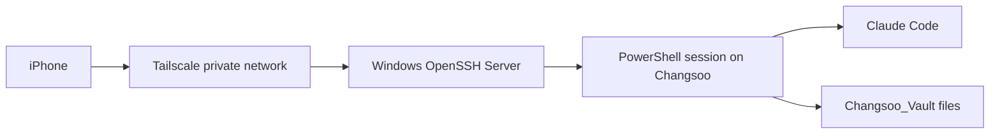

# M4 실험 절차서

## 실험 질문

iPhone에서 명령을 입력했을 때 실제 실행과 파일 변경은 집 Windows 노트북에서 일어나는가?

## 대상 구조



## 접속 정보

| 항목 | 값 |
|---|---|
| SSH 사용자 | `dougg` |
| Tailscale IP | `100.109.17.103` |
| MagicDNS 후보 | `changsoo.tail8af0a9.ts.net` |
| SSH 포트 | `22` |
| 원격 실행 호스트 | Windows 노트북 `Changsoo` |
| Vault 경로 | `C:\AI_study\2026\Changsoo_Vault` |

## 실험 단계

### 1. 서버 쪽 사전 검증

노트북에서 다음 상태가 맞아야 한다.

```powershell
Get-Service sshd,Tailscale
Test-NetConnection 127.0.0.1 -Port 22
```

성공 기준:
- `sshd`가 `Running`
- `Tailscale`이 `Running`
- TCP 22 테스트가 성공

### 2. iPhone 준비

iPhone에서 다음을 준비한다.

| 항목 | 권장 |
|---|---|
| VPN 앱 | Tailscale |
| SSH 앱 | Termius 또는 Blink Shell |
| 접속 주소 | `100.109.17.103` 우선, 실패 시 `changsoo.tail8af0a9.ts.net` |
| 사용자명 | `dougg` |
| 인증 | Windows 계정 비밀번호로 1차 테스트 |

### 3. SSH 접속 확인

iPhone SSH 앱에서 접속 후 다음 명령을 실행한다.

```powershell
hostname
whoami
$PWD.Path
```

성공 기준:
- `hostname` 결과가 `Changsoo`
- `whoami` 결과가 `changsoo\dougg`
- PowerShell 또는 Windows shell prompt가 표시됨

### 4. Claude Code 실행 확인

원격 세션에서 다음 명령을 실행한다.

```powershell
claude --version
```

성공 기준:
- Claude Code 버전이 출력됨
- 실행 위치가 iPhone이 아니라 Windows 노트북임을 설명할 수 있음

### 5. 안전한 파일 변경 검증

실험 전용 파일만 생성한다.

```powershell
cd C:\AI_study\2026\Changsoo_Vault\Ingest\CatchUpAI_VL\Topics\Claude-Code-Mobile-Remote-Execution\04-Remote-Execution-Lab\lab
"M4 remote write test from iPhone SSH - $(Get-Date -Format o)" | Out-File -Encoding utf8 .\m4-remote-write-test.txt
Get-Content .\m4-remote-write-test.txt
```

성공 기준:
- 파일이 노트북 vault 경로에 생성됨
- 같은 파일을 이 Codex 세션에서 읽을 수 있음
- 파일 내용의 시간이 원격 세션에서 생성된 시간과 일치함

## 중단 기준

- Tailscale iPhone 로그인 실패
- SSH 접속이 반복적으로 timeout
- Windows 계정 비밀번호 인증 실패
- 원격 세션에서 예상하지 않은 권한 상승 요구
- vault 외부 파일 변경이 필요해지는 경우

