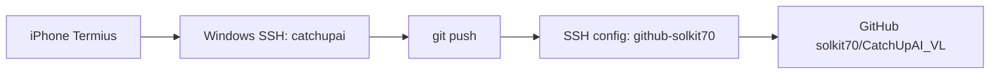

# GitHub Push 계정 고정과 로컬 결과 확인 방법

## 문제 정의

현재 `Ingest/CatchUpAI_VL` 저장소의 remote는 HTTPS 방식이다.

```text
origin https://github.com/solkit70/CatchUpAI_VL.git
```

Windows 데스크톱에서 push할 때는 Git Credential Manager가 계정 선택 팝업을 띄울 수 있다. 하지만 iPhone에서 Termius로 접속한 SSH 세션에서는 그 GUI 팝업을 조작하기 어렵다. 따라서 모바일 원격 작업에서는 GitHub push 인증을 GUI 팝업이 없는 방식으로 고정해야 한다.

## 현재 로컬 확인 결과

2026-08-24 기준 현재 확인된 값은 다음과 같다.

| 항목 | 현재 값 | 판단 |
|---|---|---|
| Git commit user.name | `solkit70` | 이미 주 계정 기준 |
| Git commit user.email | `solkit70@users.noreply.github.com` | GitHub noreply 주소 사용 |
| origin fetch/push | `https://github.com/solkit70/CatchUpAI_VL.git` | GitHub 계정 선택 팝업 가능 |
| template fetch/push | `https://github.com/solkit70/CatchUpAI_VL_Template.git` | GitHub 계정 선택 팝업 가능 |
| `catchupai` SSH key | 미생성 | GitHub 등록 필요 |

따라서 “어느 GitHub 계정으로 push할 것인가”는 이미 `solkit70` 저장소로 정해져 있지만, “어떤 인증 방식으로 push할 것인가”가 아직 HTTPS/Git Credential Manager에 남아 있다. 모바일 원격 운영에서는 이 부분을 SSH key 방식으로 전환해야 GUI 팝업 문제를 없앨 수 있다.
## 권장 결론

주로 사용하는 GitHub 계정이 `solkit70` 하나라면, 모바일 원격 작업용 `catchupai` Windows 계정에는 GitHub SSH key를 하나 만들고, 이 저장소의 remote를 SSH alias로 고정하는 방식이 가장 단순하다.



## 목표 상태

```text
origin git@github-solkit70:solkit70/CatchUpAI_VL.git
```

SSH config:

```sshconfig
Host github-solkit70
  HostName github.com
  User git
  IdentityFile C:\Users\catchupai\.ssh\id_github_solkit70
  IdentitiesOnly yes
```

이 상태가 되면 모바일 SSH 세션에서 다음 명령을 실행해도 Windows GUI 계정 선택 팝업에 의존하지 않는다.

```bash
git push origin main
```

## 안전한 적용 순서

### 1. `catchupai` 계정에서 SSH key 생성

이 단계는 GitHub에 push할 수 있는 인증 수단을 로컬 머신에 저장하는 작업이다. private key는 비밀번호와 같은 수준으로 보호해야 한다.

권장 명령:

```cmd
ssh-keygen -t ed25519 -C "solkit70 mobile remote push" -f C:\Users\catchupai\.ssh\id_github_solkit70
```

passphrase는 운영 편의와 보안 사이의 선택이다.

| 방식 | 장점 | 단점 |
|---|---|---|
| passphrase 있음 | private key 유출 시 추가 방어 | push 때 passphrase 입력 필요 |
| passphrase 없음 | 모바일에서 `git push`가 가장 단순 | 노트북 계정/파일 탈취 시 GitHub push 위험 증가 |

현재 학습 환경에서는 passphrase 있는 key를 먼저 권장한다. 정말 자동 push가 필요할 때만 별도 승인 후 passphrase 없는 key를 검토한다.

### 2. public key 확인

```cmd
type C:\Users\catchupai\.ssh\id_github_solkit70.pub
```

출력되는 한 줄 전체를 GitHub에 등록한다. `.pub` 파일은 공개키이므로 GitHub에 등록해도 된다. private key인 `id_github_solkit70` 파일은 절대 복사하거나 공유하지 않는다.

### 3. GitHub solkit70 계정에 public key 등록

GitHub 웹에서 다음 경로로 이동한다.

```text
GitHub > Settings > SSH and GPG keys > New SSH key
```

추천 Title:

```text
Changsoo Windows catchupai mobile remote
```

Key에는 `id_github_solkit70.pub` 내용을 붙여 넣는다.

### 4. SSH config 추가

```cmd
notepad C:\Users\catchupai\.ssh\config
```

아래 내용을 추가한다.

```sshconfig
Host github-solkit70
  HostName github.com
  User git
  IdentityFile C:\Users\catchupai\.ssh\id_github_solkit70
  IdentitiesOnly yes
```

### 5. SSH 연결 테스트

```cmd
ssh -T git@github-solkit70
```

성공하면 GitHub가 다음과 비슷하게 응답한다.

```text
Hi solkit70! You've successfully authenticated, but GitHub does not provide shell access.
```

### 6. repo remote 변경

`Ingest/CatchUpAI_VL` 저장소에서만 변경한다.

```cmd
cd C:\AI_study\2026\Changsoo_Vault\Ingest\CatchUpAI_VL
git remote set-url origin git@github-solkit70:solkit70/CatchUpAI_VL.git
git remote -v
```

이후 push:

```cmd
git push origin main
```

## 두 계정 운영 시 확장 방식

나중에 다른 GitHub 계정으로도 push해야 한다면 key와 host alias를 하나 더 만든다.

```sshconfig
Host github-solkit70
  HostName github.com
  User git
  IdentityFile C:\Users\catchupai\.ssh\id_github_solkit70
  IdentitiesOnly yes

Host github-other
  HostName github.com
  User git
  IdentityFile C:\Users\catchupai\.ssh\id_github_other
  IdentitiesOnly yes
```

repo마다 remote를 다르게 고정한다.

```cmd
git remote set-url origin git@github-solkit70:solkit70/CatchUpAI_VL.git
git remote set-url origin git@github-other:OTHER_ACCOUNT/OTHER_REPO.git
```

이렇게 하면 repo가 어떤 GitHub 계정으로 push할지 스스로 결정한다.

## GitHub에 push하지 않고 결과 확인하기

모바일 원격 작업에서는 반드시 GitHub에 push해야만 결과를 볼 수 있는 것은 아니다. 오히려 작은 확인은 로컬에서 끝내는 편이 안전하다.

### 1. Git 상태 확인

```cmd
cd C:\AI_study\2026\Changsoo_Vault\Ingest\CatchUpAI_VL
git status --short
```

용도:
- 어떤 파일이 바뀌었는지 빠르게 확인
- 예상하지 않은 변경이 있는지 확인
- push 전 검토

### 2. 변경 요약 확인

```cmd
git diff --stat
```

용도:
- 파일별 변경 줄 수 확인
- 대량 변경 여부 확인
- 모바일 화면에서 전체 diff를 보기 전 1차 판단

### 3. 실제 diff 확인

```cmd
git diff
```

용도:
- 텍스트 문서나 작은 코드 수정 확인
- Claude Code가 바꾼 내용을 push 전 검토

주의:
- 모바일 화면에서 긴 diff는 보기 어렵다.
- 긴 diff는 `git diff --stat`로 먼저 범위를 줄인다.

### 4. 파일 직접 보기

```cmd
type path\to\file.md
```

예:

```cmd
type Topics\Claude-Code-Mobile-Remote-Execution\05-Operations-Security\guides\remote-work-runbook.md
```

용도:
- 문서 결과 확인
- Claude Code가 만든 요약문 확인

### 5. Termius SFTP로 파일 탐색

Termius의 `Connect via SFTP`를 사용하면 GitHub에 push하지 않아도 Windows 노트북의 파일을 모바일에서 탐색할 수 있다.

권장 확인 대상:

```text
C:\AI_study\2026\Changsoo_Vault\Ingest\CatchUpAI_VL\Topics
```

용도:
- 생성된 Markdown 파일 열람
- 폴더 구조 확인
- 작은 파일 다운로드/공유

주의:
- SFTP에서 실수로 파일을 삭제하지 않는다.
- 편집은 가능하면 Claude Code/터미널에서 하고, SFTP는 확인 중심으로 쓴다.

### 6. 로컬 commit까지만 만들기

push하지 않고 변경 단위를 고정할 수 있다.

```cmd
git add path\to\file
git commit -m "Update remote execution operations guide"
git show --stat
```

용도:
- 작업 내용을 로컬 Git 이력에 저장
- 나중에 노트북 앞에서 push
- 모바일에서 작업 단위를 분리

주의:
- commit 전에 `git diff --cached`로 staging 내용을 확인한다.

### 7. 로컬 웹 서버를 Tailscale로 보기

웹사이트나 앱 작업은 GitHub push 없이 iPhone Safari에서 바로 볼 수 있다.

예:

```cmd
npm run dev -- --host 100.109.17.103
```

iPhone Safari:

```text
http://100.109.17.103:5173
```

용도:
- Vite/React/Remotion preview 같은 로컬 서버 확인
- 모바일 화면에서 실제 UI 확인

주의:
- dev server 포트가 Windows 방화벽에 막힐 수 있다.
- 필요한 경우에도 공개 포트가 아니라 Tailscale 대역만 허용해야 한다.

### 8. Claude Code에게 리뷰 요약 파일 만들게 하기

GitHub push 전에 Claude Code에게 변경 요약을 파일로 만들게 할 수 있다.

예시 요청:

```text
현재 변경된 파일을 확인하고, push 전에 검토할 요약을 review-summary.md로 작성해 주세요.
민감 정보나 대량 변경이 있는지도 확인해 주세요.
```

그 다음:

```cmd
type review-summary.md
```

## 추천 운영 패턴

일상적인 모바일 원격 작업은 다음 순서가 좋다.

```text
1. iPhone Termius 접속
2. hostname / whoami / cd 확인
3. git status --short 확인
4. Claude Code로 작은 작업 수행
5. git diff --stat 확인
6. 필요한 파일만 type 또는 SFTP로 확인
7. 필요하면 로컬 commit
8. push는 SSH key 설정이 끝난 repo에서만 실행
```

## 영상화 포인트

이 주제는 영상에서 “모바일 원격 AI 코딩의 숨은 난점”으로 설명하기 좋다.

핵심 메시지:
- 모바일에서 Claude Code를 실행하는 것보다, 인증과 확인 루틴이 더 중요하다.
- GUI 팝업에 의존하는 GitHub 인증은 원격 SSH 운영과 맞지 않는다.
- repo별 SSH alias로 push 계정을 고정하면 계정 선택 문제를 없앨 수 있다.
- GitHub에 push하지 않아도 `git diff`, SFTP, 로컬 preview로 충분히 확인할 수 있다.
## 실제 적용 결과 - 2026-08-24

모바일/iPad 원격 작업 기준 GitHub push 계정 고정 설정을 적용했다.

| 항목 | 결과 |
|---|---|
| GitHub 계정 | `solkit70` |
| SSH key title | `catchupai mobile remote` |
| SSH key 등록 | GitHub `solkit70` 계정에 등록 완료 |
| SSH alias | `github-solkit70` |
| origin remote | `git@github-solkit70:solkit70/CatchUpAI_VL.git` |
| `git ls-remote origin HEAD` | 성공, `db1f17b495b3ffd88c8700986fe267b37d7435f8 HEAD` |
| `catchupai` safe.directory | `C:/AI_study/2026/Changsoo_Vault/Ingest/CatchUpAI_VL` 등록 완료 |

### 적용 중 발생한 이슈

`catchupai` 계정으로 `dougg` 소유의 repo에 접근하자 Git이 `dubious ownership` 보호 장치를 동작시켰다. 이는 정상적인 Git 보안 기능이다. `catchupai` 계정에서 아래 설정을 추가해 이 repo를 의도적으로 신뢰하는 경로로 등록했다.

```cmd
git config --global --add safe.directory C:/AI_study/2026/Changsoo_Vault/Ingest/CatchUpAI_VL
```

### 현재 push 시 주의점

현재 `git status --short`에는 이번 Topic 변경 외에 `FDE-Forward-Deployed-Engineer`, `Live-CoMC-App` 관련 변경도 함께 보인다. 모바일에서 push할 때는 전체 `git add .`를 피하고, 이번 Topic 경로만 명시적으로 stage/commit해야 한다.

권장:

```cmd
git add Topics/Claude-Code-Mobile-Remote-Execution
```

금지:

```cmd
git add .
```

이 설정 이후 iPad Termius에서 `git push origin main`은 Git Credential Manager GUI 팝업 없이 `solkit70` 계정 SSH key로 동작해야 한다.

