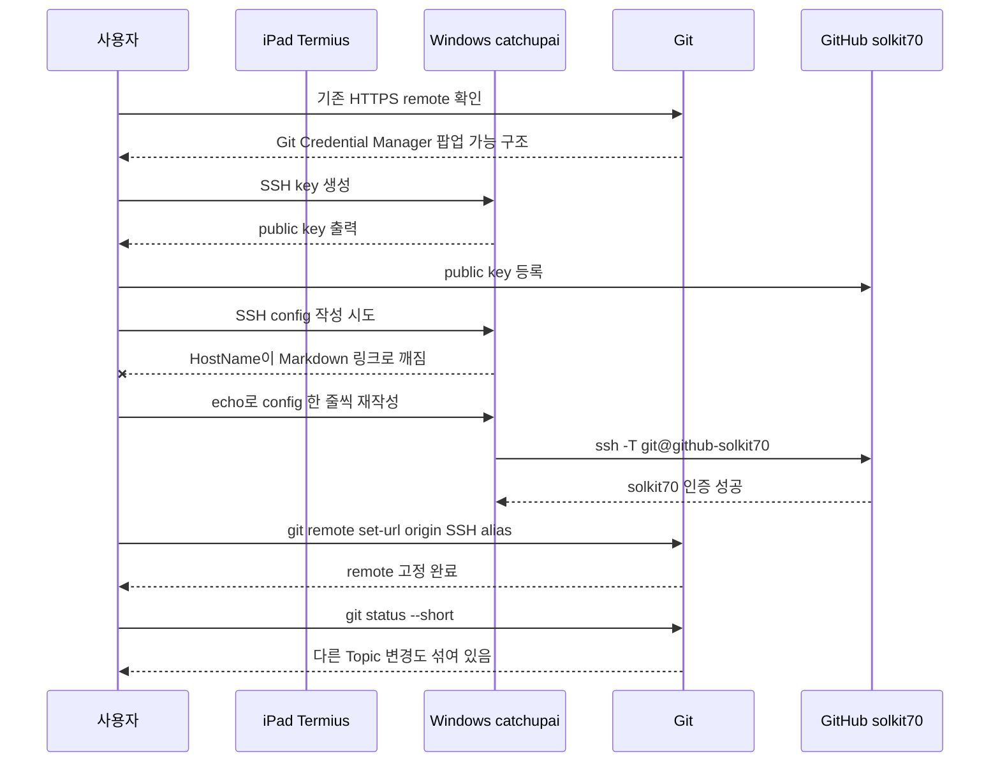

# GitHub Push 설정 실수와 영상화 포인트

## 왜 이 문서를 남기는가

모바일에서 Claude Code를 실행하는 실험은 성공했지만, 실제 운영에서는 “작업 결과를 GitHub에 어떻게 올릴 것인가”가 또 다른 관문이 된다. 사용자의 환경에는 GitHub 계정이 두 개 있고, Windows GUI에서 push할 때 계정 선택 팝업이 뜨는 문제가 있었다. 모바일 SSH 환경에서는 이 팝업을 조작하기 어렵기 때문에, GitHub push 인증을 SSH key 방식으로 고정해야 했다.

이 과정에서 발생한 실수와 해결은 나중에 영상으로 만들 때 매우 유용하다. 시청자도 비슷하게 “SSH 접속은 됐는데 GitHub push에서 막히는” 상황을 겪을 가능성이 높다.

## 실제 발생한 흐름



## 핵심 교훈

모바일 원격 작업에서 GitHub push를 안정적으로 하려면 “GitHub 계정 선택”을 사람이 매번 고르는 방식으로 두면 안 된다. repo가 어떤 계정으로 push할지 미리 결정되어 있어야 한다. 이때 SSH key와 SSH config alias를 사용하면 repo별로 push 계정을 고정할 수 있다.

## 시청자가 하기 쉬운 실수

### 실수 1: HTTPS remote를 그대로 둔다

기존 remote:

```text
https://github.com/solkit70/CatchUpAI_VL.git
```

이 방식은 Windows에서는 편할 수 있지만, Git Credential Manager 팝업이 뜰 수 있다. 모바일 SSH 세션에서는 그 팝업을 조작하기 어렵다.

영상 메시지:

```text
모바일 원격 작업에서는 GUI 팝업에 의존하는 인증 방식을 피해야 합니다.
```

### 실수 2: GitHub 계정이 두 개인데 repo별 push 계정을 고정하지 않는다

두 GitHub 계정을 쓰면 push 때 어떤 계정을 쓸지 애매해진다. 원격 모바일 환경에서는 그 애매함이 곧 장애가 된다.

해결:

```sshconfig
Host github-solkit70
  HostName github.com
  User git
  IdentityFile C:\Users\catchupai\.ssh\id_github_solkit70
  IdentitiesOnly yes
```

repo remote:

```text
git@github-solkit70:solkit70/CatchUpAI_VL.git
```

### 실수 3: Termius가 명령 안의 `github.com`을 링크처럼 바꾼다

실제 발생한 문제는 SSH config의 HostName이 아래처럼 깨진 것이다.

```text
HostName [[github.com](http://github.com)](...)
```

이 상태에서 실행하면:

```text
ssh: Could not resolve hostname ... No such host is known.
```

해결은 긴 PowerShell 명령을 붙여넣는 대신 `echo`로 한 줄씩 config를 쓰는 것이다.

```cmd
echo Host github-solkit70> "%USERPROFILE%\.ssh\config"
echo   HostName github.com>> "%USERPROFILE%\.ssh\config"
echo   User git>> "%USERPROFILE%\.ssh\config"
echo   IdentityFile C:\Users\catchupai\.ssh\id_github_solkit70>> "%USERPROFILE%\.ssh\config"
echo   IdentitiesOnly yes>> "%USERPROFILE%\.ssh\config"
```

영상 메시지:

```text
모바일 터미널에서는 자동 링크 변환이 설정 파일을 망가뜨릴 수 있습니다.
짧은 줄을 하나씩 입력하는 방식이 더 안전합니다.
```

### 실수 4: repo 소유자와 SSH 사용자 계정이 달라 Git이 막는다

`catchupai` 계정으로 `dougg` 소유 repo에 접근하자 Git이 `dubious ownership`을 감지했다.

메시지 요지:

```text
fatal: detected dubious ownership in repository
```

이건 오류라기보다 Git의 정상적인 보호 기능이다. `catchupai`가 이 repo를 의도적으로 다루는 구조라면 safe.directory에 등록한다.

```cmd
git config --global --add safe.directory C:/AI_study/2026/Changsoo_Vault/Ingest/CatchUpAI_VL
```

영상 메시지:

```text
전용 SSH 계정을 만들면 보안은 좋아지지만, 기존 사용자가 소유한 repo를 다룰 때 Git의 안전 장치가 동작할 수 있습니다.
```

### 실수 5: 변경이 섞인 상태에서 `git add .`를 한다

현재 작업 트리에는 이 Topic 외에도 다른 Topic 변경이 함께 있었다. 모바일에서 무심코 `git add .`를 하면 의도하지 않은 파일까지 commit/push할 수 있다.

금지:

```cmd
git add .
```

권장:

```cmd
git add Topics/Claude-Code-Mobile-Remote-Execution
```

영상 메시지:

```text
모바일 원격 작업에서는 stage 범위를 좁혀야 합니다. 작은 화면에서는 의도하지 않은 변경을 놓치기 쉽습니다.
```

## 최종 성공 상태

| 항목 | 결과 |
|---|---|
| GitHub 계정 | `solkit70` |
| SSH key 등록 | 완료 |
| SSH alias | `github-solkit70` |
| origin remote | `git@github-solkit70:solkit70/CatchUpAI_VL.git` |
| SSH 인증 테스트 | `git ls-remote origin HEAD` 성공 |
| GUI 계정 선택 팝업 | 더 이상 필요 없음 |

## 영상 장면 구성 후보

### Scene 1: 문제 제기

화면: Windows에서 GitHub push 시 계정 선택 팝업이 뜨는 상황 설명.

내레이션:

```text
집에서는 팝업을 클릭하면 되지만, 밖에서 iPad SSH로 접속한 상태라면 이 팝업을 누를 수 없습니다.
```

### Scene 2: 해결 구조 설명

화면: HTTPS remote와 SSH alias remote 비교.

```text
HTTPS remote: Git Credential Manager 팝업 가능
SSH alias remote: repo가 사용할 GitHub 계정을 미리 결정
```

### Scene 3: public key 등록

화면: GitHub SSH keys 페이지.

포인트:
- private key는 절대 공유하지 않음
- public key만 GitHub에 등록
- key title은 장비/용도를 알아볼 수 있게 작성

### Scene 4: 실제 실수

화면: `github.com`이 링크로 깨진 config와 hostname resolution 실패.

포인트:
- 모바일 앱의 자동 변환이 터미널 명령에 영향을 줄 수 있음
- 긴 명령 붙여넣기보다 작은 명령을 나눠 실행

### Scene 5: Git 안전 장치

화면: `dubious ownership` 메시지.

포인트:
- SSH 전용 계정과 기존 파일 소유자 차이
- safe.directory는 repo를 신뢰한다는 명시적 설정

### Scene 6: push 전 상태 확인

화면: `git status --short`에 여러 Topic 변경이 섞인 상황.

포인트:
- 모바일에서는 `git add .` 금지
- 경로를 제한해서 stage

## 시청자 체크리스트

- GitHub 계정이 여러 개라면 repo별 remote를 확인한다.
- 모바일 원격 push에는 HTTPS보다 SSH alias가 안정적이다.
- public key만 GitHub에 등록하고 private key는 절대 공유하지 않는다.
- SSH config의 `HostName github.com`이 링크로 변형되지 않았는지 확인한다.
- 전용 Windows 계정으로 기존 repo를 다루면 `safe.directory`가 필요할 수 있다.
- push 전에는 반드시 `git status --short`와 `git diff --stat`를 확인한다.
- 모바일에서는 `git add .` 대신 경로를 명시한다.

## M6 반영 메모

M6의 Remotion AI 영상화 후보에 이 GitHub push 설정 과정을 포함한다. 이 장면은 “원격 AI 코딩은 접속만 되면 끝이 아니다. 결과를 안전하게 확인하고 배포하는 루틴까지 필요하다”는 메시지를 전달하는 데 적합하다.
