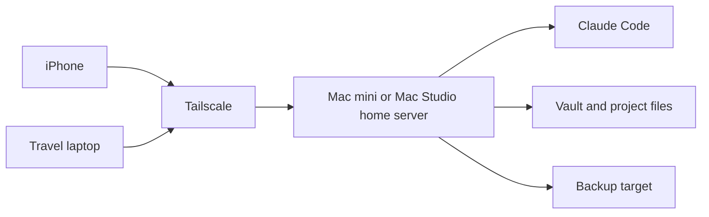

# 홈서버 운영 체크리스트

## 목적

맥미니 또는 맥 스튜디오를 집의 상시 실행 서버로 쓰고, 노트북은 이동 작업기로 사용하는 구조를 운영 관점에서 정리한다. M2의 비교 결론처럼 1차 실험은 Windows 노트북으로 성공했지만, 장기 운영에서는 상시 켜짐, 절전 안정성, 백업, 물리적 위치가 더 중요해진다.

## 권장 구조

## Mac mini vs Mac Studio 운영 판단

| 항목 | Mac mini | Mac Studio |
|---|---|---|
| 상시 서버 | 충분히 적합 | 적합하지만 과할 수 있음 |
| 전력/소음 | 유리 | 상대적으로 높음 |
| Claude Code/문서 작업 | 충분 | 충분 |
| Remotion/영상 렌더링 | 중간 규모 적합 | 장시간/고해상도 렌더링에 유리 |
| 비용 | 낮음 | 높음 |
| 추천 역할 | 기본 홈서버 | 영상/AI 작업 겸용 워크스테이션 |

현재 결론: 원격 Claude Code 서버 목적만이면 Mac mini가 우선 후보이고, Remotion 렌더링과 미디어 작업을 같은 장비에서 강하게 돌릴 계획이면 Mac Studio를 검토한다.

## 홈서버 필수 운영 조건

| 영역 | 체크 |
|---|---|
| 전원 | 정전 대비, 자동 재부팅, 절전 비활성화 |
| 네트워크 | 유선 LAN 우선, Tailscale 자동 시작 |
| 사용자 계정 | 작업 전용 표준 계정, 관리자 계정 분리 |
| SSH | public key 인증 우선, password 인증 제한 |
| 파일 위치 | vault/projects 경로 고정 |
| 백업 | 로컬 백업 + 클라우드/외장 백업 중복 |
| 업데이트 | OS/Tailscale/Claude Code 업데이트 주기 |
| 물리 보안 | 가족/방문자가 쉽게 조작하지 않는 위치 |

## Mac 홈서버 도입 시 초기 세팅 순서

1. macOS 초기 설정과 관리자 계정 생성
2. 작업 전용 표준 계정 생성
3. Tailscale 설치 및 tailnet 로그인
4. System Settings에서 Remote Login 활성화
5. SSH key 인증 설정
6. Claude Code 설치
7. vault/project 경로 구성
8. 백업 대상 연결
9. iPhone과 노트북에서 SSH 접속 검증
10. Windows 노트북에서 쓰던 M4 테스트를 Mac 서버에서 반복

## 노트북 이동 작업기 구조

노트북을 가지고 다니는 구조에서는 노트북이 실행 서버가 아니라 클라이언트가 된다. 실제 파일과 Claude Code 실행은 집 서버에 있고, 노트북은 SSH/VS Code Remote/터미널로 접속하는 화면 역할을 한다.

장점:
- 이동 중에도 같은 실행 환경 유지
- 노트북 분실 시 원본 작업 파일 노출 감소
- 장시간 작업을 집 서버에 남겨둘 수 있음

주의:
- 네트워크 없으면 작업 불가
- 홈서버 장애가 전체 작업 중단으로 이어짐
- 백업과 업데이트 책임이 커짐

## 홈서버 도입 전 결정 질문

| 질문 | 판단 기준 |
|---|---|
| Remotion 렌더링을 서버에서 자주 할 것인가 | 그렇다면 Mac Studio 비중 증가 |
| 노트북 없이도 장시간 작업을 돌릴 것인가 | 그렇다면 상시 서버 가치 증가 |
| vault를 어디에 둘 것인가 | 동기화 충돌 방지 설계 필요 |
| 가족/외부인이 서버를 만질 수 있는가 | 물리 보안 필요 |
| 장애 시 노트북 단독 작업으로 돌아갈 수 있는가 | fallback 계획 필요 |

