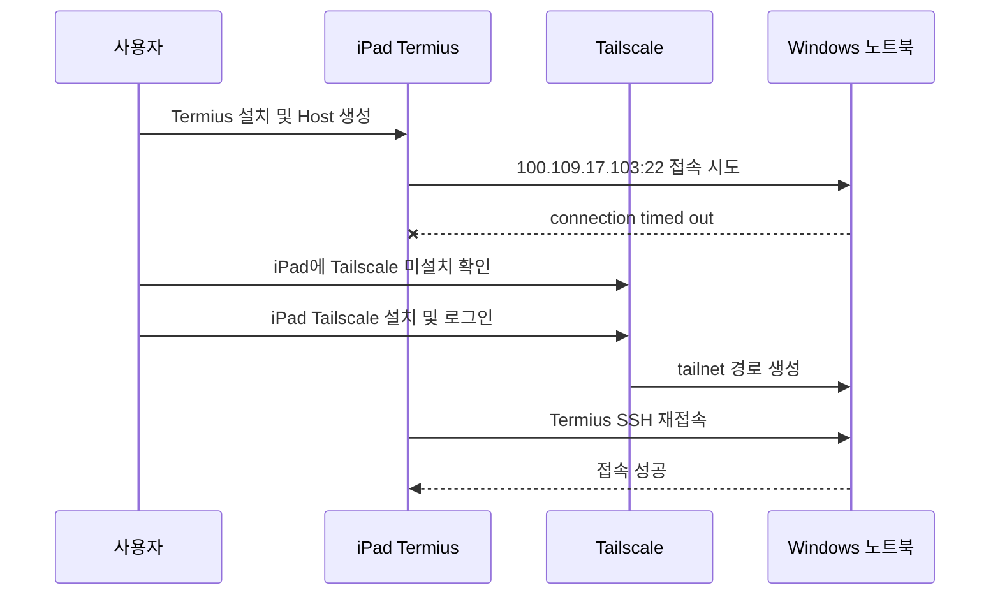

# 모바일/iPad 클라이언트 설정 실수와 학습 포인트

## 왜 이 문서를 남기는가

M4 실험은 iPhone에서 성공했지만, iPad를 추가 클라이언트로 설정하는 과정에서 중요한 혼동이 드러났다. 사용자는 iPad에 Termius를 설치하고 Host 설정을 맞췄지만 `connection timed out` 오류가 발생했다. 원인은 iPad에 Tailscale이 설치되어 있지 않았기 때문이다.

이 사례는 나중에 영상으로 만들 때 매우 좋은 설명 포인트가 된다. 모바일 원격 Claude Code 실행은 “SSH 앱 하나 설치”가 아니라, 네트워크 계층과 터미널 계층을 분리해서 이해해야 성공한다.

## 실제 발생한 흐름



## 핵심 원인

`100.109.17.103`은 일반 인터넷 주소가 아니라 Tailscale 내부 주소다. 따라서 iPhone에서 접속이 되더라도 iPad가 자동으로 접속 가능한 것은 아니다. 각 모바일 기기마다 Tailscale 앱을 설치하고 같은 tailnet에 로그인해야 한다.

## 도구별 역할

| 도구 | 한 줄 정의 | 설치 위치 | 없으면 생기는 문제 |
|---|---|---|---|
| Tailscale | 기기들을 같은 사설망에 넣는 VPN/네트워크 계층 | Windows, iPhone, iPad 각각 | `100.x.x.x` 주소로 접근 불가, timeout |
| Termius | SSH로 원격 shell에 로그인하는 터미널 앱 | iPhone, iPad | 원격 명령 입력 불가 |
| OpenSSH Server | Windows에서 SSH 접속을 받아주는 서버 | Windows 노트북 | connection refused 또는 접속 불가 |
| `catchupai` 계정 | 원격 작업용 Windows 사용자 | Windows 노트북 | 인증 실패 |
| Claude Code | 실제 코딩/문서 작업 실행 도구 | Windows `catchupai` 계정 | `claude` 명령 실행 불가 |

## 초보자가 하기 쉬운 오해

### 오해 1: Termius만 설치하면 접속된다

틀렸다. Termius는 SSH 앱일 뿐이다. `100.109.17.103`까지 가는 네트워크 경로는 Tailscale이 만든다.

### 오해 2: iPhone에서 됐으면 iPad에서도 바로 된다

틀렸다. Tailscale은 기기별로 설치, 로그인, VPN 연결이 필요하다. iPhone이 tailnet에 있어도 iPad가 자동으로 같은 네트워크에 들어오는 것은 아니다.

### 오해 3: timeout은 비밀번호 문제다

틀렸다. `connection timed out`은 대개 네트워크 경로 문제다. 비밀번호가 틀리면 보통 SSH handshake 이후 `Permission denied`, `Authentication failed`, `No more authentication methods to try` 같은 메시지가 나온다.

## 에러 메시지별 판단

| 메시지 | 의미 | 우선 확인 |
|---|---|---|
| `connection timed out` | 네트워크 경로가 닿지 않음 | Tailscale Connected, 같은 tailnet, VPN 상태 |
| `connection refused` | 서버는 닿지만 SSH 서비스가 안 받음 | `sshd` 실행 여부, 포트 22 |
| `No more authentication methods to try` | 인증 실패 | username, password, key 설정 |
| `claude is not recognized` | shell은 접속됐지만 Claude PATH 문제 | Claude 설치 위치, PATH, 재접속 |

## iPad 추가 클라이언트 체크리스트

1. iPad에 Tailscale 설치
2. `solkit70@gmail.com`으로 로그인
3. Tailscale 상태가 `Connected`인지 확인
4. iPad에 `100.x.x.x` Tailscale IP가 생겼는지 확인
5. Tailscale 기기 목록에서 `changsoo`가 보이는지 확인
6. Termius 설치
7. Host 생성

```text
Host: 100.109.17.103
Port: 22
Username: catchupai
Authentication: Password 또는 SSH key
```

8. 접속 후 확인

```cmd
hostname
whoami
claude --version
```

## 영상화 포인트

이 부분은 영상에서 “실패 사례로 배우는 구조 이해” 장면으로 넣기 좋다.

### 장면 구성 후보

1. iPhone에서는 접속 성공
2. iPad에 Termius만 설치하고 같은 Host 설정
3. `connection timed out` 발생
4. 원인 추론: Termius 문제가 아니라 Tailscale 경로 문제
5. Tailscale 설치 후 iPad가 tailnet에 나타남
6. 같은 Termius Host로 접속 성공
7. 핵심 교훈: 네트워크 계층과 터미널 계층을 분리해서 이해해야 한다

### 영상 메시지

```text
Termius는 문을 여는 열쇠가 아니라, 문 앞에서 명령을 입력하는 터미널입니다.
Tailscale이 먼저 집 컴퓨터까지 가는 사설 도로를 만들어야 합니다.
```

### 시청자에게 줄 체크포인트

- 새 모바일 기기를 추가할 때는 Tailscale부터 확인한다.
- `100.x.x.x` 주소는 Tailscale 안에서만 통한다.
- timeout은 인증 문제가 아니라 네트워크 문제로 먼저 본다.
- 도구 이름보다 역할을 이해해야 원격 AI 코딩 환경을 안정적으로 운영할 수 있다.

## M6 반영 메모

M6의 Remotion AI 영상화 후보에 이 사례를 포함한다. 특히 “Termius만 설치해서 timeout이 난 장면”은 시청자가 같은 실수를 피하는 데 도움이 되는 교육적 장면이다.
