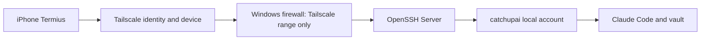

# 보안 체크리스트

## 보안 경계

현재 구조의 보안 경계는 `Tailscale tailnet`과 `Windows OpenSSH Server`가 함께 만든다. Tailscale은 장비 간 사설망을 제공하고, Windows 방화벽은 SSH inbound TCP 22를 Tailscale 주소 대역으로 제한한다. OpenSSH는 실제 로그인과 shell 실행을 담당하므로, Tailscale 접속 성공과 Windows 계정 로그인 성공은 서로 다른 보안 단계로 봐야 한다.



## 현재 안전하게 된 점

| 항목 | 현재 상태 | 판단 |
|---|---|---|
| 공개 포트 개방 | 없음 | 유지 |
| SSH 방화벽 | Tailscale 대역만 허용 | 유지 |
| SSH 사용자 | `catchupai` 표준 로컬 사용자 | 유지 |
| 관리자 계정 원격 사용 | 사용하지 않음 | 유지 |
| Claude Code 실행 계정 | `catchupai` | 운영 계정 분리 완료 |
| Tailscale 로그인 | 완료 | MFA/기기 승인 검토 필요 |

## 개선 우선순위

| 우선순위 | 작업 | 이유 | 적용 시점 |
|---:|---|---|---|
| 1 | Tailscale 계정 MFA 확인 | tailnet 접근 자체를 보호 | M5 이후 별도 확인 |
| 1 | SSH key 인증 전환 검토 | password 입력 노출과 brute force 위험 감소 | 장기 운영 전 |
| 1 | `catchupai` 계정 권한 최소화 | 원격 세션 피해 범위 제한 | 유지 점검 |
| 2 | Tailscale ACL 또는 Grants 적용 | iPhone만 노트북 SSH에 접근하도록 제한 | tailnet 장비 증가 시 |
| 2 | Tailscale device approval 검토 | 새 장비가 자동으로 tailnet에 붙는 것을 방지 | tailnet 공유/확대 전 |
| 2 | Tailscale client 자동 업데이트 확인 | 보안 패치 지연 방지 | 정기 점검 |
| 3 | Windows OpenSSH `AllowUsers catchupai` 검토 | SSH 로그인 가능 사용자를 제한 | SSH 사용자 증가 전 |
| 3 | session/log review 절차 | 문제 발생 시 추적성 확보 | 운영 안정화 후 |

## Password SSH의 현재 판단

Password 인증은 M4 실험에는 적합했다. 사용자가 직접 만든 `catchupai` 비밀번호로 접속했고, 외부 인터넷이 아니라 Tailscale 경유로만 SSH가 열려 있기 때문이다. 다만 장기 운영에서는 iPhone 분실, 비밀번호 재사용, 화면 입력 노출, 반복 인증 실패 같은 위험이 있으므로 SSH key 인증 전환을 권장한다.

## SSH Key 전환 권장안

장기 운영에서는 iPhone SSH 앱에서 key pair를 만들고, 공개키만 Windows의 `C:\Users\catchupai\.ssh\authorized_keys`에 넣는 방식이 좋다. Microsoft 문서 기준 Windows OpenSSH의 표준 사용자는 사용자 홈의 `.ssh\authorized_keys`를 사용한다. 개인키는 iPhone 안에 남고 서버에는 공개키만 저장된다.

적용은 별도 승인 후 진행한다.

```text
1. Termius에서 key pair 생성
2. public key 복사
3. Windows `catchupai` 홈에 `.ssh\authorized_keys` 생성
4. password와 key 모두 가능한 상태에서 접속 테스트
5. 충분히 검증한 뒤 password 인증 비활성화 여부 검토
```

## 금지할 운영 방식

| 금지 | 이유 |
|---|---|
| 공유기에서 TCP 22 port forwarding | 공개 인터넷에 SSH 노출 |
| 관리자 계정으로 모바일 SSH 상시 사용 | 원격 세션 탈취 시 피해 범위 증가 |
| 비밀번호를 노트나 대화에 평문 저장 | 계정 탈취 위험 |
| 검증 없이 `sshd_config`에서 password 인증 비활성화 | 모바일 접속 불능 위험 |
| vault 루트에서 바로 대규모 Claude Code 작업 시작 | 변경 범위 통제 실패 |
| Tailscale 연결 장비를 무제한으로 방치 | tailnet 내부 공격면 증가 |

## 공식 기준

- Tailscale은 tailnet 보안 강화를 위해 클라이언트 업데이트, MFA, access control policy, device approval 등을 권장한다: https://tailscale.com/docs/reference/best-practices/security
- Tailscale access control은 최소 권한 원칙에 따라 허용된 연결만 정의하는 방식이다: https://tailscale.com/docs/features/access-control
- Windows OpenSSH는 password와 publickey 인증을 지원하며, 표준 사용자의 public key는 사용자 홈의 `.ssh\authorized_keys`에 배치한다: https://learn.microsoft.com/en-us/windows-server/administration/openssh/openssh_keymanagement
- Windows OpenSSH 설정에서는 `AllowUsers`, `AllowGroups`, `DenyUsers` 같은 제한을 사용할 수 있다: https://learn.microsoft.com/en-us/windows-server/administration/openssh/openssh-server-configuration

