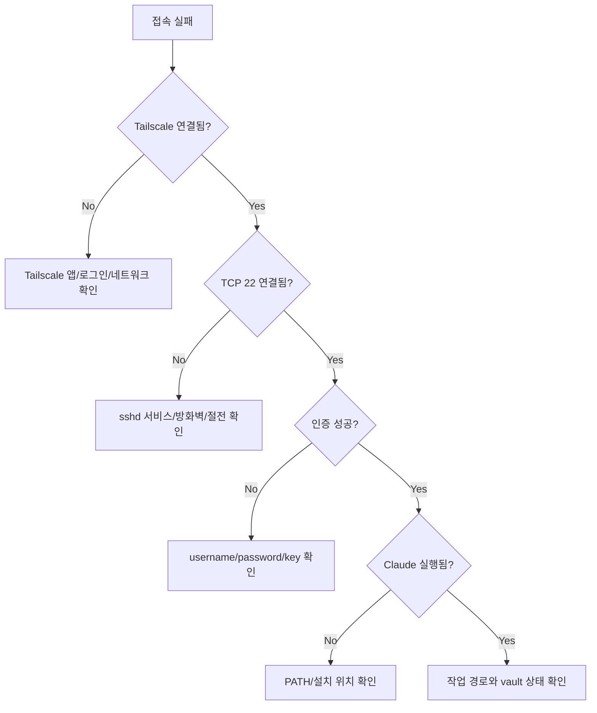

# 복구 플레이북

## 접속 실패 분류

SSH 접속 문제는 어느 계층에서 실패했는지부터 나눈다.



## Tailscale 문제

증상:
- iPhone Tailscale이 `Disconnected`
- SSH timeout
- `100.109.17.103`에 접속 불가

확인:

```cmd
tailscale status
tailscale ip -4
```

복구:
- iPhone Tailscale 앱에서 Connected 확인
- Windows Tailscale 서비스가 Running인지 확인
- 같은 tailnet 계정인지 확인
- 노트북이 절전 상태인지 확인

## SSH 서비스 문제

증상:
- `Connection refused`
- TCP 22 연결 실패

Windows에서 확인:

```powershell
Get-Service sshd,Tailscale
Test-NetConnection 100.109.17.103 -Port 22
```

복구:

```powershell
Start-Service sshd
Start-Service Tailscale
```

관리자 권한이 필요한 경우 노트북에서 직접 처리한다. 모바일에서 방화벽이나 서비스 설정을 무리하게 변경하지 않는다.

## 인증 실패

증상:
- `No more authentication methods to try`
- password authentication failure
- 계속 비밀번호를 다시 물어봄

확인:
- Username이 정확히 `catchupai`인지 확인
- 앞뒤 공백이 없는지 확인
- `catchupat` 같은 오타가 없는지 확인
- Termius Authentication이 Password인지 확인
- 비밀번호는 Windows PIN이 아니라 `catchupai` 계정 비밀번호인지 확인

## Claude Code PATH 문제

증상:

```text
'claude' is not recognized as an internal or external command
```

확인:

```cmd
C:\Users\catchupai\.local\bin\claude.exe --version
echo %PATH%
```

복구:

```cmd
setx PATH "%PATH%;C:\Users\catchupai\.local\bin"
```

그 다음 Termius 연결을 끊고 다시 접속한다.

## Vault 경로 문제

증상:
- 파일이 예상 위치에 없음
- Claude Code가 다른 폴더에서 실행됨
- Git 상태가 예상과 다름

확인:

```cmd
cd
cd C:\AI_study\2026\Changsoo_Vault\Ingest\CatchUpAI_VL
git status --short
```

복구:
- 작업을 중단하고 현재 경로를 확인한다.
- 새 파일은 실험 폴더 또는 명확한 모듈 폴더에만 만든다.
- 모르는 변경이 있으면 덮어쓰거나 삭제하지 않는다.

## 절전과 세션 끊김

증상:
- 접속이 되다가 끊김
- 외부에서는 접속되지 않지만 노트북 앞에서는 정상
- 화면이 꺼진 후 SSH가 끊김

확인:
- Windows 전원 설정에서 plugged-in sleep timeout
- 노트북 덮개 동작
- Wi-Fi 절전
- Tailscale 서비스 상태

운영 권장:
- 원격 작업 전 노트북을 전원에 연결
- 긴 작업 전 plugged-in sleep을 길게 설정하거나 끄는 것을 검토
- 화면 꺼짐과 sleep은 다르므로 sleep 설정을 별도로 확인

Microsoft는 Windows 전원 설정에서 screen, sleep, hibernate timeout을 관리한다고 안내한다: https://support.microsoft.com/en-us/windows/experience/power-battery/power-settings-in-windows-11

## 마지막 수단

다음 상황에서는 모바일에서 복구하려 하지 말고 노트북 앞에서 직접 처리한다.

| 상황 | 이유 |
|---|---|
| 방화벽 규칙 변경 후 접속 불가 | 원격 접속 경로 자체가 끊김 |
| `sshd_config` 수정 후 로그인 불가 | 설정 롤백 필요 |
| Windows 업데이트 중단 | 재부팅/복구 필요 |
| Git 변경이 대량 발생 | 작은 화면에서 판단 위험 |
| 비밀번호/키 분실 | 계정 복구 필요 |
## iPad Termius timeout

증상:

```text
Connection failed: connection timed out. No more addresses to try.
```

원인:
- iPad에 Termius는 설치되어 있었지만 Tailscale이 설치/연결되어 있지 않았다.
- `100.109.17.103`은 Tailscale 내부 IP이므로 Tailscale에 연결된 기기에서만 접근할 수 있다.

해결:
1. iPad에 Tailscale 앱 설치
2. `solkit70@gmail.com` tailnet 로그인
3. Tailscale 상태가 `Connected`인지 확인
4. Termius에서 기존 Host `100.109.17.103:22`로 다시 접속

결과:
- Tailscale 설치 및 연결 후 iPad Termius에서 Windows host 접속 성공.

