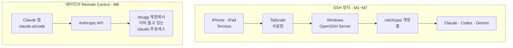

# SSH 방식 vs 네이티브 Remote Control

## 요약

M1~M7에서 만든 SSH 구조와 이번에 확인한 네이티브 Remote Control은 **경쟁 관계가 아니다.** 겹치는 영역이 하나 있을 뿐이고, 그 영역이 마침 이 Topic의 출발점이었다 — "모바일에서 Claude Code를 쓰고 싶다".

그 하나만 놓고 보면 Remote Control이 압도적으로 간단하다. 하지만 SSH 구조가 담당하던 나머지는 그대로 남는다.

## 구조 비교

## 항목별 비교

| 항목 | SSH 방식 | 네이티브 Remote Control |
|---|---|---|
| **설치 요소** | Termius + Tailscale + OpenSSH Server + 전용 계정 | 없음 |
| **초기 세팅 시간** | 수 시간 (M3~M4 기준) | 수 초 |
| **인증** | SSH 키 또는 비밀번호 + Tailscale 계정 | Claude 계정 (claude.ai 로그인) |
| **네트워크** | 사설망 필요 | 아웃바운드 HTTPS만 |
| **인바운드 포트** | 없음 (Tailscale 경유) | 없음 |
| **실행 계정** | `catchupai` (격리된 별도 계정) | `dougg` (내 일상 계정) |
| **화면** | 터미널 에뮬레이터 | 네이티브 앱 UI |
| **한글 입력** | ⚠️ iPad IME 자모 분리 문제 (M7 기록) | 정상 |
| **파일·사진 첨부** | 불가 (SCP 등 별도 수단) | 앱에서 바로 첨부 |
| **권한 승인** | 터미널에서 키 입력 | 기기에서 승인, 푸시 알림 지원 |
| **세션 유지** | tmux/screen 필요 | 앱이 관리, 자동 재연결 |
| **다중 AI CLI** | ✅ Claude · Codex · Gemini | ❌ Claude Code 전용 |
| **임의 셸 작업** | ✅ 무엇이든 | ❌ Claude Code 세션 안에서만 |
| **트랜스크립트 저장** | 로컬에만 | ⚠️ Anthropic 서버에 저장 |
| **구독 요건** | 없음 (도구 무료) | Pro · Max · Team · Enterprise |
| **API key 인증** | 무관 | ❌ 지원 안 함 |
| **오프라인 로컬망** | ✅ 인터넷 없이 LAN에서도 | ❌ Anthropic 서버 경유 필수 |

## Remote Control이 대체하지 못하는 것

**1. Claude Code 이외의 AI CLI.** M7에서 검증한 Codex CLI와 Gemini CLI는 Remote Control과 무관하다. 모바일에서 이 둘을 쓰려면 SSH가 여전히 유일한 경로다.

**2. 임의의 셸 작업.** 로그 확인, 서비스 재시작, `git` 직접 조작, 파일 복사 같은 작업은 Claude Code 세션 밖의 일이다. Remote Control은 Claude Code라는 창을 통해서만 기계를 본다.

**3. 계정 격리.** SSH 구조는 모바일에서 들어오는 접속을 `catchupai`라는 제한된 계정에 묶었다. M5 보안 체크리스트가 이 전제 위에 있다. Remote Control은 내 일상 계정 세션에 그대로 붙는다.

**4. 홈서버 구상.** M2에서 비교한 맥미니·맥 스튜디오 상시 가동 서버는 "노트북을 닫아도 돌아가는 환경"이 목적이다. Remote Control은 **로컬 프로세스가 죽으면 세션도 오프라인**이 되므로 이 요구를 대체하지 못한다. 오히려 홈서버 + Remote Control 조합이 자연스럽다.

**5. 인터넷 없는 환경.** Tailscale은 같은 LAN이면 인터넷 없이도 직결된다. Remote Control은 Anthropic 서버를 반드시 경유한다.

## SSH가 대체하지 못하는 것

**1. 진행 중인 대화를 그대로 이어받기.** `/remote-control`은 현재 대화 이력을 들고 원격 세션을 연다. SSH로는 터미널에 새로 붙는 것이라 `--resume`으로 세션을 찾아야 한다.

**2. 사진·파일 첨부.** 휴대폰으로 찍은 스크린샷을 바로 던지는 것은 SSH 터미널에서 불가능하다.

**3. 푸시 알림.** 긴 작업이 끝났을 때, 승인이 필요할 때 휴대폰으로 알림이 온다. SSH는 터미널을 열어 봐야 안다.

**4. 한글 입력.** M7에서 기록한 iPad IME 자모 분리 문제는 터미널 에뮬레이터 고유의 문제다.

## 왜 SSH를 먼저 배운 것이 헛되지 않았나

Topic Retrospective의 결론 — *"모바일 기기는 작업이 실행되는 컴퓨터가 아니라 조작 콘솔"* — 은 두 방식 모두에 그대로 적용된다. **모델이 맞았고, 구현 경로가 하나 더 있었을 뿐이다.**

오히려 SSH를 거쳤기 때문에 Remote Control의 성격을 정확히 읽을 수 있다. "인바운드 포트를 열지 않는다"가 왜 중요한지는 M2에서 포트포워딩을 보안 2점으로 매겨 본 사람만 안다. "트랜스크립트가 서버에 저장된다"가 왜 걸리는지는 M5에서 보안 체크리스트를 써 본 사람만 안다. **비교 대상이 없으면 편의성만 보인다.**

## 참조

- 연결 구조: [../concepts/native-remote-control-model.md](../concepts/native-remote-control-model.md)
- 실측: [../lab/remote-control-verification.md](../lab/remote-control-verification.md)
- 선택 기준: [../decisions/which-path-when.md](../decisions/which-path-when.md)
- M2 구조 비교표: [../../02-Architecture-Comparison/comparisons/structure-comparison-table.md](../../02-Architecture-Comparison/comparisons/structure-comparison-table.md)
- M7 멀티 CLI 규칙: [../../07-Multi-Agent-CLI-Setup/guides/multi-cli-session-rules.md](../../07-Multi-Agent-CLI-Setup/guides/multi-cli-session-rules.md)
