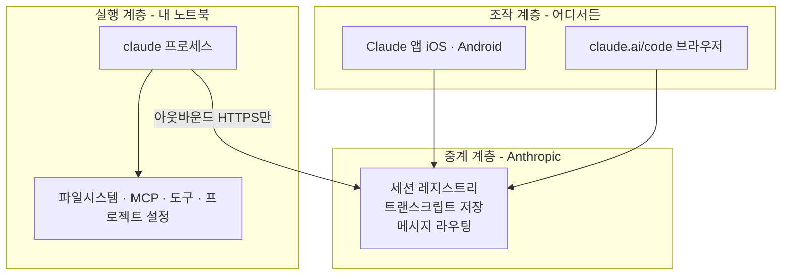

# Claude Code 네이티브 Remote Control 연결 구조

## 요약

Remote Control은 **내 컴퓨터에서 돌고 있는 Claude Code 세션에 휴대폰·태블릿·다른 브라우저를 붙이는 기능**이다. 클라우드에서 새로 실행하는 것이 아니라, 이미 로컬에서 실행 중인 프로세스를 원격에서 들여다보고 조종한다. Termius·Tailscale·OpenSSH 없이 Claude 앱의 `Code` 탭 또는 `claude.ai/code`만으로 동작한다.

이 모듈의 핵심 발견은 **M1에서 세운 "모바일은 조작 콘솔, 실행은 로컬"이라는 모델이 그대로 유효하다**는 것이다. 바뀐 것은 모델이 아니라 그 모델을 구현하는 경로다.

## 연결 구조

**로컬은 아웃바운드 HTTPS만 사용한다.** 인바운드 포트를 열지 않는다. 세션을 시작하면 Anthropic API에 등록하고 작업을 폴링하는 방식이라, 공유기 포트포워딩도 사설망도 필요 없다. M2에서 "직접 SSH + 포트포워딩"을 보안 2점으로 매기고 보류했던 이유 자체가 여기서는 발생하지 않는다.

## 실행 위치 — 무엇이 어디서 일어나는가

| 항목 | 위치 |
|---|---|
| 모델 추론 | Anthropic |
| **명령 실행 · 파일 읽기/쓰기** | **내 노트북** |
| MCP 서버 | 내 노트북 (로컬 설정 그대로) |
| 프로젝트 설정 · 스킬 · 권한 | 내 노트북 |
| 대화 트랜스크립트 | **Anthropic 서버에 저장** |

마지막 줄이 이 구조에서 가장 중요한 보안 항목이다. Remote Control이 연결된 동안 **내 메시지, Claude의 응답, 도구 활동 기록이 Anthropic 서버에 저장된다.** 기기 간 대화 동기화와 네트워크 끊김 후 재연결을 위해서다. 실행과 파일 접근은 로컬에 머물지만 트랜스크립트는 그렇지 않다.

## 시작하는 네 가지 방법

| 방법 | 명령 | 성격 |
|---|---|---|
| 서버 모드 | `claude remote-control` | 터미널이 서버로 대기. 여러 세션 동시 제공(기본 32개), QR 코드 표시 |
| 인터랙티브 | `claude --remote-control` 또는 `--rc` | 평소처럼 터미널에서 쓰면서 원격도 열어 둠 |
| 진행 중 세션에서 | `/remote-control` 또는 `/rc` | **현재 대화 이력을 그대로 들고** 원격 세션 시작 |
| VS Code 확장 | 프롬프트 박스에 `/remote-control` | 배너로 연결 상태 표시. 이름 인자·QR 미지원 |

이름을 붙이려면 `claude --remote-control "My Project"` 또는 `/remote-control My Project` 처럼 인자를 준다. 이름을 안 주면 `호스트명-graceful-unicorn` 형태로 자동 생성되고, 프롬프트를 보내면 그 내용을 반영해 제목이 갱신된다.

모든 세션에서 자동 연결하려면 `/config`에서 **Enable Remote Control for all sessions**를 켜거나, `~/.claude/settings.json`에 `remoteControlAtStartup: true`를 넣는다. 프로젝트 설정에서는 `false`만 존중되고 `true`는 무시된다 — 레포에 체크인한 파일이 그 레포를 여는 모든 사람의 Remote Control을 켜지 못하게 하는 안전장치다.

## 사용 요건

- **구독**: Pro · Max · Team · Enterprise. **API key 인증은 지원하지 않는다**
- **인증**: `claude auth login`으로 claude.ai 로그인. `claude setup-token`이나 `CLAUDE_CODE_OAUTH_TOKEN`의 장기 토큰은 모델 요청만 가능해서 안 된다
- **엔드포인트**: `api.anthropic.com` 직결이어야 한다. Bedrock·Vertex·Foundry, `ANTHROPIC_BASE_URL` 커스텀, 엔터프라이즈 게이트웨이는 모두 불가
- **피처 플래그**: `DISABLE_TELEMETRY`, `DO_NOT_TRACK`, `CLAUDE_CODE_DISABLE_NONESSENTIAL_TRAFFIC`, `DISABLE_GROWTHBOOK` 중 하나라도 설정되어 있으면 가용성 판단 자체가 막힌다
- **워크스페이스 신뢰**: 프로젝트 디렉터리에서 `claude`를 최소 한 번 실행해 신뢰 대화상자를 수락해야 한다. 홈 디렉터리에서는 신뢰가 저장되지 않으므로 프로젝트 폴더에서 시작한다

## 연결된 기기에서 되는 것과 안 되는 것

터미널·브라우저·휴대폰에서 **동시에** 메시지를 보낼 수 있고, 서브에이전트와 워크플로우 진행 상황도 모든 기기에 동기화된다. 사진이나 파일을 첨부하면 사진은 메시지의 일부로 바로 전달되고, 다른 파일은 로컬에 내려받은 뒤 `@` 파일 참조로 전달된다.

명령어는 일부만 원격에서 동작한다.

| 구분 | 명령어 |
|---|---|
| **원격 가능** | `/compact` `/clear` `/context` `/usage` `/recap` `/exit` |
| **인자를 붙이면 가능** | `/model sonnet` `/effort high` `/fast` `/color` `/rename` `/autocompact 500k` |
| **제한적 가능** | `/mcp` (모바일은 텍스트 요약), `/config` (모바일은 `key=value`) |
| **로컬 전용** | `/plugin` `/resume` |

## 끊김과 복구

노트북이 잠자거나 네트워크가 끊겨도 **복귀하면 자동 재연결**된다. 끊긴 동안의 서브에이전트·워크플로우 상태 업데이트는 큐에 쌓였다가 복구 시 전달된다. 다만 모드에 따라 한계가 다르다 — 서버 모드는 약 10분 후 프로세스가 종료되고, 인터랙티브 세션은 네트워크가 돌아올 때까지 계속 재시도한다.

`claude remote-control`을 Ctrl+C로 멈춰도 약 **4시간 안에는** 같은 디렉터리에서 `claude remote-control --continue` 또는 `--session-id <id>`로 되살릴 수 있다. 단 이 두 플래그는 **v2.1.200 이상**이 필요하다.

## 참조

- 공식 문서: https://code.claude.com/docs/en/remote-control
- 실측 기록: [../lab/remote-control-verification.md](../lab/remote-control-verification.md)
- SSH 방식과의 비교: [../comparisons/ssh-vs-native-remote-control.md](../comparisons/ssh-vs-native-remote-control.md)
