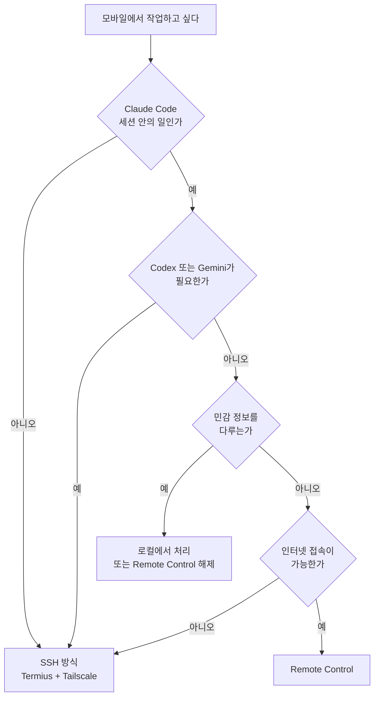

# 상황별 선택 기준 - 어느 경로로 갈 것인가

## 요약

기본값은 **Remote Control**이다. 세팅이 없고 화면이 편하다. SSH는 Remote Control이 못 하는 일이 생겼을 때 꺼내 쓴다.

단, 이 Vault에는 개인정보가 있어 **민감 작업에는 예외 규칙**이 붙는다.

## 결정 흐름

## 시나리오별 판단

| 상황 | 선택 | 이유 |
|---|---|---|
| 외출 중 긴 작업 진행 상황 확인 | **Remote Control** | 푸시 알림 + 앱 UI. SSH로는 터미널을 계속 열어 둬야 한다 |
| 소파에서 방금 하던 작업 이어가기 | **Remote Control** | `/remote-control`이 대화 이력을 그대로 들고 간다 |
| 휴대폰으로 찍은 스크린샷을 바로 분석 | **Remote Control** | SSH 터미널은 파일 첨부가 안 된다 |
| 승인 대기 중인 도구 호출 처리 | **Remote Control** | 기기에서 바로 승인. 푸시로 알려준다 |
| Codex나 Gemini로 작업 | **SSH** | Remote Control은 Claude Code 전용 |
| 서비스 재시작, 로그 확인 등 셸 작업 | **SSH** | Claude Code 창 밖의 일 |
| 뉴스레터 수신자 명단, 세무·의료 자료 작업 | **로컬** | 트랜스크립트가 Anthropic 서버에 저장된다 |
| 비행기·지하 등 인터넷 불안정 | **SSH** (같은 LAN이면) | Remote Control은 Anthropic 서버 경유 필수 |
| 노트북을 닫아도 계속 돌려야 함 | **홈서버 + 둘 중 하나** | Remote Control은 로컬 프로세스가 죽으면 오프라인 |

## 민감 작업 규칙

`Changsoo_Vault`에 있는 개인정보다.

- `newsletters/Builders Lounge 메일링 리스트.md` — 이메일 32건 (`.gitignore` 대상)
- 주택 워런티 기록 — 주소, 계약 정보
- 가족 의료 일정
- 세무 자료 (Bright Future AI Ventures LLC)

Remote Control이 연결된 동안 **작업 내용이 트랜스크립트로 Anthropic 서버에 저장된다.** 기기 간 동기화와 재연결에 필요한 설계지 결함이 아니다. 다만 위 자료를 다룰 때는 의식해야 한다.

실무 기준을 이렇게 잡는다.

1. **읽고 요약하는 정도**는 그대로 진행한다. 어차피 모델 요청으로 Anthropic에 전달되는 내용이다
2. **명단·주소·계좌를 대량으로 출력하는 작업**은 Remote Control을 끄고 로컬에서 한다. 터미널 세션의 상태 표시줄에서 연결을 해제하거나, 그 세션에서만 `disableRemoteControl`을 적용한다
3. **완전히 끄려면** `~/.claude/settings.json`에 `disableRemoteControl` 설정을 넣는다. 조직 차원의 Zero Data Retention 요건이 있으면 애초에 Remote Control을 쓸 수 없다

## 이 환경에서 먼저 해결할 것

실측에서 나온 문제들이다. 순서대로 처리한다.

| 순서 | 항목 | 이유 |
|---|---|---|
| 1 | ✅ **터미널 CLI 업데이트** | 2.1.143 → **2.1.250** 완료. 버전 게이트 7건 해소 |
| 2 | ✅ **자동 업데이트 활성화** | `~/.claude.json`의 `autoUpdates`가 `false`였다. `true`로 변경, 채널은 `latest` |
| 3 | ✅ **`ANTHROPIC_API_KEY` 제거** | User 스코프 환경변수 삭제. 터미널 Remote Control 차단 해소 |
| 4 | ⬜ **API 키 폐기(revoke)** | 환경변수는 지웠지만 키 자체는 유효하다. `console.anthropic.com`에서 폐기 |
| 5 | ⬜ **`/config`에서 푸시 알림 켜기** | 긴 작업의 실질적 가치가 여기서 나온다 |
| 6 | ⬜ **자동 연결 여부 결정** | `remoteControlAtStartup: true`로 모든 세션 자동 연결할지, 필요할 때만 `/rc`로 켤지 |

6번은 **명시적으로 켜는 쪽을 권한다.** 자동 연결이면 민감 작업을 할 때도 늘 켜져 있게 된다. 필요할 때 `/rc` 한 번 치는 비용이 크지 않다.

## 참조

- 구조 비교: [../comparisons/ssh-vs-native-remote-control.md](../comparisons/ssh-vs-native-remote-control.md)
- 실측: [../lab/remote-control-verification.md](../lab/remote-control-verification.md)
- M5 보안 체크리스트: [../../05-Operations-Security/guides/security-checklist.md](../../05-Operations-Security/guides/security-checklist.md)
