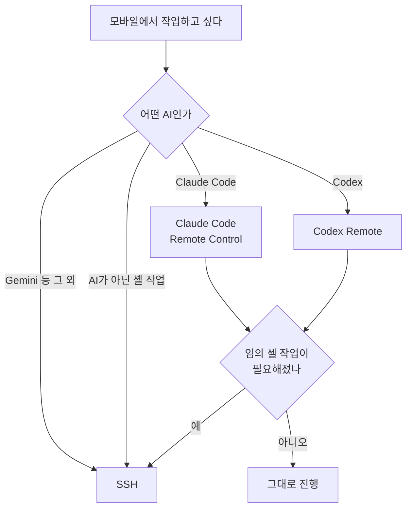

# 3자 비교 — SSH · Claude Code Remote Control · Codex Remote

## 요약

세 경로 모두 **"모바일은 조작 콘솔, 실행은 로컬"** 이라는 같은 모델을 구현한다. M1에서 세운 이 모델이 세 번 연속으로 확인된 셈이다.

차이는 **무엇이 호스트 노릇을 하느냐**에서 갈린다. SSH는 운영체제의 SSH 서버가, Claude는 `claude` 프로세스 자신이, Codex는 ChatGPT 데스크톱 앱이 호스트다. 이 한 가지가 나머지 차이를 대부분 설명한다.

## 전체 비교표

| 항목 | SSH (M1~M7) | Claude Code Remote Control (M8) | Codex Remote (M9) |
|---|---|---|---|
| **호스트 주체** | Windows OpenSSH 서버 | `claude` 프로세스 (CLI · VS Code 확장) | **ChatGPT 데스크톱 앱** |
| 설정 위치 | 터미널 + 공유기/사설망 | `/remote-control` 또는 `--rc` | 앱 **Settings → Connections** |
| **CLI에서 설정** | 예 | 예 | **불가** |
| 클라이언트 | Termius 등 SSH 앱 | Claude 앱 · `claude.ai/code` | ChatGPT 앱 |
| 페어링 | SSH 키 + Tailscale 계정 | 세션 목록에서 선택 또는 QR | **QR 스캔 + MFA/패스키** |
| 인바운드 포트 | 없음 (Tailscale 경유) | 없음 (아웃바운드 폴링) | 없음 (secure relay) |
| **실행 위치** | 로컬 | 로컬 | 로컬 |
| **다룰 수 있는 AI** | **Claude · Codex · Gemini 무엇이든** | Claude Code만 | Codex만 |
| 임의 셸 작업 | **가능** | 불가 | 불가 |
| 실행 계정 | `catchupai` (격리) | `dougg` (일상 계정) | `dougg` (앱이 도는 계정) |
| 화면 | 터미널 에뮬레이터 | 네이티브 앱 UI | 네이티브 앱 UI |
| 한글 입력 | ⚠️ iPad IME 자모 분리 | 정상 | 정상 |
| 파일·사진 첨부 | 불가 | 가능 | 가능 |
| 푸시 알림 | 없음 | 지원 | 지원 |
| **Git 상태 이전** | 수동 | 없음 | **Handoff** |
| **SSH 호스트 연동** | 본체 | 없음 | **지원** — 앱이 SSH 호스트 등록 |
| **브라우저·데스크톱 조작** | 없음 | 없음 | **Computer Use** (앱 내장 브라우저) |
| └ **모바일에서 화면 보기** | — | — | ❌ **불가.** 조작만 되고 화면은 호스트에만 (실측) |
| 모바일 → 모바일 | 해당 없음 | 해당 없음 | **불가** |
| 호스트 잠자기 | 노트북이 깨어 있어야 | 프로세스가 살아 있어야 | 앱 실행 + 온라인. 잠자기 선택 시 끊김 |
| **데이터 저장 명시** | 로컬에만 | **트랜스크립트 서버 저장 명시** | **문서에 명시 없음** |
| 요금 | 도구 무료 | Pro · Max · Team · Enterprise | ChatGPT 플랜 (Plus 확인) |
| API key 인증 | 무관 | 미지원 | — |
| 오프라인 LAN | **가능** | 불가 | 불가 |

## 세 경로가 겹치는 지점과 갈리는 지점

**SSH는 최하층이다.** 나머지 둘이 못 하는 일이 생기면 언제나 여기로 내려온다. 그래서 M1~M7의 구조는 상위 두 경로가 생겨도 유지할 가치가 있다.

## Codex Remote만 갖는 세 가지

**1. Handoff.** 대화와 Git 상태를 로컬과 원격 호스트 사이에서 옮긴다. 노트북에서 시작해 원격 worktree에서 이어가고 다시 가져오는 흐름이 가능하다. Claude Code에는 대응 기능이 없다.

**2. SSH 호스트 등록.** ChatGPT 데스크톱 앱이 `~/.ssh/config`의 호스트를 등록해 그 위의 `codex`를 구동한다. **M1~M7에서 만든 Tailscale + Windows OpenSSH 구조를 그대로 재활용할 수 있다는 뜻이다.** 두 경로가 배타적이지 않고 겹쳐 쓰인다.

**3. Computer Use.** 브라우저나 데스크톱 작업을 시킨다. 브라우저는 **앱에 내장**되어 있다(`Ctrl+Shift+B`) — Chrome 확장은 쓰던 세션이 필요할 때만 쓰는 별개 물건이다.

단 제약이 크다. Windows에서는 잠금 해제 + 포그라운드가 필요하고, 무엇보다 **모바일에서는 브라우저 화면을 볼 수 없다.** 밖에서 지시하면 집 컴퓨터에서 열리지만 폰에는 텍스트 응답만 온다 — **밖에서 쓰는 기능으로는 아직 못 쓴다.**

→ 실측: [../lab/browser-control-verification.md](../lab/browser-control-verification.md)

## Claude Code Remote Control만 갖는 것

**설정이 CLI 안에서 끝난다.** `/remote-control` 한 줄이면 되고 별도 데스크톱 앱이 필요 없다. Codex는 ChatGPT 데스크톱 앱 설치가 전제라 진입 비용이 한 단계 더 있다.

**서버 모드.** `claude remote-control`로 한 프로세스에서 여러 세션(기본 32개)을 제공한다. `--spawn worktree`로 세션마다 git worktree를 분리할 수도 있다.

## 데이터 취급 — 비대칭이 있다

이 표에서 가장 신경 쓰이는 줄이다.

| | 문서의 서술 |
|---|---|
| Claude Code | *"the session transcript, including your messages, Claude's responses, and tool activity, is stored on Anthropic servers"* + 보존 정책 링크 |
| Codex Remote | **해당 서술 없음** |

**"명시가 없다"를 "저장하지 않는다"로 읽으면 안 된다.** 릴레이가 세션 상태와 컨텍스트를 기기 간에 동기화한다고 되어 있으니 어떤 형태로든 서버를 거친다. 다만 무엇이 얼마나 남는지 이 문서만으로는 판단할 수 없다.

**실무 판단**: Claude Code 쪽은 저장 범위를 알고 쓰는 것이고, Codex 쪽은 모르고 쓰는 것이다. 개인정보가 있는 이 Vault 기준으로는 **알고 쓰는 쪽이 낫다.** Codex Remote를 쓰기 전에 ChatGPT 계정의 데이터 관리 설정을 따로 확인해야 한다.

## 공통 보안 후퇴 — 계정 격리가 사라진다

SSH 구조는 모바일 접속을 `catchupai`라는 별도 계정에 묶었다. M5 보안 체크리스트가 그 전제 위에 있다.

**Claude Code Remote Control과 Codex Remote 모두 이 계층이 없다.** 둘 다 내 일상 계정(`dougg`)에서 도는 프로세스에 붙는다. 편의를 얻는 대신 격리를 내준 구조다.

## 참조

- Codex Remote 구조: [../concepts/codex-remote-model.md](../concepts/codex-remote-model.md)
- Claude Code Remote Control: [../../08-Native-Remote-Control/concepts/native-remote-control-model.md](../../08-Native-Remote-Control/concepts/native-remote-control-model.md)
- SSH 방식 vs Claude RC: [../../08-Native-Remote-Control/comparisons/ssh-vs-native-remote-control.md](../../08-Native-Remote-Control/comparisons/ssh-vs-native-remote-control.md)
- M2 구조 비교표: [../../02-Architecture-Comparison/comparisons/structure-comparison-table.md](../../02-Architecture-Comparison/comparisons/structure-comparison-table.md)
- M7 멀티 CLI 규칙: [../../07-Multi-Agent-CLI-Setup/guides/multi-cli-session-rules.md](../../07-Multi-Agent-CLI-Setup/guides/multi-cli-session-rules.md)
