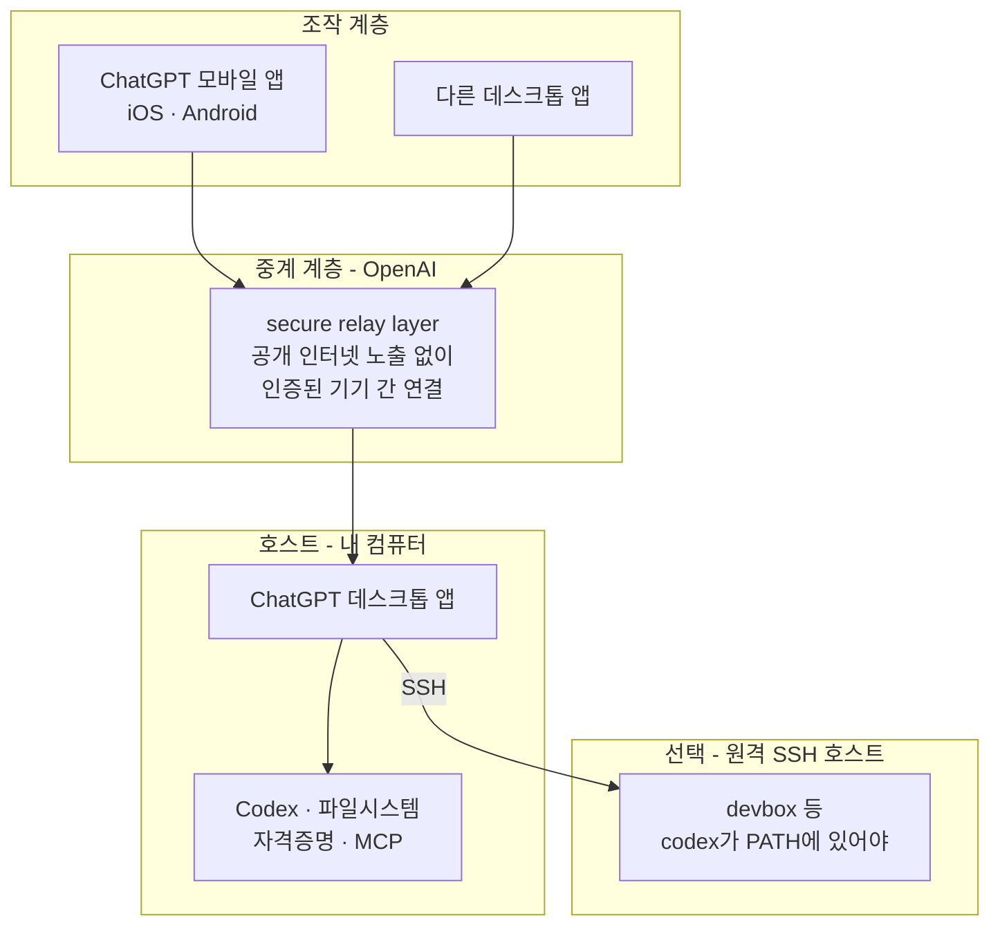

# Codex Remote 연결 구조

## 요약

Codex Remote는 **ChatGPT 데스크톱 앱이 호스트가 되어** 휴대폰의 ChatGPT 앱에서 그 컴퓨터의 Codex를 조종하는 기능이다. Claude Code Remote Control과 목적은 같지만 **호스트 주체가 다르다** — Claude는 CLI나 IDE 확장이 직접 원격 세션을 열고, Codex는 데스크톱 앱을 통해서만 열린다.

공식 문서가 이 점을 못 박는다.

> "Mobile setup starts from the app; you can't set it up from the Codex CLI or IDE extension."

즉 **Codex CLI가 설치되어 있어도 이 기능과는 별개다.** M7에서 검증한 `codex-cli 0.149.1`은 원격 연결 설정에 관여하지 않는다.

## 연결 구조



> "A secure relay layer keeps trusted machines reachable across your authorized ChatGPT devices without exposing them directly to the public internet."

인바운드 포트를 열지 않는 점은 Claude Code Remote Control과 같다.

## 세팅 절차

### 호스트 등록

1. 호스트 컴퓨터에서 **ChatGPT 데스크톱 앱** 실행
2. **Settings → Connections → Control this Mac or PC**
3. **Set up** (최초) 또는 **Add** (기기 추가)
4. 원격 접근 승인 및 인증 요청 처리

### 모바일 페어링

1. 호스트가 QR 코드를 표시
2. ChatGPT 모바일 앱 카메라로 스캔
3. 계정·워크스페이스 일치 확인
4. MFA · SSO · 패스키 인증 완료
5. 모바일 앱의 **Remote** 섹션에 호스트가 나타남

### SSH 호스트 추가 (선택)

`~/.ssh/config`에 호스트를 정의한다.

```text
Host devbox
  HostName devbox.example.com
  User you
  IdentityFile ~/.ssh/id_ed25519
```

`ssh devbox`로 접속이 되는지 확인하고, **원격 호스트의 PATH에 `codex` 명령이 있어야** 한다. 그다음 데스크톱 앱의 **Settings → Connections → SSH**에서 호스트와 프로젝트 폴더를 등록한다.

**이 기능이 M1~M7과 직접 이어진다.** 우리가 만든 Tailscale + Windows OpenSSH 구조를 그대로 등록 대상으로 쓸 수 있다는 뜻이다.

## Handoff — Claude Code에 없는 기능

진행 중인 대화와 **Git 상태**를 로컬 컴퓨터와 원격 호스트 사이에서 옮긴다.

| 조건 | 내용 |
|---|---|
| 대상 호스트 요건 | 같은 Git 저장소에 대해 **저장된 프로젝트가 일치**해야 한다 |
| 조작 | 대화 하단에서 현재 실행 위치 선택 → 대상 호스트 선택 → 대상·브랜치 확인 → **Hand off** |
| 동작 | Codex가 worktree를 생성하거나 재사용하고 Git 상태를 이전 |
| 제약 | **요청을 보낸 그 대화 자체는 이전할 수 없다.** 클라우드 환경으로의 Handoff도 미지원 |

## Computer Use — 브라우저·데스크톱 조작

원격 호스트에서 브라우저나 데스크톱 작업을 시키는 기능이다. Chrome 확장 설치가 필요하다.

**Windows에서는 두 가지 제약이 있다.**

- 세션이 **잠금 해제 상태**여야 한다
- **포그라운드에서 실행**된다 — 작업 중 다른 일을 하기 어렵다

## 모바일에서 쓸 수 있는 명령

| 명령 | 용도 |
|---|---|
| `/plan` | 변경 전에 구현 방향 제안 |
| `/goal <objective>` | 여러 턴에 걸쳐 유지되는 목표 설정 |
| `/side [question]` | 본 대화 맥락을 흐트러뜨리지 않는 가벼운 곁가지 질문 |
| `/review` | 로컬 변경 또는 브랜치 비교 검토 |
| `/status` | 컨텍스트 사용량과 rate limit 확인 |
| `/compact` | 목표가 그대로일 때 긴 대화 압축 |
| `/fork` | 이력을 물려받는 새 주 대화 생성 |

`/side`와 `/fork`를 혼동하지 말라고 문서가 명시한다. **fork는 이력을 물려받는 주 대화**이고, **side는 현재 작업 주변의 질문**이다.

승인은 명령·파일 변경·네트워크 접근·도구 단위로 올라온다. 문서의 권고는 **"작업을 계속 진행시키는 가장 좁은 권한"** 을 고르라는 것이다 — 낯선 명령은 1회 승인, 신뢰하는 작업은 대화 범위 승인, 아니면 거부하고 더 안전한 대안을 요구한다.

## 요건

- **ChatGPT 계정** — 같은 워크스페이스에서 Codex 접근 권한
- **최신 ChatGPT 모바일 앱** (iOS · Android) — Remote 기능이 보여야 한다
- **최신 ChatGPT 데스크톱 앱** — macOS 또는 **Windows**
- 호스트가 **깨어 있고 온라인**이며 같은 계정으로 로그인
- MFA · SSO · 패스키 설정

## 끄기와 제약

ChatGPT에서 **로그아웃하면 Remote Control이 꺼진다.** 다만 기기 페어링 자체는 남는다. 다시 로그인한 뒤 설정에서 Remote Control을 켜면 복구된다. 연결된 기기는 **Settings → Connections**에서 관리한다.

| 제약 | 내용 |
|---|---|
| 모바일 → 모바일 | **불가.** 데스크톱끼리 또는 휴대폰 → 데스크톱만 |
| CLI에서 설정 | **불가.** 데스크톱 앱에서만 |
| 클라우드 환경 Handoff | 미지원 |
| Windows Computer Use | 잠금 해제 + 포그라운드 필요 |
| 잠자기 | 잠자기를 선택하면 원격 접근이 끊긴다. Mac은 "Keep this Mac awake" 설정 제공 |

## 데이터 취급 — 문서에 명시가 없다

Claude Code 문서는 *"the session transcript ... is stored on Anthropic servers"* 라고 저장 사실과 목적, 보존 정책 링크를 명시한다. **Codex Remote 문서에는 이에 해당하는 서술이 없다.** 무엇이 저장되고 얼마나 보존되는지 이 문서만으로는 알 수 없다.

**"명시가 없다"는 것이 "저장하지 않는다"는 뜻은 아니다.** 릴레이가 세션 상태와 컨텍스트를 기기 간에 동기화한다고 되어 있으므로 어떤 형태로든 서버를 거친다. 민감한 자료를 다룰 때는 ChatGPT 계정의 데이터 관리 설정을 별도로 확인해야 한다.

## 참조

- 공식 문서: https://learn.chatgpt.com/docs/remote-connections
- 실무 워크플로우: https://developers.openai.com/blog/mastering-codex-remote-for-engineering
- 발표: https://openai.com/index/work-with-codex-from-anywhere/
- 3자 비교: [../comparisons/three-way-remote-comparison.md](../comparisons/three-way-remote-comparison.md)
- 세팅 절차서: [../lab/setup-procedure.md](../lab/setup-procedure.md)
