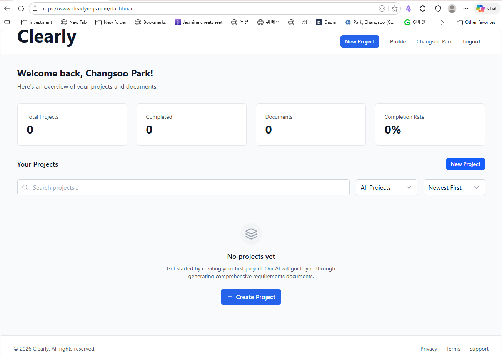

# M3: Clearly 앱 소개 영상 제작

**Topic**: Clearly-BRD-PRD
**모듈**: M3 (Bonus Module)
**날짜**: 2026-02-22
**상태**: 🔄 진행 중 (스크립트/슬라이드 완료, 영상 생성 대기)

---

## 📖 학습 순서

이 폴더를 처음 여는 분은 아래 순서대로 읽으세요.

| 순서 | 문서 | 설명 |
|------|------|------|
| 1 | [clearly-intro-script-kr.md](clearly-intro-script-kr.md) | KR 영상 스크립트 원본 (나레이션 포함, 27 슬라이드) |
| 2 | [clearly-intro-script-kr - slides.md](clearly-intro-script-kr%20-%20slides.md) | KR Deckset 슬라이드 파일 (TTS 소스) |
| 3 | [clearly-intro-script-en.md](clearly-intro-script-en.md) | EN 영상 스크립트 원본 |
| 4 | [clearly-intro-script-en - slides.md](clearly-intro-script-en%20-%20slides.md) | EN Deckset 슬라이드 파일 |
| 5 | [remotion-kr-plan.md](remotion-kr-plan.md) | Remotion을 활용한 KR 영상 제작 계획 |
| 최종 | `clearly-intro-kr.mp4` / `clearly-intro-en.mp4` | 완성된 KR/EN 소개 영상 |

**이전 모듈**: [02-CatchUpAI-BRD-PRD](../02-CatchUpAI-BRD-PRD/) | **다음 모듈**: 없음 (마지막 모듈)

---

## 개요

M1 (Clearly 개념 학습), M2 (BRD/PRD 실습)에서 얻은 모든 학습 산출물을 활용하여 **Clearly 앱을 소개하는 YouTube 영상**을 제작합니다.

**영상 목적**: Clearly 앱 소개 + 단계별 사용법 + 실제 홈페이지 제작 결과 시연
**언어**: 한국어 | **예상 길이**: 17-20분

---

## 영상 구성 (27 슬라이드)

| 섹션 | 슬라이드 | 예상 시간 | 주요 내용 |
|------|---------|---------|----------|
| 1. 인트로 | 4장 | 2분 | 채널 소개, 오늘의 주제 |
| 2. Vibe Coding & 문제 제기 | 4장 | 3분 | 왜 BRD/PRD가 필요한가 |
| 3. Clearly 앱 소개 | 5장 | 3분 | 기능, BRD vs PRD, 두 가지 모드 |
| 4. 단계별 사용법 데모 | 9장 | 5분 | 프로젝트 생성 → BRD → PRD → Output |
| 5. 실제 결과물 시연 | 4장 | 2분 | Catch Up AI 홈페이지 |
| 6. 인사이트 & 아웃트로 | 3장 | 1분 | 핵심 정리, 마무리 |

---

## 산출물 목록

| 파일 | 상태 | 설명 |
|------|------|------|
| `clearly-intro-script.md` | ✅ 완료 | 원본 영상 스크립트 (나레이션 포함) |
| `clearly-intro-script - slides.md` | ✅ 완료 | Deckset 형식 슬라이드 (스피커노트 포함) |
| `_files_/` | ⏳ 대기 | 앱 스크린샷 7장 (다음 세션에 수집) |
| `audio/` | ⏳ 대기 | TTS 오디오 파일 (자동 생성) |
| `slides-gemini/` | ⏳ 대기 | AI 생성 슬라이드 이미지 (자동 생성) |
| `clearly-intro.mp4` | ⏳ 대기 | 최종 MP4 영상 |

---

## 영상 제작 워크플로우

```
clearly-intro-script.md          (원본 스크립트)
        ↓ markdown-slides 스킬
clearly-intro-script - slides.md (Deckset 슬라이드)
        ↓ 스크린샷 수집 → _files_/ 폴더
        ↓ markdown-video 스킬
clearly-intro.mp4                (최종 영상)
```

---

## 다음 세션에서 할 일

### Step 1: 스크린샷 수집 (사용자 직접 캡처)

`_files_/` 폴더에 저장:

| 파일명 | 캡처 내용 |
|--------|----------|
| `clearly-main.png` | clearlyreqs.com 메인 화면 |
| `project-create.png` | 프로젝트 생성 화면 |
| `brd-wizard.png` | BRD Wizard 질문 화면 (진행률 포함) |
| `brd-result.png` | 생성된 BRD 문서 화면 |
| `prd-result.png` | 생성된 PRD 화면 |
| `output-tool.png` | Output Tool 선택 화면 |
| `homepage.png` | 완성된 홈페이지 화면 |

### Step 2: 슬라이드 이미지 경로 삽입

`clearly-intro-script - slides.md`에 스크린샷 참조 추가:
```markdown

```

### Step 3: markdown-video 스킬 실행

```bash
# SKILL.md 경로:
# Topics/Claude-Skills/temp-claude-obsidian-skills/markdown-video/SKILL.md

# Step 1: 오디오 생성 (OpenAI TTS)
python generate_audio.py "clearly-intro-script - slides.md" --output-dir "audio"

# Step 2: 슬라이드 이미지 생성 (Gemini)
python create_slides_gemini.py "clearly-intro-script - slides.md" \
  --output-dir "slides-gemini" --style "professional" --auto-approve

# Step 3: MP4 합성
python slides_to_video.py \
  --slides-dir "slides-gemini" --audio-dir "audio" --output "clearly-intro.mp4"
```

**API 요구사항**: `OPENAI_API_KEY`, `GEMINI_API_KEY` 환경변수 설정 필요
**예상 비용**: ~$1.30 (Gemini 이미지 30장 + OpenAI TTS)

---

## 참조한 M1/M2 학습 문서

| 문서 | 활용 내용 |
|------|----------|
| `01-Clearly-Overview/concepts/what-is-clearly.md` | Clearly 정의, 워크플로우 |
| `01-Clearly-Overview/concepts/brd-vs-prd.md` | BRD vs PRD 비교 |
| `01-Clearly-Overview/concepts/vibe-coding-role.md` | Vibe Coding 개념 |
| `01-Clearly-Overview/guides/clearly-usage-guide.md` | 단계별 사용법, 팁 |
| `02-CatchUpAI-BRD-PRD/notes/wizard-experience.md` | 실제 Wizard 경험 |

---

**방법론**: CUA_VL (VibeLearn AI) v2.0
