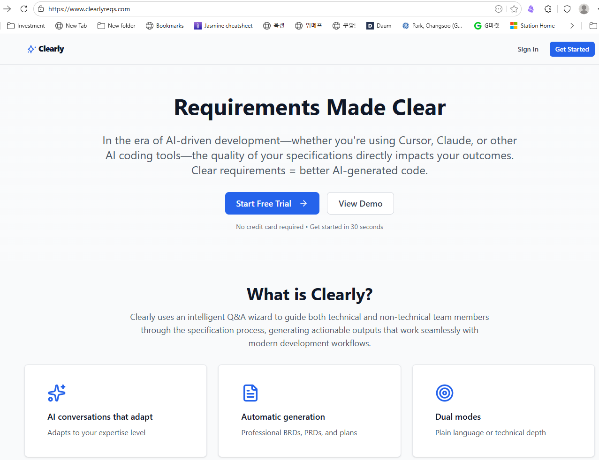
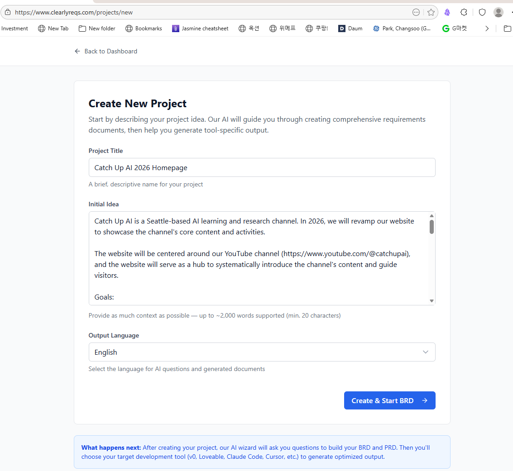
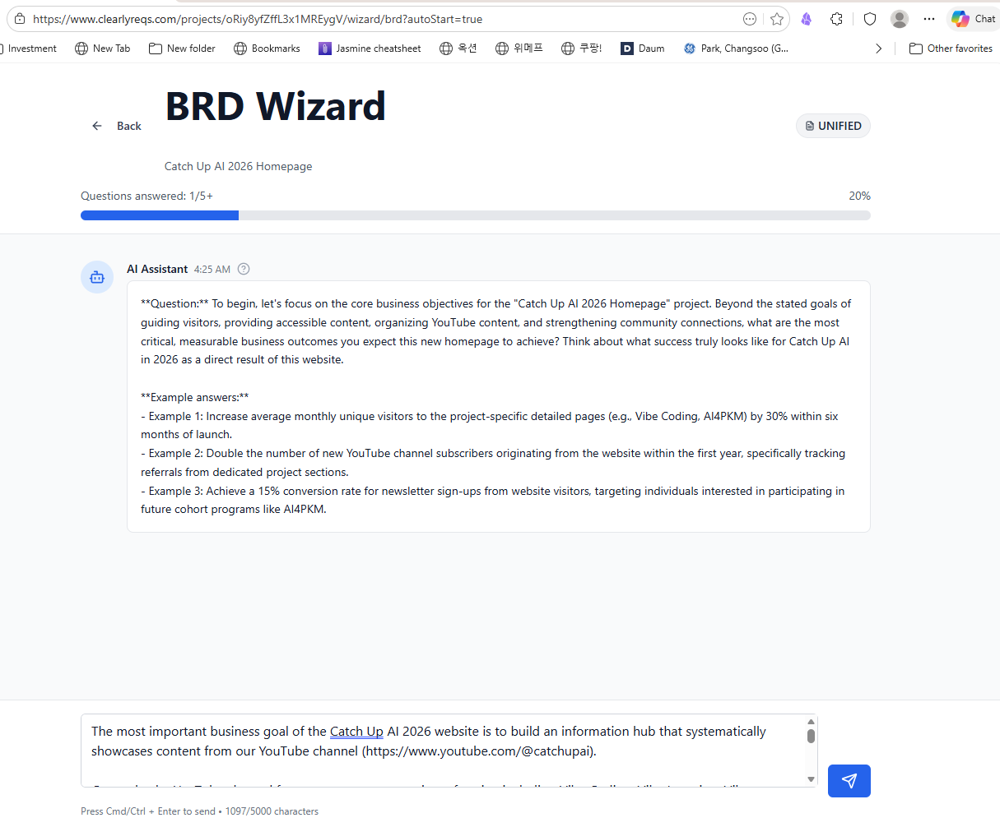
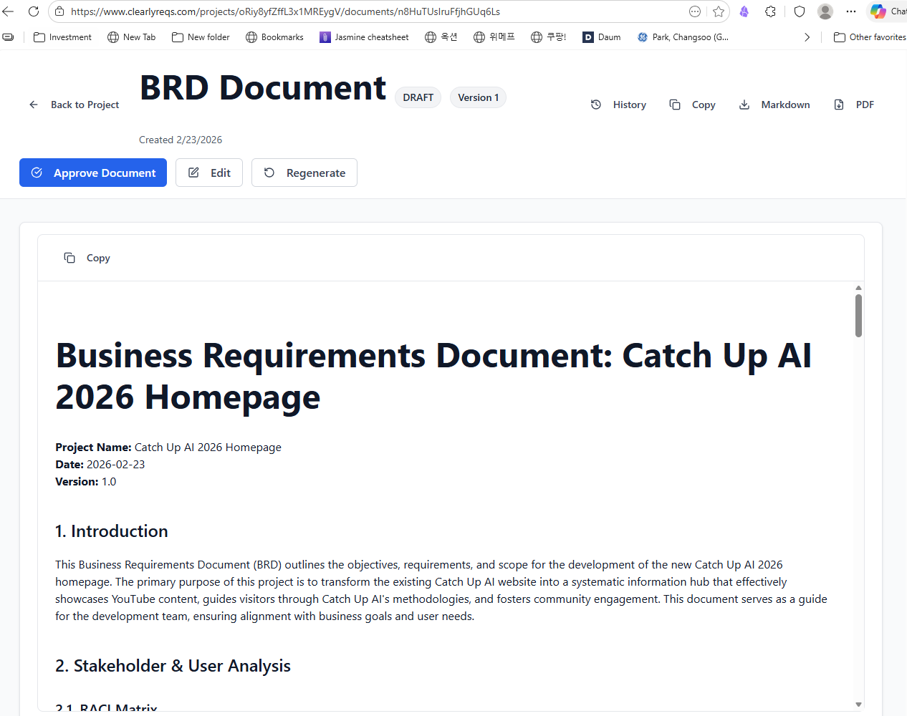
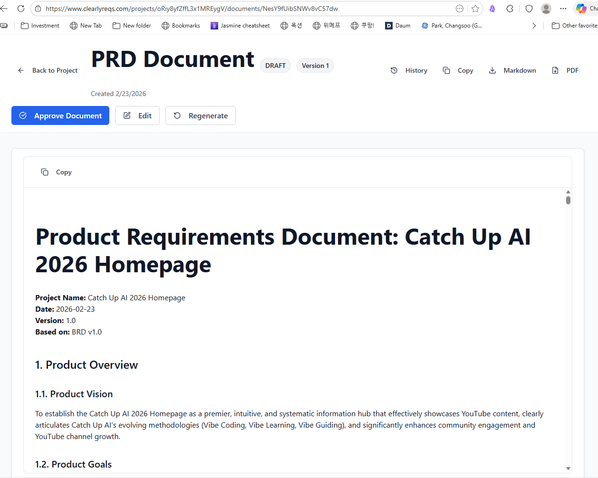
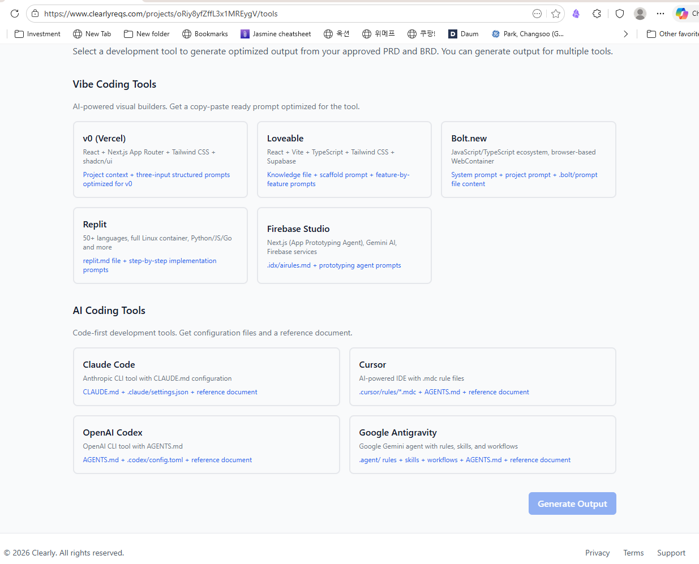
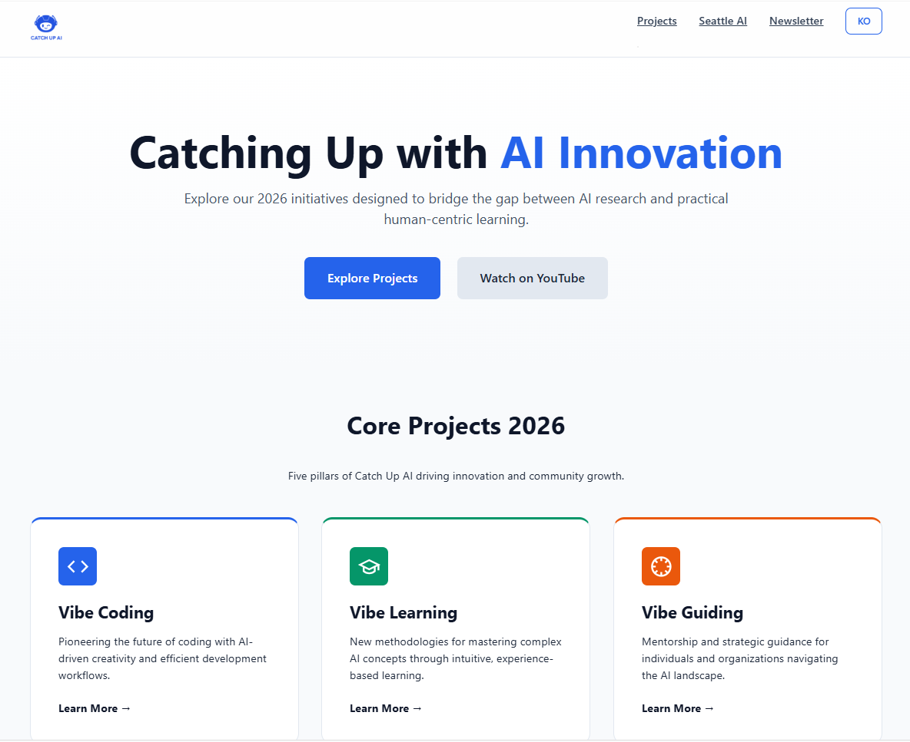

slidenumbers: true

---

# 🎬 Complete Guide to Clearly App
## Write BRD/PRD in 5 Minutes with AI and Start Vibe Coding

**Catch Up AI | 2026**

^ Hello everyone! This is Catch Up AI. Today I want to introduce a tool I've been finding incredibly useful lately — it's called Clearly. Just by answering a few questions in a conversational way, it automatically generates professional requirement documents — BRD and PRD. In today's video, I'll show you what Clearly is, how to use it, and the actual homepage planning documents I created with it. By the end, you'll be able to start using it right away.

---

## 📋 What You'll Learn Today

- 🤔 Why do requirement documents still matter in the AI era?
- 🎯 What is Clearly app? What problem does it solve?
- 📝 BRD vs PRD — what's the difference?
- 🛠️ Step-by-step Clearly tutorial (live demo)
- 🌐 Real output: homepage planning document complete!
- 💡 Tips and best practices

^ Today's video covers six main topics. We'll start with why requirement documents matter even in the AI era, then cover Clearly's core concepts, the difference between BRD and PRD, and a live demo of how to use it. Finally, I'll share the homepage planning document I actually made and some useful tips.

---

## 🙋 This Video Is For You If...

- You've tried AI coding tools (Claude Code, Cursor, v0) but the **results weren't what you expected**
- You have an idea but **don't know how to start**
- You need to write planning documents but **don't know where to begin**
- You want to properly start **Vibe Coding**

^ Have you ever experienced this? You ask ChatGPT or Claude to "build me a website," and what comes back is completely different from what you had in mind. That's exactly the problem I'm solving today. For AI to build exactly what you want, you first need to organize your thinking into a language AI can understand. That's what BRD and PRD are, and Clearly is the tool that makes creating them incredibly easy.

---

## ✨ Clearly, in One Line

> **"Answer a few conversational questions and get professional BRD/PRD generated in 5 minutes — an AI-powered requirements platform"**

🌐 **clearlyreqs.com**



^ Ready to dive in? Clearly in one sentence: it's a platform where you answer a few conversational questions and get professional BRD and PRD documents generated in about 5 minutes. The website is clearlyreqs.com and you can start for free. I'll be showing you the actual app on screen — let me cover the concepts first, then we'll jump straight into the demo.

---

# 🎵 Vibe Coding and the Problem

---

## 🎵 What Is Vibe Coding?

> **A development approach where instead of writing code directly, you convey your "Vibe" (vision) to AI and let it generate the code**

| Traditional Dev | Vibe Coding |
|----------------|-------------|
| Write code directly | Convey ideas to AI |
| Focus on "How" | Focus on "What" |
| Implementation details | Vision & requirements |

^ Let's talk briefly about Vibe Coding. Vibe Coding means instead of writing code directly, you convey your "vision" to AI and let it generate the code. For example, "Build me a web app where users can log in and see a dashboard." This is where the developer's role changes — from someone who writes code directly, to an architect and communicator who clearly instructs AI on what to build.

---

## ⚠️ The Core Problem with Vibe Coding

```
Tell AI "build me a website" → ??
```

- **Problem**: What AI builds is different from what's in your head!
- **Reason**: Without clear instructions, AI fills gaps with **assumptions**

> **"Input quality = Output quality"**
> Clear Requirements → Better AI-Generated Code

^ But there's a problem. For Vibe Coding to work well, you need to clearly communicate your idea to AI, and that's harder than it sounds. If you just say "build me a website," AI fills in all the blanks with assumptions — who the target audience is, what features are needed, what the design should look like. AI guesses all of this, and that's why the result ends up different from what you wanted. There's a core principle: input quality equals output quality. Clear requirements lead to much more accurate AI-generated code.

---

## 💡 BRD/PRD Is the Solution for Vibe Coding

**The Vibe Coding Workflow:**

```
Idea → BRD → PRD → Vibe Coding Prompt → Code Generation
```

- **BRD**: "Why build it? What to build?" (business perspective)
- **PRD**: "How to build it?" (product/tech perspective)
- Give these documents to AI → **much more accurate code**

^ So that's where BRD and PRD come in. BRD is a Business Requirements Document — it defines why you're doing this project and what needs to be built. PRD is a Product Requirements Document — it contains the technical details of how to build it. When you give these two documents to AI coding tools, AI understands your project much better and generates far more accurate code. And Clearly is the tool that makes creating these BRD and PRD documents easy.

---

## 🔄 How the Developer's Role Is Changing in the AI Era

**Traditional Developer → AI-Era Developer**

- ❌ Writing all code directly
- ✅ An **architect who defines clear requirements**

**BRD/PRD's new role:**
- Not just documents, but **prompts passed to AI**
- Team communication tool → **Context for AI coding tools**

**Most important skill**: The ability to effectively instruct AI

^ BRD and PRD originally came from large-scale software development, where they were used for team communication. But in the AI era, these documents have taken on a new role — they become prompts, or context, for AI. AI coding tools like Claude Code and Cursor reference these documents at the start of a project to set the development direction. So one of the most important skills in the AI era has become the ability to effectively instruct AI. Memorization and coding skills matter less than this.

---

# 🚀 Introducing the Clearly App

---

## 🚀 Clearly App: Key Features

**Website**: clearlyreqs.com

**3-Step Workflow:**

1. 🤖 **BRD Wizard** — AI asks questions, you answer → BRD auto-generated
2. 📋 **PRD Wizard** — Technical follow-up questions based on BRD → PRD generated
3. 🔧 **Output Tool** — Optimized files generated for your dev tool

**Key characteristics:**
- BRD generated in 3–5 questions (Clearly auto-judges when it has enough info)
- 3 example answers provided for each question
- Multiple output language options


^ Now let's look at Clearly itself. Clearly's core is a three-step workflow. First, in the BRD Wizard, AI asks questions and automatically generates a BRD from your answers. Clearly automatically judges when it has enough information — usually around 3 to 5 questions. Second, in the PRD Wizard, it builds on the BRD with more technical questions to create the PRD. Third, in the Output Tool step, it automatically generates files optimized for AI development tools like Claude Code, Cursor, or v0. A particularly nice feature is that each question comes with 3 sample answers, so even first-time users can easily get a feel for how to respond.

---

## 📊 BRD vs PRD: Key Differences

| | BRD | PRD |
|--|-----|-----|
| **Core Question** | Why? + What? | What? + How? |
| **Perspective** | Business | Product/Tech |
| **Audience** | Stakeholders, Executives | Dev team, Designers |
| **Abstraction** | High-level | Low-level (detailed) |
| **Content** | Goals, KPIs, user needs | Feature specs, API, data models |

**Order**: Idea → **BRD** → **PRD** → Development

^ Let me clarify the difference between BRD and PRD more precisely. BRD covers "why we're building this and what we're building" from a business perspective. The main audience is executives and stakeholders, and it's abstract and high-level. PRD, on the other hand, covers "how to build it" from a product and technical perspective. It's for developers and designers, and contains specific feature specs and tech stack details. The order is always: idea first, then BRD, then PRD, and finally development.

---

## ⚙️ Two Modes in Clearly

**Plain Mode** (for non-technical users)
- BRD + PRD + Vibe Coding prompts
- Optimized for no-code tools like v0, Bubble

**Technical Mode** (for developers)
- BRD + PRD + **detailed technical task list**
- Includes dependencies and priorities
- Optimized for AI coding tools like Claude Code, Cursor

> Note: As of 2026, both modes have been integrated into one unified experience

^ Clearly has two modes. Plain Mode is for non-technical users — it generates BRD and PRD plus Vibe Coding prompts, optimized for no-code tools like v0 or Bubble. Technical Mode is for developers — in addition to BRD and PRD, it creates detailed technical task lists with dependencies and priorities, optimized for AI coding tools like Claude Code or Cursor. For reference, when I used it, the two modes had already been integrated into one unified experience.

---

## 🎯 Clearly = The Starting Point for Vibe Coding

```
Idea
   ↓
Clearly (BRD → PRD)
   ↓
Output Tool (generate dev tool config files)
   ↓
AI Coding Tool (Claude Code, Cursor, etc.)
   ↓
Finished Product
```

> **"Clearly isn't just a document tool — it's the starting point for the Vibe Coding workflow"**

^ What impressed me most about Clearly was that it's not just a document tool. After the Output Tool step, configuration files are automatically generated that you can use directly in AI coding tools like Claude Code or Cursor. So the flow is: start with an idea, create BRD and PRD with Clearly, auto-generate dev tool configuration with Output Tool, and immediately start coding with an AI coding tool. That's the complete Vibe Coding workflow.

---

# 🛠️ Step-by-Step Tutorial Demo

---

## 🆕 Step 1: Create a Project

**Access**: clearlyreqs.com → Sign in with Google account

**New project creation screen:**
- **Project Title**: Your project name
- **Initial Idea**: Your initial project idea (20–2,000 characters)
  - Recommended: include relevant URLs, target users, success metrics
- **Output Language**: Choose your language (English supported)

> 💡 **Tip**: The more detailed your Initial Idea, the better questions you'll get!



^ Let's actually use it. Go to clearlyreqs.com and log in with your Google account to get to the dashboard. Click "New Project" to see the project creation screen. Enter the project name in Project Title and your idea in Initial Idea. One important tip here — the more detailed your Initial Idea, the better questions AI will generate. Include things like relevant website URLs, target users, and success metrics. Set Output Language to English to get documents in English.

---

## 🤖 Step 2: BRD Wizard

**How it works:**
- AI presents questions one at a time
- 3 **sample answers** provided for each question
- Progress: "Questions answered: X/5+"
- **"Generate BRD" button**: activates when Clearly judges it has enough info
  - Can activate after just 2–3 answers
  - About 5 questions presented in total

**Key question areas:**
1. Business goals — "What is the core value of this project?"
2. Tech stack — "What technology/platform will you use?"
3. Target users — "Who is this service for?"
4. Content management — "How will this be operated?"
5. Risks — "What constraints do you anticipate?"



^ Now, the BRD Wizard. As you can see on screen, AI presents questions one by one. Below each question are 3 sample answers — use these as reference and respond according to your project. The progress indicator shows how many questions you've answered, and the Generate BRD button activates when Clearly judges it has collected enough information. This can happen after just 2 to 3 answers. About 5 questions are presented in total. The main question areas are business goals, tech stack, target users, content management, and risks.

---

## 💡 BRD Wizard Answer Tips

**How to answer well:**

- ✅ **Be specific**: "fast" → "loads in under 3 seconds"
- ✅ **Be measurable**: "easy to use" → "complete in 3 steps or fewer"
- ✅ **Prioritize**: Must have / Should have / Nice to have
- ✅ **Use sample answers**: follow the structure, customize content for your project

**Prep tips:**
- Draft your answers in a text file in advance
- Research your URLs, target users, and KPIs beforehand

^ A few tips for answering in the BRD Wizard. First, be specific: instead of "fast," write "3-second load time." Second, be measurable: instead of "easy to use," write "complete in 3 steps or less." Third, prioritize: categorize into Must have, Should have, Nice to have — this helps AI create more accurate documents. And one more practical tip: organizing your answers in a text file beforehand lets you move through the process much faster.

---

## 🤖 Pro Tip: Use AI to Prepare BRD/PRD Answers

**The nature of Clearly Wizard questions:**
- AI-generated questions → **vary slightly each time**
- Unexpected questions can catch you off guard

**Key strategy: Discuss your project thoroughly with AI beforehand!**

```
① When a question appears in Clearly
② Copy & paste the question to your AI tool
③ "Write an answer to this question"
→ Get a detailed answer optimized for your project!
```

**Key point:** The more you discuss with AI upfront, the more accurate your answers will be

^ Here's a special tip. I actually used AI tools to prepare my answers for Clearly's BRD and PRD Wizard questions. Because the Wizard questions are AI-generated, they vary slightly each time, and unexpected questions can catch you off guard. The key strategy: before using Clearly, have a thorough conversation with an AI tool — like Claude Code or ChatGPT — about your project. Discuss your goals, target users, and tech stack. Once AI deeply understands your project, whenever a question comes up in Clearly, just paste it into AI and say "write an answer to this question" — and you'll get a tailored, detailed answer. The more you discuss upfront, the more accurate and detailed the answers will be.

---

## 📄 Step 3: Generate and Review the BRD

**Key sections to check after BRD generation:**
- Introduction (project overview)
- Stakeholder & User Analysis (RACI matrix)
- Business Objectives & KPIs
- Functional Requirements
- Non-Functional Requirements
- Risk Analysis

**Export options:**
- 📋 **Markdown** (recommended) — easy to copy and edit
- 📄 **PDF** — for sharing and printing

> ⚠️ **Important**: Save locally immediately after generating!



^ After completing the Wizard, click "Generate BRD" and a complete BRD appears within seconds. The structure is remarkably professional — from Introduction through stakeholder analysis with RACI matrix, KPIs, functional requirements, non-functional requirements, and risk analysis. Something that would take hours for a person to write, AI created from just a few questions. After generating, be sure to save locally! Exporting to Markdown makes it easy to edit, and PDF is great for sharing. Click "Approve Document" at this stage to activate the PRD Wizard.

---

## 🔧 Step 4: PRD Wizard

**Starts after Approving the BRD:**

**Key question areas:**
1. Tech stack details — frameworks, hosting, build tools
2. API/data integration — how to connect external services
3. Multilingual implementation — translation management, scalability
4. Design system — CSS variables, component structure
5. Analytics & security — GA4 setup, privacy compliance

**Output**: Detailed PRD with 12 sections
- Includes Timeline, performance metrics, deployment strategy



^ Approving the BRD kicks off the PRD Wizard. The PRD Wizard asks much more technical questions than the BRD. It covers tech stack details, API integration, multilingual implementation, design system, analytics, and security. The resulting PRD is organized into 12 sections, including Timeline and Milestones, performance metrics, and deployment strategy. What's remarkable is that this 12-section document is auto-generated from just 5 to 6 question answers.

---

## 🔗 Step 5: Select Output Tool

**Activates after Approving the PRD:**

**Vibe Coding Tools:**
- **v0**, **Lovable**, **Bolt.new**, **Replit**, **Firebase Studio**

**AI Coding Tools:**
- **Claude Code** ← my tool of choice
- **Cursor**, **OpenAI Codex**, **Google Antigravity**

**Files generated when choosing Claude Code:**
- `CLAUDE.md` — project instructions file
- `.claude/settings.json` — tech stack/metadata
- `REFERENCE_DOCUMENT.md` — combined BRD/PRD reference



^ The final step is the Output Tool. Here you select which AI development tool you want to use. All the major AI tools are available: v0, Lovable, Bolt, Claude Code, Cursor, and more. I chose Claude Code — click "Generate Output" and files optimized for Claude Code are automatically created. CLAUDE.md contains project structure and coding conventions, settings.json has tech stack information. Put these files in your actual project folder and Claude Code immediately understands your project and can start coding. That's the real start of Vibe Coding!

---

## ⚠️ Practical Tips & Best Practices

**Must-do's:**
- ✅ **Save locally immediately** after each stage (export to Markdown)
- ✅ **Prepare your answers** in a text file beforehand
- ✅ Review the BRD carefully before Approving
- ✅ Use sample answer structures but customize for your project

**How to use efficiently:**
- 💡 More detail in Initial Idea → better question quality
- 💡 Pre-discuss with AI tools → better Wizard answer quality
- 💡 Carefully reviewing BRD before Approve → higher PRD quality

^ A few more practical tips. The most important one is saving locally — export to Markdown at the end of each stage. If you organize your answers in a text file beforehand, or have a thorough conversation with AI tools about your project, the process goes much faster. For efficient usage: the more detailed your Initial Idea, the more relevant questions AI generates. And carefully reviewing and approving the BRD is key to getting higher quality PRD output.

---

# 🌐 Real Results Demo

---

## 🌐 Real Results: Catch Up AI 2026 Homepage

**Project overview:**
- **Goal**: An information hub showcasing 5 key projects from the Catch Up AI channel
- **Tech stack**: HTML/CSS/JavaScript (static website)
- **Hosting**: Amazon S3
- **Audience**: Developers and non-developers interested in AI, Seattle AI community

**Key features:**
- 5 project pages
- Multilingual support (Korean/English)
- Responsive design | Newsletter subscription

^ Let me show you the actual results. I used Clearly to create the homepage planning document for my YouTube channel, Catch Up AI. The goal was to create an information hub showcasing 5 AI methodologies I research. I decided on a static website using HTML, CSS, and JavaScript, hosted on Amazon S3. Multilingual support and responsive design were included in the requirements.

---

## 📋 BRD Core Content

**Business Objectives (KPIs):**
- 1,000 monthly visitors within 3 months
- 200 newsletter subscribers
- 15% YouTube viewer-to-site conversion rate

**Key Stakeholders:**
- Developers and non-developers interested in learning AI
- Seattle AI community members
- Vibe Learning methodology researchers

**Key Risks:**
- Content update frequency (weekly)
- Multilingual translation quality management

^ Here's the core content of the BRD Clearly created. Notice how the business objectives have specific KPIs? Things like 1,000 monthly visitors within 3 months and 200 newsletter subscribers. There's stakeholder analysis and even risk assessment included. If I had written this manually, it would have taken hours. Thanks to Clearly, I created this professional document in just 30 minutes.

---

## 🔧 PRD → Claude Code Integration

**PRD v2 structure (12 sections):**
- Technical architecture (static site, S3 hosting)
- Multilingual processing (dynamic JSON loading)
- Design system (CSS variable-based)
- GA4 event tracking setup
- Deployment strategy and timeline

**Claude Code integration files:**
- `CLAUDE.md` — architecture, coding conventions
- `.claude/settings.json` — tech stack, metadata
- `REFERENCE_DOCUMENT.md` — combined BRD/PRD reference

^ The PRD contains much more technical content. It's organized into 12 sections, including technical architecture, multilingual processing approach, design system, GA4 analytics setup, and deployment strategy. And when I selected Claude Code as my Output Tool, CLAUDE.md, settings.json, and REFERENCE_DOCUMENT.md were automatically generated. Put these files in a Claude Code project, and Claude understands the entire context of my project and helps with coding. The Vibe Coding preparation is complete!

---

## 🎉 The Finished Homepage

**Catch Up AI 2026 Homepage**

🌐 **catchupai.net**

Key pages:
- 🏠 **Main page** — introducing 5 projects
- 🎵 **Vibe Coding** page
- 📚 **Vibe Learning (CUA_VL)** page
- 🗺️ **Vibe Guiding** page
- 🤖 **AI4PKM** page
- 📰 **Seattle AI News** page



^ And based on these planning documents, the homepage developed by Claude Code is complete! You can check it right now at catchupai.net. It's the official homepage for my channel, Catch Up AI, with the main page introducing 5 projects, each with its own detailed page — Vibe Coding, Vibe Learning, Vibe Guiding, AI4PKM, and the Seattle AI News page. All of this was built starting from the BRD and PRD created with Clearly.

---

# 💎 Key Insights & Outro

---

## 💎 Key Insights Summary

**1. Clearly is the starting point for Vibe Coding** 🚀
> Not just a document tool — it's the beginning of a workflow connected to AI coding tools

**2. Preparation determines quality** 📝
> Discussing your project with AI tools in advance and writing a detailed Initial Idea produces better documents

**3. Clear requirements = better AI output** 📊
> "Input quality equals output quality"

**4. The core skill of the AI era** 🤖
> The ability to effectively instruct AI matters more than writing code directly

^ Let me wrap up the key insights from using Clearly today. First, Clearly is not just a document tool — it's the starting point for the Vibe Coding workflow. Second, preparation determines quality: discussing your project with AI tools in advance and writing a detailed Initial Idea produces much richer and more accurate documents. Third, clear requirements produce better AI output — input quality equals output quality. And fourth, in the AI era, the ability to effectively instruct AI becomes more important than directly writing code.

---

## 🎯 When to Use Clearly

**Tier 1** (small-scale): scripts, utilities → optional
**Tier 2** (mid-scale): feature additions, modules → recommended
**Tier 3** (large-scale): new projects, architecture design → **essential**

**Especially useful when:**
- 🚀 Starting a new project with Vibe Coding
- 📝 Organizing requirements for a team project
- 🎓 Learning how to write requirements properly
- 💼 Explaining a project to investors or teammates

^ Let me also share when it's best to use Clearly. Small-scale scripts or utility work is fine without it. But I'd recommend it for mid-scale feature additions or module development, and consider it nearly essential for large-scale new projects or architecture design. It's especially useful when starting a new project with Vibe Coding, organizing requirements for a team project, or when you need to explain a project to investors or team members.

---

## 🙏 Wrap-Up

**What you learned today:**
- ✅ Why BRD/PRD matters in the AI era
- ✅ Clearly app's 3-step workflow
- ✅ Step-by-step usage (Create project → BRD → PRD → Output)
- ✅ Better documents through preparation and AI utilization

**Next steps:**
1. 🌐 Visit clearlyreqs.com — start free (no credit card required)
2. 📝 Generate a BRD for your own project
3. 🚀 Start Vibe Coding with Claude Code or Cursor!

**🔔 Please subscribe and like!**

^ How was today's video? I hope you now understand how easily BRD and PRD can be created with Clearly, and what role they play in the Vibe Coding workflow. Go to clearlyreqs.com right now and start for free — no credit card required! Please share your questions and experiences in the comments. If this video was helpful, please subscribe and hit the like button. See you in the next video. Thank you!
