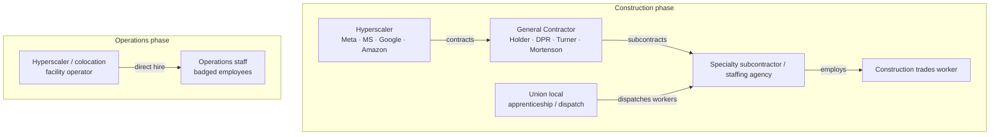

<!-- lang-switch -->
[🇰🇷 한국어](employment-structure.md) · 🇺🇸 **English**
<!-- lang-switch -->

## The question this document answers

**"If you complete a Meta program, who actually employs you?"**

If your answer is "Meta," you're wrong — and this is the misconception that costs
the most when choosing a program.

---

## The employer differs at each stage

### Construction phase — the hyperscaler is not the employer

Construction workers belong to a general contractor (GC), its subcontractors, or a
staffing agency. GC names surfaced in research: **Holder, DPR, Turner, Mortenson**.

Tradesmen International (a staffing agency) states that it supplies "skilled craft
professionals" **to contractors** building data centers — so the path
**staffing agency → construction company → job site** is real too.

The Meta entry in the baseline table describing "job placement with partner
construction companies" is exactly this structure.
**Meta provides the training; a partner company does the hiring.**

### Operations phase — this is where direct employment appears

Operations electricians are "typically badged employees of the facilities operator,
a hyperscaler, or a colocation company." The word **badged** is the key detail — it
means a direct employee who carries a company badge.

In other words, if direct employment by a hyperscaler is the goal, **target
operations-phase roles, not construction-phase ones.**

---

## Four common misconceptions

### Misconception 1 — "Completing a Big Tech program makes you a Big Tech employee"

**No.** Construction-phase programs feed into partner construction companies.
Four of the six programs in the baseline table (Meta, MS-NABTU, Google, Amazon TWD)
target construction-phase trades, so **most of these programs are not a path to
Big Tech employment.**

The programs closer to direct hire are the ones targeting operations-phase roles
(MS Datacenter Academy, Amazon Technical Apprenticeship).

### Misconception 2 — "The operator, the funder, and the employer are the same"

They can be three different entities. The Google entry in the baseline table says
"Google.org **support**" — funding something and operating it are different things,
and the application channel is likely not Google itself.

→ Separating these three is exactly what M2's first exercise does.

### Misconception 3 — "A new data center means lots of jobs"

**Most are temporary.** Research found that the "vast majority" of jobs announced
alongside a new data center are temporary construction jobs. Once the building is
finished, the resident operations staff is far smaller.

Figures cited from Uptime Institute:

| Facility size | Resident operations staff |
|---|---|
| Small | **8–12 per MW** |
| Large hyperscale campus | **1–2 per MW** |

**Larger data centers need fewer people per MW.** You'd expect jobs to scale up with
size, but the opposite happens — likely due to automation and standardization. This
figure is a useful baseline when reading claims about regional economic impact.

⚠️ This figure was quoted secondhand from search results; the Uptime Institute source
itself has not been checked directly. Needs confirmation in M2 or M4.

### Misconception 4 — "Trades work pays poorly"

Construction data center work is reported as "sometimes reaching six figures."
Operations-side Critical Facilities Engineer runs $93k–$155k, so **the ranges
overlap.** Choosing a track is not the same as ranking income.

---

## What this structure means for application strategy

| Goal | Target | Program character |
|---|---|---|
| Fast entry, higher starting pay | Construction-phase trades | Free intensive training + partner-company placement |
| Job stability, direct hire by Big Tech | Operations-phase roles | Community-college or apprenticeship based |
| Lowest entry barrier | Data Center Technician | HS diploma + on-the-job training |

**This doesn't mean temporary work is bad.** Moving between projects is the normal
shape of skilled construction work, and the pay is high. But **expecting to settle
in one place will not match reality.**

---

## To confirm (handed to M2)

- [ ] Confirm the **post-completion employer** for each of the 6 programs from official pages
- [ ] The Google.org entry's actual application channel (Google, or a training provider?)
- [ ] Primary source for the Uptime Institute per-MW staffing figures
- [ ] Whether the GC names (Holder, DPR, Turner, Mortenson) connect to actual data center projects

---

## References

- [Built In — Data Center Jobs](https://builtin.com/articles/data-center-jobs): operations roles, pay, requirements
- [Tradesmen International](https://www.tradesmeninternational.com/news-events/the-skilled-trades-behind-data-center-construction-and-how-to-staff-them/): staffing-agency model
- [[Roundup/2026-08-19 - Daily Roundup#새로 생긴 학습 주제 두 가지]]: baseline table
- Previous: [role-map.en.md](role-map.en.md) · Next: [../examples/program-to-role-matrix.en.md](../examples/program-to-role-matrix.en.md)
