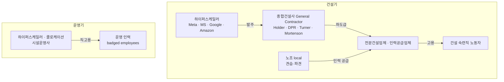

<!-- lang-switch -->
🇰🇷 **한국어** · [🇺🇸 English](employment-structure.en.md)
<!-- lang-switch -->

## 이 문서가 답하는 질문

**"Meta 프로그램을 수료하면 누구에게 고용되는가?"**

이 질문에 "Meta"라고 답하면 틀린다. 그리고 이 오해는 프로그램을 고를 때
가장 비싼 대가를 치르게 하는 오해다.

---

## 고용 주체는 단계마다 다르다

### 건설기 — 하이퍼스케일러는 고용주가 아니다

건설 인력은 종합건설사(GC)나 그 하도급업체, 또는 인력공급업체 소속이다.
검색 결과가 지목한 GC 이름: **Holder, DPR, Turner, Mortenson**.

Tradesmen International(인력공급업체) 자료는 자사가 "skilled craft professionals"를
데이터센터를 짓는 **contractor에게 공급**한다고 적고 있다. 즉 **인력공급업체 → 건설사 → 현장**
경로도 실재한다.

기초 표의 Meta 항목이 "협력 건설업체 취업 연계"라고 적은 것이 바로 이 구조다.
**Meta는 교육을 제공하고, 고용은 협력업체가 한다.**

### 운영기 — 여기서는 직고용이 나온다

운영 전기공은 "typically badged employees of the facilities operator, a hyperscaler,
or a colocation company"다. **badged** 라는 표현이 핵심이다 — 출입증을 받는 정직원이라는 뜻.

즉 하이퍼스케일러에 직접 고용되고 싶다면 **건설기가 아니라 운영기 직무**를 노려야 한다.

---

## 흔한 오해 4가지

### 오해 1 — "빅테크 프로그램을 수료하면 빅테크 직원이 된다"

**아니다.** 건설기 프로그램의 출구는 협력 건설업체다.
기초 표 6개 중 4개(Meta·MS NABTU·Google·Amazon TWD)가 건설기 숙련직을 겨냥하므로,
**대부분의 프로그램은 빅테크 취업 경로가 아니다.**

빅테크 직고용에 가까운 것은 운영기 직무를 겨냥하는 프로그램이다
(MS Datacenter Academy, Amazon Technical Apprenticeship).

### 오해 2 — "운영 주체 = 자금원 = 고용주"

셋이 다를 수 있다. 기초 표의 Google 항목은 "Google.org **지원**"이라고 적혀 있다 —
돈을 대는 것과 운영하는 것은 다르고, 지원 창구가 구글이 아닐 가능성이 높다.

→ M2 실습 1이 이 셋을 분리해 확인하는 작업이다.

### 오해 3 — "데이터센터가 들어오면 일자리가 많이 생긴다"

**대부분은 임시직이다.** 검색 결과는 신규 데이터센터 발표에서 나오는 일자리의
"vast majority"가 임시 건설직이라고 적고 있다. 건물이 완공되면 상주 운영 인력은
훨씬 적다.

Uptime Institute 인용 수치:

| 시설 규모 | 상주 운영 인력 |
|---|---|
| 소규모 | **MW당 8~12명** |
| 대형 하이퍼스케일 캠퍼스 | **MW당 1~2명** |

**큰 데이터센터일수록 MW당 사람이 적다.** 규모가 커지면 일자리도 비례해 늘 것 같지만
반대다. 자동화와 표준화 때문으로 보이며, 이 수치는 지역 경제 효과 주장을 읽을 때
기준선이 된다.

⚠️ 이 수치는 검색 결과가 인용한 것이고 Uptime Institute 원문을 직접 확인하지 않았다.
M2 또는 M4에서 원출처 확인이 필요하다.

### 오해 4 — "숙련직은 임금이 낮다"

건설 데이터센터 작업은 "sometimes reaching six figures"로 보고된다.
운영기 Critical Facilities Engineer가 $93k~$155k이므로 **구간이 겹친다.**
트랙 선택이 곧 수입 서열은 아니다.

---

## 이 구조가 지원 전략에 주는 함의

| 목표 | 노려야 할 것 | 프로그램 성격 |
|---|---|---|
| 빠른 취업·높은 초봉 | 건설기 숙련직 | 무료 집중 교육 + 협력업체 연계 |
| 고용 안정·빅테크 직고용 | 운영기 직무 | 커뮤니티 칼리지·견습 기반 |
| 낮은 진입 장벽 | 데이터센터 기술자 | 고졸 + 현장훈련 |

**임시직이 나쁘다는 뜻이 아니다.** 건설 숙련직은 프로젝트를 옮겨 다니며 일하는 것이
정상 형태이고 임금도 높다. 다만 **"한 곳에 정착"을 기대하고 들어가면 어긋난다.**

---

## 확인 필요 (M2로 넘김)

- [ ] 6개 프로그램 각각의 **수료 후 고용 주체**를 공식 페이지에서 확인
- [ ] Google.org 항목의 실제 지원 창구 (구글인가, 훈련기관인가)
- [ ] Uptime Institute MW당 인력 수치의 원출처
- [ ] GC 이름(Holder·DPR·Turner·Mortenson)이 실제 데이터센터 프로젝트와 연결되는지

---

## 참조

- [Built In — Data Center Jobs](https://builtin.com/articles/data-center-jobs): 운영기 직무·연봉·요건
- [Tradesmen International](https://www.tradesmeninternational.com/news-events/the-skilled-trades-behind-data-center-construction-and-how-to-staff-them/): 인력공급업체 모델
- [[Roundup/2026-08-19 - Daily Roundup#새로 생긴 학습 주제 두 가지]]: 기초 표
- 이전 문서: [role-map.md](role-map.md) · 다음: [../examples/program-to-role-matrix.md](../examples/program-to-role-matrix.md)
