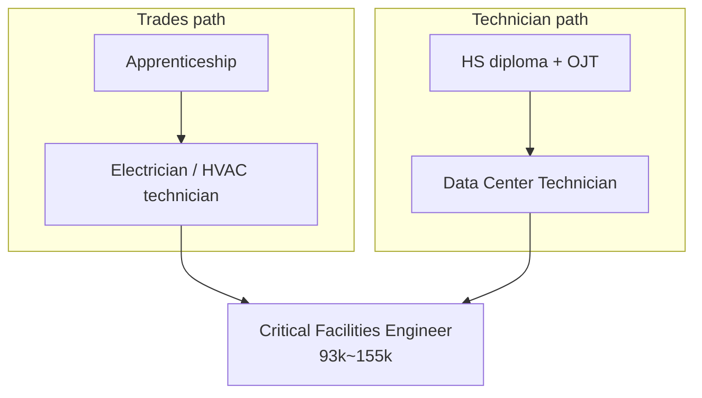

<!-- lang-switch -->
[🇰🇷 한국어](role-map.md) · 🇺🇸 **English**
<!-- lang-switch -->

## Why start with a map

Every later investigation sits on this coordinate system. Asking "which cell does this
belong in?" for each program reveals where the six cluster and where the gaps are.

There are two axes.

- **Time axis**: Construction — while the building goes up / Operations — after it goes live
- **Role axis**: Trades — license and apprenticeship centered / Technician — certification and experience centered

---

## The 2×2 role map

| | **Construction** (temporary, project-based) | **Operations** (ongoing, year-round) |
|---|---|---|
| **Trades** | Electrician HVAC technician Plumber / pipefitter Low-voltage technician (fiber, structured cabling) Carpenter / general labor Welder / ironworker / concrete | Operations Electrician **Critical Facilities Engineer** |
| **Technician** | *(essentially empty)* | **Data Center Technician** Data Center Operations Manager Security staff |

### Why Construction × Technician is empty

There are no servers while the building is under construction. IT-role demand only
appears after the facility goes live. It is reasonable to treat this empty cell as
**structural**, not as a gap in research.
→ Re-checked against the program list in M2.

---

## Role detail

### Construction-phase trades

Source: [Tradesmen International — The Skilled Trades Behind Data Center Construction](https://www.tradesmeninternational.com/news-events/the-skilled-trades-behind-data-center-construction-and-how-to-staff-them/)

| Role | What they do (direct quotes) |
|---|---|
| Electrician | "Installing and maintaining power distribution systems" / "Running conduit and wiring for critical infrastructure" / "Setting up backup generators and uninterruptible power supply (UPS) systems" |
| HVAC technician | "Installing precision cooling systems" / "Managing airflow and temperature control" |
| Plumber / pipefitter | "Installing piping for cooling systems" / "Supporting water-based and liquid cooling infrastructure" / "Ensuring system integrity and leak prevention" |
| Low-voltage technician | "Installing structured cabling systems" / "Supporting network infrastructure" / "Setting up data and communication lines" |
| Carpenter / general labor | "Framing and structural elements" / "Equipment installation support" / "Site preparation and material handling" |

**The low-voltage technician role is what "fiber" work actually is.** Four of the six
programs list "fiber" as a target role — this is where it sits on the map.

### Operations-phase roles

Source: [Built In — Data Center Jobs: Pay, Roles and What to Expect](https://builtin.com/articles/data-center-jobs)

| Role | What they do | Pay | Entry requirement |
|---|---|---|---|
| **Data Center Technician** | Installing servers, routers, switches; hardware/software upgrades; checking wiring and power; performance checks; troubleshooting connectivity | $60,000–$90,000 | **"typically require a high school diploma"** — many employers offer on-the-job training/apprenticeship |
| **Critical Facilities Engineer** | Mechanical/electrical systems, monitoring building-management software, maintaining switchgear, batteries, generators, chillers | $93,000–$155,000 | **3+ years** experience in HVAC/electrical/critical-facilities maintenance. Associate's/bachelor's in mechanical/electrical engineering **or entry via apprenticeship** |
| Data Center Operations Manager | Day-to-day operations, staff management, vendor contracts, budget, safety/security compliance | $117,000–$198,000 | Engineering + facilities-management experience |

---

## Three things the map reveals

### 1. The lowest-barrier door is on the technician side

**Data Center Technician entry is a high school diploma plus on-the-job training.**
Compared to a typical 3–5 year trades apprenticeship, this is a much shorter path in.
It's the opposite of the assumption that "technician roles require education/experience."

→ This could be decisive for the M7 fit assessment.

### 2. The two tracks are not walled off — there's a bridge

The Critical Facilities Engineer entry path explicitly includes **"or entry via
apprenticeship."** That means starting in a trades apprenticeship and later crossing
into a senior operations role is possible.

→ **Treating M7 as "pick one track or the other" misses this bridge.**
   Starting in trades and moving into operations may be a single continuous path.

### 3. Pay ranges overlap

Skilled construction jobs are reported as "sometimes reaching six figures" ($100k+),
while operations-side Critical Facilities Engineer runs $93k–$155k.
**Choosing a track is not the same as ranking income.**

---

## To confirm (handed to M2)

- [ ] Whether Construction × Technician is actually empty — re-check against the program list
- [ ] The share of welders/ironworkers in data center construction (the baseline table
      mentions "welding," but the 5-trade list from Tradesmen doesn't — lists differ by source)
- [ ] Source and conditions behind the "six figures" claim (region-dependent? overtime included?)

---

## References

- [Tradesmen International — The Skilled Trades Behind Data Center Construction](https://www.tradesmeninternational.com/news-events/the-skilled-trades-behind-data-center-construction-and-how-to-staff-them/): 5 construction trades and their roles
- [Built In — Data Center Jobs](https://builtin.com/articles/data-center-jobs): 3 operations roles, pay, entry requirements
- [[Roundup/2026-08-19 - Daily Roundup#새로 생긴 학습 주제 두 가지]]: baseline table of 6 programs
- Next: [employment-structure.en.md](employment-structure.en.md)
