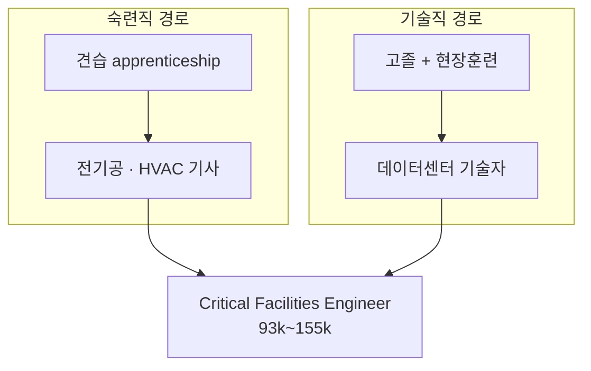

## 왜 지도부터 만드는가

이후 모든 조사가 이 좌표계 위에 얹힌다. 프로그램을 하나씩 볼 때마다
"이건 어느 칸인가"를 물으면 6개가 어디에 몰려 있고 어디가 비어 있는지 드러난다.

축은 둘이다.

- **시간 축**: 건설기(construction) — 짓는 동안 / 운영기(operations) — 가동 후
- **직무 축**: 숙련직(trades) — 면허·견습 중심 / 기술직(technician) — 자격증·경력 중심

---

## 2×2 직무 지도

| | **건설기** (임시·프로젝트 단위) | **운영기** (상시·연 단위) |
|---|---|---|
| **숙련직** (trades) | 전기공(Electrician) HVAC 기사 배관공·파이프피터 저전압 기술자(광섬유·구조화 배선) 목수·일반노무 용접공·철골공·콘크리트 | 운영 전기공(Operations Electrician) **Critical Facilities Engineer** |
| **기술직** (technician) | *(사실상 비어 있음)* | **데이터센터 기술자**(DC Technician) 데이터센터 운영 매니저 보안 인력 |

### 건설기 × 기술직이 비어 있는 이유

짓는 동안에는 서버가 없다. IT 직무 수요는 건물이 가동된 뒤에 생긴다.
이 칸이 비어 있는 것은 조사 누락이 아니라 **구조적으로 그렇다**고 보는 것이 타당하다.
→ M2에서 이 가설이 맞는지 프로그램 목록으로 재확인한다.

---

## 직무별 상세

### 건설기 숙련직

출처: [Tradesmen International — The Skilled Trades Behind Data Center Construction](https://www.tradesmeninternational.com/news-events/the-skilled-trades-behind-data-center-construction-and-how-to-staff-them/)

| 직무 | 하는 일 (원문 인용) |
|---|---|
| 전기공 | "Installing and maintaining power distribution systems" / "Running conduit and wiring for critical infrastructure" / "Setting up backup generators and uninterruptible power supply (UPS) systems" |
| HVAC 기사 | "Installing precision cooling systems" / "Managing airflow and temperature control" |
| 배관공·파이프피터 | "Installing piping for cooling systems" / "Supporting water-based and liquid cooling infrastructure" / "Ensuring system integrity and leak prevention" |
| 저전압 기술자 | "Installing structured cabling systems" / "Supporting network infrastructure" / "Setting up data and communication lines" |
| 목수·일반노무 | "Framing and structural elements" / "Equipment installation support" / "Site preparation and material handling" |

**저전압 기술자가 광섬유(fiber) 직무의 실체다.** 6개 프로그램 중 4개가 "광섬유"를 대상 직무로
적고 있는데, 지도상 위치는 여기다.

### 운영기 직무

출처: [Built In — Data Center Jobs: Pay, Roles and What to Expect](https://builtin.com/articles/data-center-jobs)

| 직무 | 하는 일 | 연봉 | 진입 요건 |
|---|---|---|---|
| **데이터센터 기술자** | 서버·라우터·스위치 설치, 하드웨어/소프트웨어 업그레이드, 배선·전원 확인, 성능 점검, 연결 문제 해결 | $60,000~$90,000 | **"typically require a high school diploma"** — 다수 고용주가 현장훈련·견습 제공 |
| **Critical Facilities Engineer** | 기계·전기 설비 담당, 건물관리 소프트웨어 모니터링, 스위치기어·배터리·발전기·칠러 유지보수 | $93,000~$155,000 | HVAC·전기·중요시설 유지보수 **경력 3년 이상**. 기계/전기공학 준학사·학사 **또는 견습 프로그램으로 진입** |
| 데이터센터 운영 매니저 | 일상 운영 총괄, 인력 관리, 벤더 계약, 예산, 안전·보안 준수 | $117,000~$198,000 | 엔지니어링 + 시설관리 경력 |

---

## 지도를 그리고 나서 보이는 것 3가지

### 1. 가장 낮은 문이 기술직 쪽에 있다

**데이터센터 기술자는 고졸 + 현장훈련으로 들어간다.** 숙련직 견습이 보통 3~5년인 것과 비교하면
진입 기간이 짧다. "기술직 = 학력·경력 필요"라는 통념과 반대다.

→ M7 적합성 판별에서 이 항목이 결정적일 수 있다.

### 2. 두 트랙은 분리돼 있지 않다 — 다리가 있다

Critical Facilities Engineer의 진입 경로에 **"또는 견습 프로그램으로 진입"**이 명시돼 있다.
숙련직 견습으로 시작해 운영기 고급 직무로 건너갈 수 있다는 뜻이다.

→ **M7에서 "둘 중 하나 고르기"로 접근하면 이 다리를 놓친다.**
   숙련직으로 시작해 운영기로 넘어가는 것이 하나의 경로일 수 있다.

### 3. 임금 구간이 겹친다

숙련직 건설 일자리는 "sometimes reaching six figures"(6자리, 즉 $100k+)로 보고되고,
운영기 Critical Facilities Engineer는 $93k~$155k다. **트랙 선택이 곧 수입 서열은 아니다.**

---

## 확인 필요 (M2로 넘김)

- [ ] 건설기 × 기술직 칸이 실제로 비어 있는가 — 프로그램 목록으로 재확인
- [ ] 용접공·철골공이 데이터센터 건설에서 차지하는 비중 (기초 표에는 "용접"이 있으나
      Tradesmen 자료의 5개 트레이드 목록에는 없다 — 출처마다 목록이 다르다)
- [ ] "six figures" 주장의 출처와 조건 (지역·초과근무 포함 여부)

---

## 참조

- [Tradesmen International — The Skilled Trades Behind Data Center Construction](https://www.tradesmeninternational.com/news-events/the-skilled-trades-behind-data-center-construction-and-how-to-staff-them/): 건설기 트레이드 5종과 각 역할
- [Built In — Data Center Jobs](https://builtin.com/articles/data-center-jobs): 운영기 직무 3종, 연봉, 진입 요건
- [[Roundup/2026-08-19 - Daily Roundup#새로 생긴 학습 주제 두 가지]]: 6개 프로그램 기초 표
- 다음 문서: [employment-structure.md](employment-structure.md)
