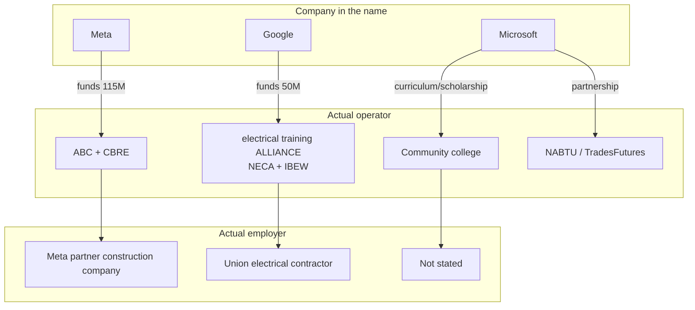

<!-- lang-switch -->
[🇰🇷 한국어](who-actually-hires-you.md) · 🇺🇸 **English**
<!-- lang-switch -->

## M1's hypothesis got confirmed

M1's [employment-structure.en.md](../../01-Ecosystem-and-Roles/concepts/employment-structure.en.md)
proposed "Misconception 2 — operator = funder = employer" as a hypothesis.
**M2's research found the three roles split apart in 5 of the 6 programs.**

A company's name being attached to a program doesn't mean that company operates it
or hires you. **Not knowing this leads to applying in the wrong place.**

---

## How the three roles split

---

## Case-by-case confirmation

### ④ Google.org — the clearest case

| | Party |
|---|---|
| Company in the name | **Google** |
| Funder | Google.org AI Opportunity Fund ($50M, ~$20M of it for electrical training) |
| **Operator** | **electrical training ALLIANCE** — a joint effort of NECA (electrical contractors association) and IBEW (electrical workers union) |
| **Application channel** | **Local IBEW local / etA training center** |
| Employer | A union-affiliated electrical contractor |

**There is nowhere to send an application to Google.** Google only put up the money.
The 8/19 baseline table's wording of "support" for this entry — and only this entry — turned out to be exactly right.

### ① Meta AWA — the employer is decided before training starts

| | Party |
|---|---|
| Funder | Meta ($115M) |
| Operator | Meta + ABC (Associated Builders and Contractors) + CBRE |
| Application channel | Meta's official portal (separate per track) |
| **Employer** | **A Meta partner construction company** — "a job at a Meta partner waiting on the other side" |

Notable: **a conditional hire commitment from the partner company is secured
before training even begins.** This isn't "train, then go find a job" — it's
entering training with employment already locked in.

→ The application channel is indeed Meta, but **the employer is not Meta.** The two differ.

### ② Microsoft Datacenter Academy — the application channel is a college

| | Party |
|---|---|
| Funder | Microsoft (scholarship, equipment, curriculum) |
| **Operator** | **Each community college** |
| **Application channel** | **That college's admissions office** — official guidance: "visit the college in your selected area and submit your application directly to them" |
| Employer | **Not stated** (only "Microsoft data center internship opportunities" is mentioned) |

This isn't applying to Microsoft — it's **enrolling at a college.**
And **no post-completion employment guarantee is stated** — the biggest
difference from ①.

### ③ Microsoft NABTU — a different thing entirely

The baseline table described this as construction-trades training, but the
substance of the 2026-04-21 expansion is **AI-literacy education for people
already in the trades.**

| | Party |
|---|---|
| Funder | Microsoft |
| Operator | NABTU (North America's Building Trades Unions) |
| Application channel | **TradesFutures apprenticeship-readiness program** (34 states) |

→ The real path to data center employment here isn't the Microsoft piece — it's
**the TradesFutures apprenticeship.**

### ⑥ Amazon Technical Apprenticeship — the only case where all three match

| | Party |
|---|---|
| Funder | Amazon |
| Operator | Amazon/AWS |
| Application channel | Amazon careers site |
| **Employer** | **Direct Amazon/AWS employment** |

**The only one of the six where "name = operator = employer" holds.**
This is the shape to look for if the goal is direct hire by Big Tech.

⚠️ Eligibility still needs confirmation — the "veterans and spouses" wording
conflicts with an "expanded eligibility" article.

---

## Three questions to ask before applying to anything

Separate these three every time a new program shows up.

1. **Who do you actually apply to** — the company, a college, or a union local?
2. **Who employs you** — that company, a partner, or is it not stated?
3. **Is employment guaranteed** — a conditional commitment (①), an internship
   opportunity (②), or nothing stated?

**A program where all three match is rare.** Only 1 of the 6 (⑥) had that.

---

## Practical implications

| What you want | Program type to look for | Which one fits here |
|---|---|---|
| Direct hire by Big Tech | Name = operator = employer | ⑥ Amazon Apprenticeship |
| Employment locked in before training | A conditional hire commitment | ① Meta AWA |
| A degree or credential | Education-institution based | ② MS DCA (e.g., Big Bend CC) |
| Entry into a union apprenticeship | Local-union channel | ③ TradesFutures · ④ IBEW/etA |

---

## References

- M1 hypothesis: [../../01-Ecosystem-and-Roles/concepts/employment-structure.en.md](../../01-Ecosystem-and-Roles/concepts/employment-structure.en.md)
- Detailed evidence: [../examples/program-anatomy.en.md](../examples/program-anatomy.en.md)
- [NECA — Google.org's support for etA](https://www.necanet.org/news-media/detail/press-releases/2026/06/12/neca-applauds-google.org-for-support-of-the-electrical-training-alliance-and-skilled-trades-growth)
- [Meta — America's Workforce Academy](https://www.meta.com/actions/americas-workforce-academy/)
- [Microsoft Datacenter Academy](https://careers.microsoft.com/v2/global/en/datacenteracademy.html)
