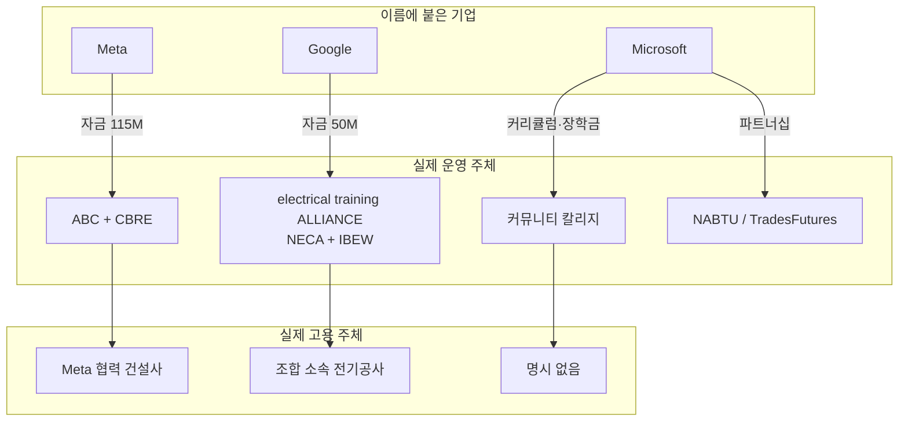

<!-- lang-switch -->
🇰🇷 **한국어** · [🇺🇸 English](who-actually-hires-you.en.md)
<!-- lang-switch -->

## M1의 가설이 확인됐다

M1 [employment-structure.md](../../01-Ecosystem-and-Roles/concepts/employment-structure.md)에서
"오해 2 — 운영 주체 = 자금원 = 고용주"를 가설로 적었다. **M2 조사에서 6개 중 5개가
셋이 갈라졌다.**

프로그램 이름에 기업명이 붙어 있다고 그 기업이 운영·고용하는 것이 아니다.
**이것을 모르면 엉뚱한 곳에 지원서를 낸다.**

---

## 셋이 갈라지는 구조

---

## 사례별 확인 결과

### ④ Google.org — 가장 뚜렷한 사례

| | 주체 |
|---|---|
| 이름에 붙은 기업 | **Google** |
| 자금원 | Google.org AI Opportunity Fund ($50M, 그중 ~$20M 전기공 훈련) |
| **운영** | **electrical training ALLIANCE** — NECA(전기공사협회) + IBEW(전기노조) 공동 |
| **지원 창구** | **지역 IBEW local / etA 훈련센터** |
| 고용 주체 | 조합 소속 전기공사 업체 |

**구글에 지원서를 낼 곳이 없다.** 구글은 돈만 댔다.
8/19 기초 표가 이 항목만 "지원"이라고 적은 것이 정확한 표현이었다.

### ① Meta AWA — 고용주가 훈련 전에 정해진다

| | 주체 |
|---|---|
| 자금원 | Meta ($115M) |
| 운영 | Meta + ABC(Associated Builders and Contractors) + CBRE |
| 지원 창구 | Meta 공식 포털 (트랙별 별도) |
| **고용 주체** | **Meta 협력 건설사** — "a job at a Meta partner waiting on the other side" |

특이한 점: **훈련 시작 전에 협력사의 조건부 채용 확약을 받는다.**
훈련을 마치고 취업을 찾는 것이 아니라, 취업이 확정된 상태로 훈련에 들어간다.

→ 지원 창구는 Meta가 맞지만 **고용주는 Meta가 아니다.** 둘이 다르다.

### ② Microsoft Datacenter Academy — 지원 창구가 대학이다

| | 주체 |
|---|---|
| 자금원 | Microsoft (장학금·장비·커리큘럼) |
| **운영** | **각 커뮤니티 칼리지** |
| **지원 창구** | **해당 대학 입학처** — 공식 안내: "visit the college in your selected area and submit your application directly to them" |
| 고용 주체 | **명시 없음** (Microsoft 데이터센터 인턴십 기회만 언급) |

Microsoft에 지원하는 것이 아니라 **대학에 입학**하는 것이다.
그리고 **수료 후 고용 보장이 명시돼 있지 않다** — ①과 가장 큰 차이다.

### ③ Microsoft NABTU — 성격 자체가 달랐다

기초 표는 이 항목을 건설 숙련직 훈련으로 적었으나, 2026-04-21 발표된 확대분의 실체는
**숙련직에게 AI를 가르치는 리터러시 교육**이다.

| | 주체 |
|---|---|
| 자금원 | Microsoft |
| 운영 | NABTU (북미 건설노조연합) |
| 지원 창구 | **TradesFutures 견습 준비 프로그램** (34개 주) |

→ 데이터센터 취업 경로로서의 실체는 Microsoft 쪽이 아니라 **TradesFutures 견습**이다.

### ⑥ Amazon Technical Apprenticeship — 유일하게 셋이 일치

| | 주체 |
|---|---|
| 자금원 | Amazon |
| 운영 | Amazon/AWS |
| 지원 창구 | Amazon 채용 사이트 |
| **고용 주체** | **Amazon/AWS 직고용** |

**6개 중 유일하게 "이름 = 운영 = 고용주"가 성립한다.**
빅테크 직고용을 원한다면 이 형태를 찾아야 한다.

⚠️ 단, 자격 대상 확인 필요 — 군 출신·배우자 대상이라는 표기와 "대상 확대" 기사가 상충한다.

---

## 지원 전 반드시 물어야 할 3가지

프로그램을 하나 만날 때마다 이 셋을 분리해 확인한다.

1. **누구에게 지원서를 내는가** — 기업인가, 대학인가, 노조 local인가
2. **누가 나를 고용하는가** — 그 기업인가, 협력사인가, 명시가 없는가
3. **고용이 보장되는가** — 조건부 확약(①)인가, 인턴십 기회(②)인가, 명시 없음인가

**이 셋이 같은 프로그램은 드물다.** 6개 중 1개(⑥)뿐이었다.

---

## 실무적 함의

| 원하는 것 | 봐야 할 프로그램 유형 | 이번 조사에서 해당 |
|---|---|---|
| 빅테크 직고용 | 이름=운영=고용주가 일치하는 것 | ⑥ Amazon Apprenticeship |
| 훈련 전 취업 확정 | 조건부 채용 확약이 있는 것 | ① Meta AWA |
| 학위·자격증 확보 | 교육기관 기반 | ② MS DCA (Big Bend CC 등) |
| 조합 견습 진입 | 노조 local 창구 | ③ TradesFutures · ④ IBEW/etA |

---

## 참조

- M1 가설: [../../01-Ecosystem-and-Roles/concepts/employment-structure.md](../../01-Ecosystem-and-Roles/concepts/employment-structure.md)
- 상세 근거: [../examples/program-anatomy.md](../examples/program-anatomy.md)
- [NECA — Google.org의 etA 지원](https://www.necanet.org/news-media/detail/press-releases/2026/06/12/neca-applauds-google.org-for-support-of-the-electrical-training-alliance-and-skilled-trades-growth)
- [Meta — America's Workforce Academy](https://www.meta.com/actions/americas-workforce-academy/)
- [Microsoft Datacenter Academy](https://careers.microsoft.com/v2/global/en/datacenteracademy.html)
