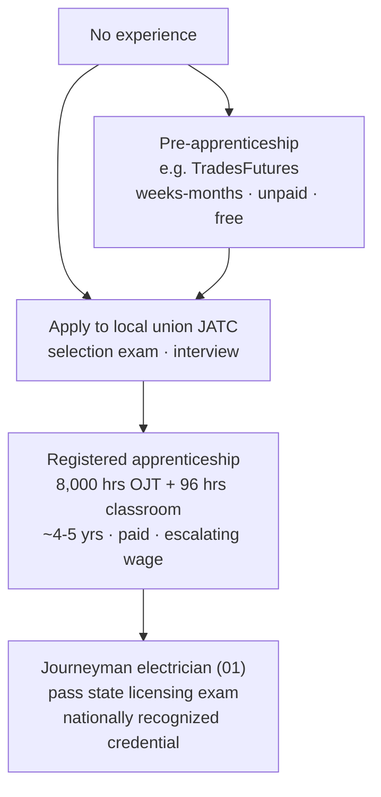
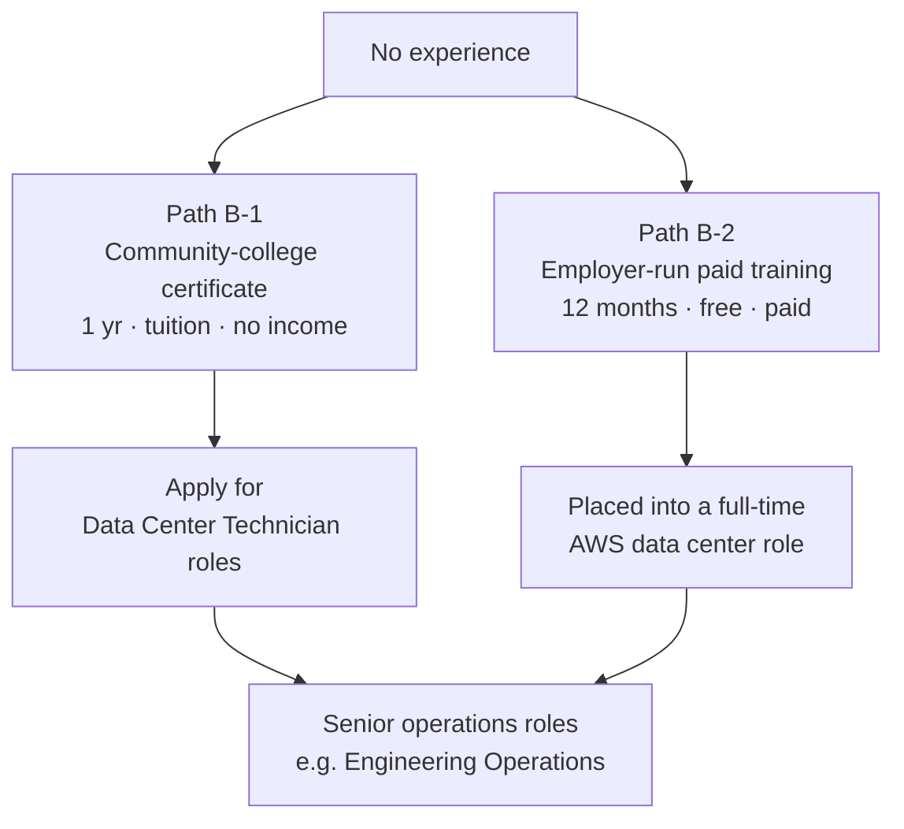

<!-- lang-switch -->
[🇰🇷 한국어](career-pathways.md) · 🇺🇸 **English**
<!-- lang-switch -->

## Scope of this document

Maps **"from where I am now (no experience) to employment"** across two tracks.
As confirmed in M1, data center labor splits into **construction-phase trades**
and **operations-phase technician** work, and the entry paths are completely
different.

> **Applying rule 3** — this document records facts only. Whether either track
> fits me personally is decided in M7.

## Track A — construction-phase trades (using electrician as the example)

| Stage | Duration | Cost | Income at this stage |
|---|---|---|---|
| Pre-apprenticeship | Weeks to months | Free | **None** |
| Registered apprenticeship | **8,000 hours** (~4 years at 2,000 hrs/yr) + 96 hours classroom | Free–low cost | **Yes** — starts as a percentage of journeyman wage, escalating |
| Journeyman | — | Exam fee | Full wage |

**Source**: WA L&I electrical apprenticeship page — *"8,000 total hours of
experience (4,000 of which must be new commercial or industrial installations)
and 96 hours of basic classroom instruction,"* leading to **(01) journey level
electrician**.

### Starting wage percentage — unconfirmed

WA L&I only states that *"Apprentices must be paid according to a progressively
increasing wage scale ... based on the specified journey-level wage for their
occupation."* **The starting percentage (e.g., 40%, 50% of journeyman) is set
differently in each program's own standards (WSATC standards)** — there is no
single value.

→ If an actual number is needed, check the **L&I Apprentice Wage Lookup** for a
specific local and trade: https://secure.lni.wa.gov/wagelookup/ApprenticeWageLookup.aspx

### The application channel is not a company

**You apply directly to the local JATC (Joint Apprenticeship and Training
Committee).** The program standards specify that *"individuals desiring
apprenticeship training should make application in person to the Apprenticeship
Coordinator or designee."*

This is why, in M2, ④ Google.org's application channel turned out to be the IBEW
local. **Google is the funder; the local does the selecting.**

## Track B — operations-phase technician (using Data Center Technician as the example)

The path splits into two.

| Path | Duration | Cost | Income at this stage | After completion |
|---|---|---|---|---|
| **B-1** ② MS Datacenter Academy (Big Bend CC, Moses Lake WA) | 1-year certificate or 2-year associate | Tuition — **MS scholarship covers tuition, books, exam fees** | **None** | **No** guaranteed job. Offers a Microsoft data-center internship opportunity |
| **B-2** ⑤-a AWS WBLP (Kent WA, etc.) | **12 months** | **Free** | **Yes (paid)** | **Placed into a full-time AWS data center role** |

**B-2 has no pre-stage.** Apply to the job posting, get accepted, and you're an
employee from that day.

### Entry requirements

| Path | Stated requirements |
|---|---|
| B-1 | Standard admissions requirements for that college |
| B-2 | Official page **states no degree or experience requirement.** Target
described as *"students, high school or college graduates, current employees,
or cleared professionals."* **Cases exist of completing it right out of high
school with no experience** |

### Wages — unconfirmed

M1's baseline material cited **$60–90k** for Data Center Technician in general,
but that's the role broadly, and **WBLP's training-period pay is not on the
official page.**

→ Opening actual Kent WA postings in M5 will likely show a wage range (WA
requires wage disclosure in job postings).

## Structural differences between the two tracks

| | Track A — trades | Track B — technician |
|---|---|---|
| Entry gate | **Selection by a local union** — competitive, waitlisted | **Applying to a job posting** |
| Nature of the credential | Nationally recognized (journeyman) | Internal work history or school certificate |
| Final employer | A union construction company (project-based) | **A data center operator (ongoing)** |
| Continuity of work | Move on when the project ends | Resident staff for as long as the facility operates |

M1's finding that **"Construction × Technician is a structural gap"** is
confirmed again here. **Builders and operators enter through different paths
from the very start.**

## Unconfirmed items

| Item | Next step |
|---|---|
| Starting apprentice wage (% of journeyman) | L&I Apprentice Wage Lookup for a specific local |
| WBLP training-period pay | M5 — check actual Kent WA postings |
| WBLP's DOL registration status | M5 — check apprenticeship.gov / L&I registration list |
| JATC selection competitiveness / waitlist | M5 — contact Puget Sound Electrical JATC |

## References

- WA L&I electrical apprenticeship: https://www.lni.wa.gov/licensing-permits/electrical/electrical-licensing-exams-education/electrical-apprenticeship
- WA apprenticeship program search: https://secure.lni.wa.gov/arts-public/
- Apprentice wage lookup: https://secure.lni.wa.gov/wagelookup/ApprenticeWageLookup.aspx
- [4 credential types](../concepts/credential-types.en.md) · [track comparison table](track-comparison.en.md)
