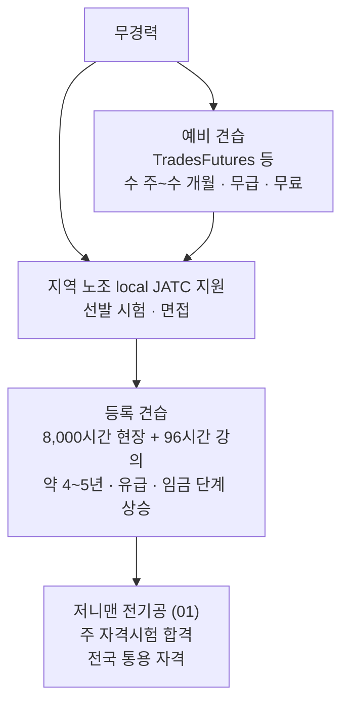
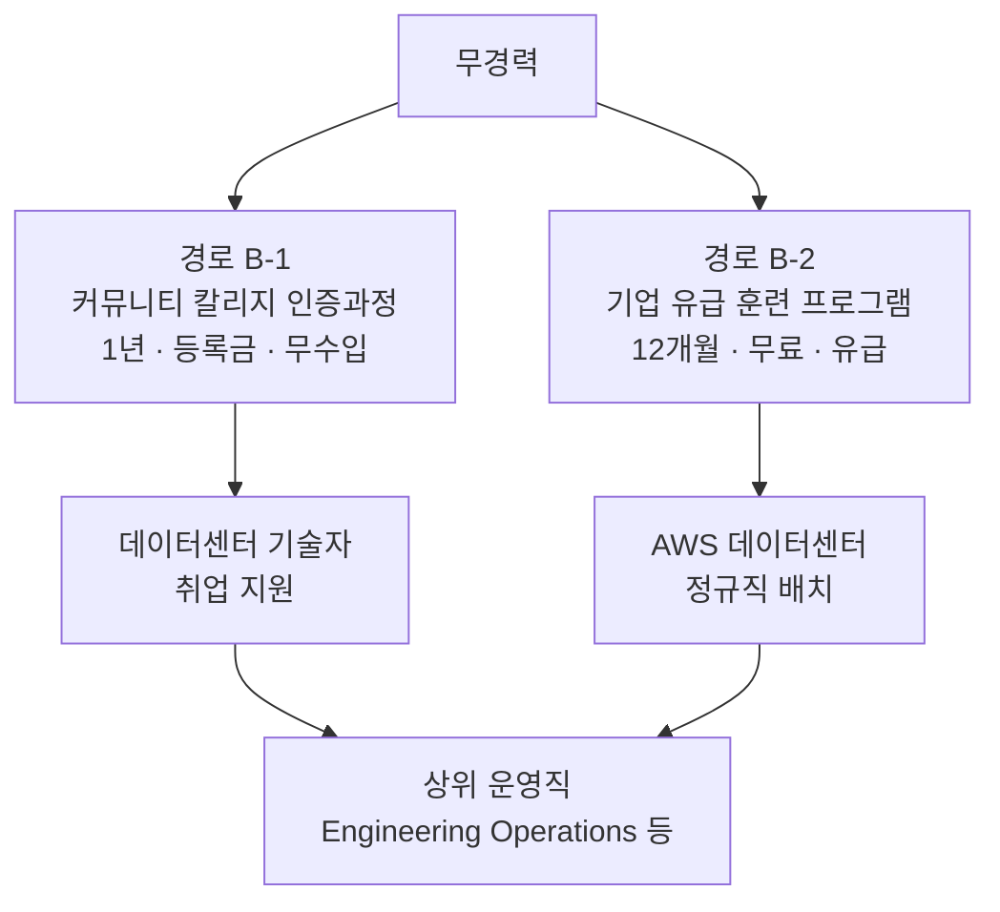

## 이 문서의 범위

**"지금(무경력) 위치에서 취업까지"** 를 두 트랙으로 그린다. M1에서 확인한 대로 데이터센터 인력은 **건설기 숙련직**과 **운영기 기술직** 둘로 갈리고, 진입 경로가 완전히 다르다.

> **규칙 3 적용** — 이 문서는 사실만 적는다. 본인에게 어느 쪽이 맞는지는 M7에서 판단한다.

## 트랙 A — 건설기 숙련직 (전기공 기준)

| 단계 | 기간 | 비용 | 이 단계의 수입 |
|---|---|---|---|
| 예비 견습 | 수 주~수 개월 | 무료 | **없음** |
| 등록 견습 | **8,000시간** (약 4년, 2,000시간/년 기준) + 강의 96시간 | 무료~저비용 | **있음** — 저니맨 임금의 일정 비율로 시작해 단계 상승 |
| 저니맨 | — | 시험 응시료 | 정규 임금 |

**출처**: WA L&I 전기 견습 페이지 — *"8,000 total hours of experience (4,000 of which must be new commercial or industrial installations) and 96 hours of basic classroom instruction"*, 완료 시 **(01) journey level electrician**.

### 임금 비율 — 확인 불가

WA L&I는 *"Apprentices must be paid according to a progressively increasing wage scale ... based on the specified journey-level wage for their occupation"* 라고만 명시한다. **시작 비율(예: 저니맨의 40%, 50%)은 프로그램별 표준서(WSATC standards)에 각각 다르게 기재**되며, 단일 값이 없다.

→ 실제 수치가 필요하면 **L&I 견습 임금 조회**에서 특정 local·직종을 지정해 확인한다: https://secure.lni.wa.gov/wagelookup/ApprenticeWageLookup.aspx

### 지원 창구가 기업이 아니다

**지역 JATC(Joint Apprenticeship and Training Committee)에 직접 지원한다.** 프로그램 표준서는 *"individuals desiring apprenticeship training should make application in person to the Apprenticeship Coordinator or designee"* 로 규정한다.

M2에서 ④ Google.org의 지원 창구가 IBEW local이었던 이유가 이것이다. **구글은 자금원이고, 선발은 local이 한다.**

## 트랙 B — 운영기 기술직 (데이터센터 기술자 기준)

경로가 둘로 갈린다.

| 경로 | 기간 | 비용 | 이 단계의 수입 | 수료 후 |
|---|---|---|---|---|
| **B-1** ② MS Datacenter Academy (Big Bend CC, Moses Lake WA) | 1년 인증 또는 2년 준학사 | 등록금 — **MS 장학금이 등록금·교재·응시료 커버** | **없음** | 취업 **보장 없음**. MS 데이터센터 인턴십 기회 제공 |
| **B-2** ⑤-a AWS WBLP (Kent WA 등) | **12개월** | **무료** | **있음 (유급)** | **AWS 데이터센터 정규직 배치** |

**B-2에는 예비 단계가 없다.** 채용 공고에 지원해 합격하면 그날부터 직원이다.

### 진입 요건

| 경로 | 명시된 요건 |
|---|---|
| B-1 | 해당 대학 입학 요건 (대학별) |
| B-2 | 공식 페이지에 **학위·경력 요건 명시 없음.** 대상을 *"students, high school or college graduates, current employees, or cleared professionals"* 로 기재. **고졸 직후·무경험 수료 사례 존재** |

### 임금 — 확인 불가

M1이 기초 자료에서 데이터센터 기술자 **$60~90k** 를 인용했으나, 이는 직무 일반 수준이고 **WBLP 훈련 기간 임금은 공식 페이지에 없다.**

→ M5에서 Kent WA 실제 공고를 열면 임금 범위가 표시될 가능성이 높다 (WA는 채용공고 임금 공개 의무 주).

## 두 트랙의 구조적 차이

| | 트랙 A 숙련직 | 트랙 B 기술직 |
|---|---|---|
| 진입 관문 | **노조 local 선발** — 경쟁·대기 존재 | **채용 공고 지원** |
| 자격의 성격 | 전국 통용 (저니맨) | 사내 이력 또는 학교 인증 |
| 최종 고용주 | 조합 건설사 (프로젝트 단위) | **데이터센터 운영사 (상시)** |
| 일의 지속성 | 프로젝트 종료 시 이동 | 시설 운영이 계속되는 한 상주 |

M1이 지적한 **"건설기 × 기술직 칸은 구조적 공백"** 이 여기서 다시 확인된다. **짓는 사람과 돌리는 사람은 애초에 다른 경로로 들어온다.**

## 미확인 항목

| 항목 | 다음 조치 |
|---|---|
| 견습 시작 임금 비율 (저니맨 대비 %) | L&I 견습 임금 조회에서 특정 local 지정 |
| WBLP 훈련 기간 임금 | M5 — Kent WA 실제 공고 확인 |
| WBLP의 DOL 등록 여부 | M5 — apprenticeship.gov / L&I 등록 목록 조회 |
| JATC 선발 경쟁률·대기 기간 | M5 — Puget Sound Electrical JATC 문의 |

## 참조

- WA L&I 전기 견습: https://www.lni.wa.gov/licensing-permits/electrical/electrical-licensing-exams-education/electrical-apprenticeship
- WA 견습 프로그램 검색: https://secure.lni.wa.gov/arts-public/
- 견습 임금 조회: https://secure.lni.wa.gov/wagelookup/ApprenticeWageLookup.aspx
- [자격 형태 4종](../concepts/credential-types.md) · [트랙 비교표](track-comparison.md)
