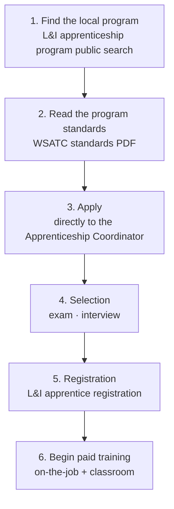

<!-- lang-switch -->
[🇰🇷 한국어](union-local-entry.md) · 🇺🇸 **English**
<!-- lang-switch -->

## Why the application channel isn't the company

When M2 broke down ④ Google.org, the application channel turned out to be **not
Google, but the local IBEW local.** ③ Microsoft NABTU was the same — **TradesFutures
and the local union.**

The reason is structural. **Construction-trades apprenticeships are run by a
joint labor-management committee, not by a company.**

| Party | Role |
|---|---|
| Big Tech (Google, Microsoft) | **Funding** |
| Association/union (NECA + IBEW → etA) | Curriculum, standards |
| **Local JATC** | **Selection, training, placement** |
| Union-affiliated construction company | On-site employment |

Don't apply to the company that wrote the check. **The JATC is what actually selects you.**

## What is a JATC

**Joint Apprenticeship and Training Committee** — a labor-management body with
equal representation from employers and the union, running the apprenticeship program.

In Washington State, **WSATC (Washington State Apprenticeship and Training
Council)** is the single regulating body. WSATC approves, manages, and enforces
standards, and only apprentices registered with the L&I apprenticeship division
are recognized.

## Entry process

### Step 1 — find the program

Search by region and trade in the **L&I apprenticeship program public search.**
https://secure.lni.wa.gov/arts-public/

For electrical trades, the L&I electrical apprenticeship page's **`(01) Programs`
tab** lists registered programs by region. It's also searchable online under
**`General Electrician.`**

In the Seattle / King County area, electrical apprenticeship is run by the
**Puget Sound Electrical JATC** (WSATC-0134).

### Step 2 — read the standards

Each program publishes a **WSATC Program Standards** PDF. Everything below is
specified there.

- **Entry eligibility** — minimum age, education, etc.
- **Selection process** and scoring
- **Wage schedule** (percentage of journeyman, escalation conditions per step)
- Required hours and classroom requirements
- **Physical requirements**

→ **This is where the blanks in the M3 comparison table (starting wage
percentage, physical requirements) live.** Opening the relevant local's
standards in M5 fills them in.

### Step 3 — apply

The common wording across standards is:

> *"individuals desiring apprenticeship training should make application in
> person to the Apprenticeship Coordinator or designee"*

Some programs require **applying in person.** Whether online applications are
accepted varies by local — check the standards document.

### Step 4 — selection

There's an exam and an interview. **Some programs give priority to graduates of a
pre-apprenticeship** — ③ NABTU's TradesFutures exists for exactly this purpose.

### Steps 5–6 — registration and training

Once registered with L&I as an apprentice, you receive an **apprentice ID card**,
and during training you must **carry a training certificate and photo ID at all
times** (per WA electrical-trade regulations).

Pay starts as a percentage of journeyman wage and **escalates in steps based on
hours worked or skill milestones.** The sponsor decides on advancement.
Demonstrating above-standard skill can earn **advanced standing** (skipping a
step) with the corresponding pay increase.

On completion, the employer and union are notified and you are **classified at
journeyman level.** For electrical trades, this is followed by the **(01) journey
level electrician** licensing exam.

## Difference from a non-union path

| | Union apprenticeship | Non-union training |
|---|---|---|
| Selecting body | JATC (joint labor-management) | A company or educational institution |
| Application channel | **The local union** | Company hiring / school admissions |
| Wage | Set by the standards' wage schedule | At the company's discretion |
| Credential | Nationally recognized (registered apprenticeship) | Institution- or company-specific |
| Placement | Rotates among union-jurisdiction job sites | That one company |

**⑤-a AWS WBLP is a non-union path.** You apply to a job posting, and AWS itself
selects, trains, and employs you directly. No committee or union sits in between.

## Unconfirmed items

| Item | Next step |
|---|---|
| Puget Sound Electrical JATC standards detail (wage schedule, physical requirements, selection scoring) | M5 — check the WSATC-0134 PDF |
| Intake timing, competitiveness, waitlist | M5 — contact the JATC directly |
| Whether online application is available | M5 — check the standards |

## References

- WA apprenticeship program public search: https://secure.lni.wa.gov/arts-public/
- WA L&I electrical apprenticeship: https://www.lni.wa.gov/licensing-permits/electrical/electrical-licensing-exams-education/electrical-apprenticeship
- WA L&I apprenticeship portal: https://www.apprenticeship.lni.wa.gov/
- Puget Sound Electrical JATC standards: https://www.lni.wa.gov/licensing-permits/apprenticeship/_docs/0134.pdf
- Apprentice wage lookup: https://secure.lni.wa.gov/wagelookup/ApprenticeWageLookup.aspx
