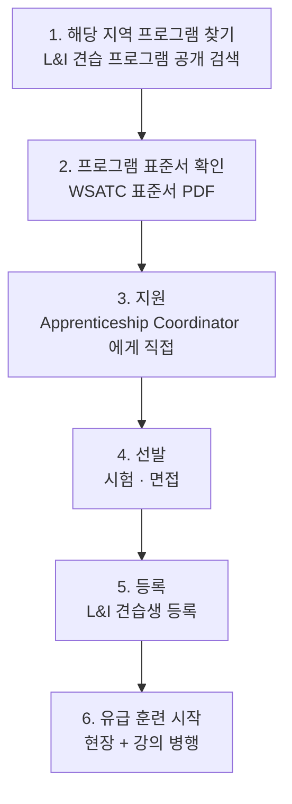

<!-- lang-switch -->
🇰🇷 **한국어** · [🇺🇸 English](union-local-entry.en.md)
<!-- lang-switch -->

## 왜 지원 창구가 기업이 아닌가

M2에서 ④ Google.org를 해부했을 때 지원 창구가 **구글이 아니라 지역 IBEW local**이었다. ③ Microsoft NABTU도 마찬가지로 **TradesFutures와 지역 local**이었다.

이유는 구조에 있다. **건설 숙련직 견습은 기업이 아니라 노사 공동 위원회가 운영한다.**

| 주체 | 역할 |
|---|---|
| 빅테크 (Google·Microsoft) | **자금 지원** |
| 협회·조합 (NECA + IBEW → etA) | 커리큘럼·표준 |
| **지역 JATC** | **선발 · 훈련 · 배치** |
| 조합 소속 건설사 | 현장 고용 |

돈을 낸 회사에 지원하면 안 된다. **선발권을 가진 곳은 JATC다.**

## JATC란

**Joint Apprenticeship and Training Committee** — 노사 공동 견습훈련위원회. 사용자 측과 조합 측이 동수로 참여해 견습 프로그램을 운영한다.

워싱턴주에서는 **WSATC(Washington State Apprenticeship and Training Council)** 가 단일 규제 기관이다. WSATC가 표준을 승인·관리·집행하고, L&I 견습과에 등록된 견습생만 인정한다.

## 진입 절차

### 1단계 — 프로그램 찾기

**L&I 견습 프로그램 공개 검색**에서 지역·직종으로 찾는다.
https://secure.lni.wa.gov/arts-public/

전기 직종은 L&I 전기 견습 페이지의 **`(01) Programs` 탭**에 지역별 등록 프로그램 표가 있다. 온라인 직종 검색에서 **`General Electrician`** 으로도 조회된다.

시애틀·킹카운티 권역의 전기 견습은 **Puget Sound Electrical JATC**가 운영한다 (WSATC-0134).

### 2단계 — 표준서 확인

각 프로그램은 **WSATC 표준서(Apprenticeship Program Standards)** PDF를 공개한다. 여기에 아래가 전부 규정돼 있다.

- 최저 연령·학력 등 **입학 자격**
- **선발 절차**와 배점
- **임금 비율표** (저니맨 대비 %, 단계별 상승 조건)
- 필요 시간 수·강의 요건
- **신체 요구 조건**

→ **M3 비교표에서 비어 있던 항목(임금 시작 비율, 신체 요구)이 여기 있다.** M5에서 해당 local 표준서를 열어 채운다.

### 3단계 — 지원

표준서의 공통 문구는 이렇다.

> *"individuals desiring apprenticeship training should make application in person to the Apprenticeship Coordinator or designee"*

**직접 방문 접수**를 규정하는 프로그램이 있다. 온라인 접수 여부는 local별로 다르므로 표준서에서 확인한다.

### 4단계 — 선발

시험과 면접이 있다. **예비 견습(pre-apprenticeship) 이수자에게 우선권을 주는 프로그램이 있다** — ③ NABTU의 TradesFutures가 이 목적의 과정이다.

### 5~6단계 — 등록과 훈련

L&I에 견습생으로 등록되면 **견습 ID 카드**를 받고, 훈련 중에는 **training certificate와 사진 신분증을 상시 소지**해야 한다 (WA 전기 직종 규정).

임금은 저니맨 임금 대비 비율로 시작해 **근무 시간 또는 역량 달성에 따라 단계 상승**한다. 상승 결정은 sponsor가 한다. 표준 이상의 역량을 입증하면 **advanced standing**(단계 건너뛰기)과 그에 따른 임금 인상을 받을 수 있다.

완료 시 사용자와 조합에 통보되고 **저니맨 등급으로 분류**된다. 전기 직종은 이후 **(01) journey level electrician** 자격시험에 응시한다.

## 비노조 경로와의 차이

| | 노조 견습 | 비노조 훈련 |
|---|---|---|
| 선발 주체 | JATC (노사 공동) | 기업 또는 교육기관 |
| 지원 창구 | **지역 local** | 기업 채용·학교 입학처 |
| 임금 | 표준서에 규정된 비율표 | 기업 재량 |
| 자격 | 전국 통용 (등록 견습) | 기관·기업별 |
| 배치 | 조합 관할 현장 순환 | 해당 기업 |

**⑤-a AWS WBLP는 비노조 경로다.** 채용 공고에 지원하고, AWS가 직접 선발·훈련·고용한다. 중간에 위원회나 조합이 없다.

## 미확인 항목

| 항목 | 다음 조치 |
|---|---|
| Puget Sound Electrical JATC 표준서 상세 (임금 비율·신체 요구·선발 배점) | M5 — WSATC-0134 PDF 확인 |
| 모집 시기·경쟁률·대기 기간 | M5 — JATC 직접 문의 |
| 온라인 접수 가능 여부 | M5 — 표준서 확인 |

## 참조

- WA 견습 프로그램 공개 검색: https://secure.lni.wa.gov/arts-public/
- WA L&I 전기 견습: https://www.lni.wa.gov/licensing-permits/electrical/electrical-licensing-exams-education/electrical-apprenticeship
- WA L&I 견습 포털: https://www.apprenticeship.lni.wa.gov/
- Puget Sound Electrical JATC 표준서: https://www.lni.wa.gov/licensing-permits/apprenticeship/_docs/0134.pdf
- 견습 임금 조회: https://secure.lni.wa.gov/wagelookup/ApprenticeWageLookup.aspx
