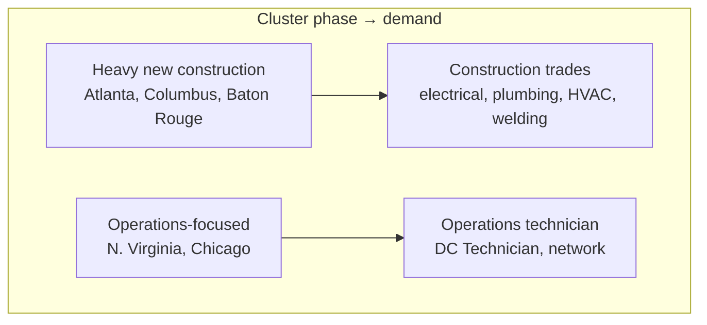

<!-- lang-switch -->
[🇰🇷 한국어](us-dc-clusters.md) · 🇺🇸 **English**
<!-- lang-switch -->

# US Data Center Cluster Map

**Researched**: 2026-08-30 (M4, exercise 1)
**Purpose**: Build a nationwide coordinate system. **Looks broadly, regardless of
my own eligibility** (a roadmap-defined M4 side thread)

## Why data centers cluster

Power, land, and tax incentives concentrate in specific regions. Workforce
programs **spring up alongside that** — which is why finding a program starts
with finding a cluster.

And now there's a fourth factor: **a labor shortage.**

> *"More than half of all respondents in 2026 report difficulties finding
> qualified candidates for open positions"*
> — [Uptime Institute 16th Annual Global Data Center Survey](https://uptimeinstitute.com/about-ui/press-releases/16th-annual-2026-global-data-center-survey-deployment-of-high-density-racks-rising-fast-operators-face-continued-recruiting-and-retention-pressures) (2026-07-28, 800+ respondents)

Secondary coverage puts this at **53%**, **up from 46% in 2025**.
Counting recruitment and retention difficulties together brings it to **roughly two-thirds.**

That is why so much Big Tech funding flowed into training in 2026.

> ⚠️ **Correction (2026-09-02)** — this paragraph originally read *"over 60% of data
> center operators can't find enough workers."* Checking the primary source shows
> **that number does not appear in it.** It appears to be a conflation of **53%**
> (difficulty finding qualified candidates) and **~two-thirds** (recruitment *or* retention).
> M1's principle — **the more striking a number, the more it needs a primary-source check** —
> proved itself again here.

## Cluster list

Capacity is measured differently across sources (colocation floor power vs.
whole-state grid capacity). Sources are kept separate **so figures aren't
compared across incompatible tables.**

### A. By colocation market (top markets)

| # | Cluster | Scale | Phase | Major operators |
|---|---|---|---|---|
| 1 | **Northern Virginia** (Loudoun, Prince William) | 300+ facilities · **4,000MW+**, **35%+** of US colo capacity | Operations-focused + expansion | AWS · Microsoft · Google · Meta · Equinix · Digital Realty |
| 2 | **Atlanta** (Georgia) | 1,459MW · **2,000MW+ under construction** | **Largest new construction** — fastest growth | Microsoft · Google · QTS · Switch |
| 3 | **Dallas–Fort Worth** (Texas) | 710MW (2020) → **1,000MW+** (2026) | Operations + construction in parallel | Google · Meta · Digital Realty · CyrusOne |
| 4 | **Phoenix** (Arizona) | Western hub | Heavy construction activity | Microsoft · Google · Meta · Vantage |
| 5 | **Chicago** (Illinois) | ~130 facilities · **1,120MW** of floor space | Operations-focused | Microsoft · Digital Realty · CyrusOne |

### B. By whole-state power capacity

| State | Capacity | Character |
|---|---:|---|
| **Texas** | 127,662 MW | Power surplus + tax incentives. #1 for new siting |
| **Virginia** | 58,467 MW | Mature market. Demand skews toward operations staff |
| **Georgia** | 32,327 MW | Rapid growth |
| **Ohio** | 27,755 MW | **Emerging central-US hub** — Meta and AWS entering |
| **Utah** | 27,463 MW | Emerging western hub |

> ⚠️ Table B's figures appear to be **state-level grid/planned capacity**, not
> data-center floor power. Don't compare them directly against table A —
> treat B as ranking reference only.

### C. Additional clusters that matter for programs specifically

Not top-ranked by capacity, but **actual workforce programs are open there**,
which makes them more important for this topic.

| Cluster | Character | Relevance here |
|---|---|---|
| **Central Washington** (Quincy, Moses Lake) | Hydropower-based, one of the earliest clusters | **Site of ② MS Datacenter Academy** (Big Bend CC). My own state of residence |
| **Des Moines, Iowa** | Microsoft, Meta, Google | Site of **② MDA** (DMACC) |
| **Columbus, Ohio** | Emerging · large Meta investment | One of **① Meta AWA's 4 pilot cities** |
| **Indianapolis** | Emerging | ① Meta AWA pilot |
| **Baton Rouge** (Louisiana) | Large new Meta build | ① Meta AWA pilot |
| **Houston** (Texas) | Construction demand | ① Meta AWA pilot |

## What the difference in phase produces — not the same "data center job"

M1's 2×2 (construction/operations × trades/technician) applies to geography just
as directly.



**M1's structural gap shows up geographically** — there are no servers while
construction is underway, so there's no reason for operations-technician
openings in a market that's still building. Conversely, mature markets have
fewer new-construction jobs.

> **News that "a data center is coming to my area" alone doesn't tell you which
> role is needed.** Ask about the phase first.

## A methodology issue found during this research

The `amazon.jobs` search API **intermittently returns `hits=0`.**

```
learning        first try: 0  →  shortly after: 7,023
technician      first try: 0  →  repeated: 2,352 (consistent across 4 tries)
```

Query once, get 0, and it reads as **"no postings."** In reality it's "couldn't be read."

**Attaching a control query to the same batch wasn't enough** — the target query
returned 0 even while the control returned 10,000 in the same run, because each
request fails independently.

**The right approach is repeating 4 times with a delay and judging by consistency.**

| Query | Result across 4 tries | Verdict |
|---|---|---|
| `technician` | 2352 · 2352 · 2352 · 2352 | Stable |
| `data center technician` | 1334 ×4 | Stable |
| `work-based learning` | 3 · 3 · 3 · 3 | **A stable 3** |

## References

- [10 Biggest Data Center Locations in the U.S. in 2026](https://brightlio.com/largest-data-centers-in-us/)
- [US Data Center Database: 7,700+ Facilities by State & Provider](https://www.aterio.io/insights/us-data-centers)
- [Measuring the Data Center Boom (2026)](https://programs.com/resources/data-center-statistics/)
- [NECA / Google.org — support for the electrical training ALLIANCE](https://www.necanet.org/news-media/detail/press-releases/2026/06/12/neca-applauds-google.org-for-support-of-the-electrical-training-alliance-and-skilled-trades-growth)
