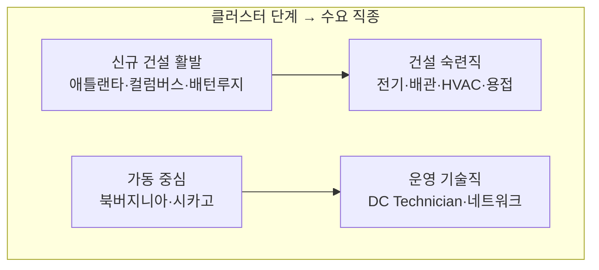

<!-- lang-switch -->
🇰🇷 **한국어** · [🇺🇸 English](us-dc-clusters.en.md)
<!-- lang-switch -->

# 미국 데이터센터 클러스터 지도

**조사일**: 2026-08-30 (M4 실습 1)
**목적**: 전미 범위의 좌표를 만든다. **본인 지원 가능성과 무관하게 넓게 본다** (로드맵 M4 단서)

## 왜 데이터센터는 뭉치는가

전력·용지·세제 혜택 세 가지가 특정 지역에 몰려 있기 때문이다. 인력 프로그램은 **그 옆에 생긴다** — 프로그램을 찾으려면 먼저 클러스터를 찾아야 하는 이유다.

그리고 지금은 넷째 요인이 붙었다. **인력난**이다.

> *"More than half of all respondents in 2026 report difficulties finding
> qualified candidates for open positions"*
> — [Uptime Institute 16th Annual Global Data Center Survey](https://uptimeinstitute.com/about-ui/press-releases/16th-annual-2026-global-data-center-survey-deployment-of-high-density-racks-rising-fast-operators-face-continued-recruiting-and-retention-pressures) (2026-07-28, 응답 800+)

2차 보도는 이를 **53%** 로 적고, **2025년 46% 에서 올랐다**고 덧붙인다.
채용난과 이직 문제를 **합치면 약 3분의 2** 다.

그래서 2026년에 빅테크 자금이 훈련 쪽으로 대거 흘러들었다.

> ⚠️ **정정 (2026-09-02)** — 이 문단은 원래 *"60% 이상이 인력을 못 구한다"* 로 적혀 있었다.
> 1차 출처를 확인하니 **그 숫자는 원문에 없다.**
> **53%**(적합한 지원자를 못 찾음)와 **약 2/3**(채용난 또는 이직)이 섞인 것으로 보인다.
> **인상적인 숫자일수록 원출처를 확인해야 한다** 는 M1 의 원칙이 여기서 한 번 더 확인됐다.

## 클러스터 목록

용량 단위가 자료마다 다르다(콜로케이션 상면 전력 vs 주 전체 인입 용량). **같은 표 안에서 비교하지 않도록** 출처를 나눠 적는다.

### A. 콜로케이션 시장 기준 (상위 시장)

| # | 클러스터 | 규모 | 단계 | 주요 사업자 |
|---|---|---|---|---|
| 1 | **북버지니아** (Loudoun·Prince William) | 시설 300+ · **4,000MW+**, 미국 콜로 용량의 **35%+** | 가동 중심 + 증설 | AWS · Microsoft · Google · Meta · Equinix · Digital Realty |
| 2 | **애틀랜타** (조지아) | 1,459MW · **건설 중 2,000MW+** | **신규 건설 최대** — 성장률 1위 | Microsoft · Google · QTS · Switch |
| 3 | **댈러스–포트워스** (텍사스) | 710MW(2020) → **1,000MW+**(2026) | 가동 + 건설 병행 | Google · Meta · Digital Realty · CyrusOne |
| 4 | **피닉스** (애리조나) | 서부 허브 | 건설 활발 | Microsoft · Google · Meta · Vantage |
| 5 | **시카고** (일리노이) | 시설 약 130 · **1,120MW** 상면 | 가동 중심 | Microsoft · Digital Realty · CyrusOne |

### B. 주 전체 전력 용량 기준

| 주 | 용량 | 성격 |
|---|---:|---|
| **텍사스** | 127,662 MW | 전력 여유 + 세제. 신규 유치 1위 |
| **버지니아** | 58,467 MW | 성숙 시장. 가동 인력 수요 |
| **조지아** | 32,327 MW | 급성장 |
| **오하이오** | 27,755 MW | **중부 신흥** — Meta·AWS 진출 |
| **유타** | 27,463 MW | 서부 신흥 |

> ⚠️ B의 수치는 데이터센터 상면 전력이 아니라 **주 단위 인입/계획 용량**으로 보인다. A와 직접 비교하면 안 된다. 순위 참고용으로만 쓴다.

### C. 프로그램 관점에서 중요한 추가 클러스터

용량 순위로는 상위가 아니지만 **인력 프로그램이 실제로 열려 있어** 이 Topic에는 더 중요하다.

| 클러스터 | 성격 | 이 Topic에서의 의미 |
|---|---|---|
| **중부 워싱턴** (Quincy·Moses Lake) | 수력 발전 기반, 초기 클러스터 중 하나 | **② MS Datacenter Academy 개설지**(Big Bend CC). 본인 거주 주 |
| **아이오와 데모인** | Microsoft·Meta·Google | **② MDA 개설지**(DMACC) |
| **오하이오 컬럼버스** | 신흥 · Meta 대형 투자 | **① Meta AWA 파일럿 4개 도시 중 하나** |
| **인디애나폴리스** | 신흥 | ① Meta AWA 파일럿 |
| **배턴루지** (루이지애나) | Meta 대형 신규 | ① Meta AWA 파일럿 |
| **휴스턴** (텍사스) | 건설 수요 | ① Meta AWA 파일럿 |

## 단계 차이가 만드는 것 — 같은 "데이터센터 일자리"가 아니다

M1에서 만든 2×2(건설기/가동기 × 숙련직/기술직)가 지역에도 그대로 적용된다.



**M1의 구조적 공백이 지역으로 드러난다** — 짓는 동안에는 서버가 없으므로, 건설이 한창인 곳에 운영 기술직 자리가 있을 리 없다. 반대로 성숙 시장에는 새 건설 일감이 적다.

> **"우리 지역에 데이터센터가 들어온다"는 소식만으로는 어떤 직종이 필요한지 알 수 없다.** 단계를 먼저 물어야 한다.

## 이 조사에서 확인한 방법론 문제

`amazon.jobs` 검색 API가 **간헐적으로 `hits=0`을 돌려준다.**

```
learning        1차 조회 0건  →  잠시 후 7,023건
technician      1차 조회 0건  →  반복 조회 2,352건 (4회 일관)
```

한 번 조회하고 0을 받으면 **"공고가 없다"로 읽게 된다.** 실제로는 "못 읽었다"인데도.

**대조군 질의를 같은 회차에 붙이는 것만으로는 부족했다** — 대조군이 10,000건을 반환하는 동안에도 대상 질의만 0이 나왔다. 요청 단위로 따로 실패하기 때문이다.

**시간 간격을 두고 4회 반복해 일관성으로 판정**해야 한다.

| 질의 | 4회 결과 | 판정 |
|---|---|---|
| `technician` | 2352 · 2352 · 2352 · 2352 | 안정 |
| `data center technician` | 1334 ×4 | 안정 |
| `work-based learning` | 3 · 3 · 3 · 3 | **안정적으로 3건** |

## 참조

- [10 Biggest Data Center Locations in the U.S. in 2026](https://brightlio.com/largest-data-centers-in-us/)
- [US Data Center Database: 7,700+ Facilities by State & Provider](https://www.aterio.io/insights/us-data-centers)
- [Measuring the Data Center Boom (2026)](https://programs.com/resources/data-center-statistics/)
- [NECA / Google.org — electrical training ALLIANCE 지원](https://www.necanet.org/news-media/detail/press-releases/2026/06/12/neca-applauds-google.org-for-support-of-the-electrical-training-alliance-and-skilled-trades-growth)
