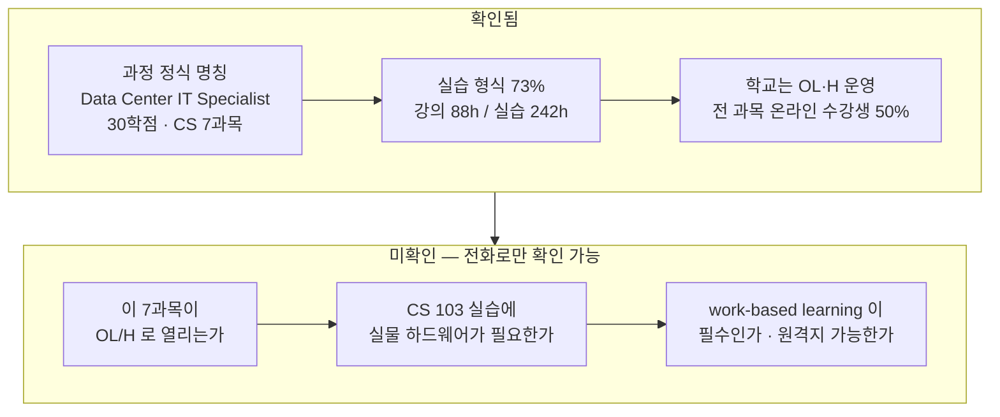

<!-- lang-switch -->
🇰🇷 **한국어** · [🇺🇸 English](online-onsite-split.en.md)
<!-- lang-switch -->

# 온라인 / 현장 분해 — BBCC 데이터센터 과정

**조사일**: 2026-08-30 (M6 실습 1)
**대상**: M5가 확인한 **유일하게 열려 있는 경로** — Big Bend Community College (Moses Lake, WA)
**출처**: BBCC 2026-2027 공식 카탈로그 PDF (`pdftotext`로 전문 추출)

## 먼저 — 과정 이름이 어디에도 없었다

M2·M5는 이 과정을 *"데이터센터 기술자 인증과정"* · *"Systems Administration – Datacenter Specialization"* 으로 적었다. **웹페이지 어디에도 정식 명칭이 없었기 때문이다.**

카탈로그 PDF 전문에서 찾았다.

> ### `Data Center IT Specialist Certificate of Accomplishment` — **30학점**

BBCC 컴퓨터과학 프로그램 페이지에도, Microsoft 홍보 페이지에도, 지역 신문 기사에도 이 이름은 없다. **PDF를 열지 않았으면 계속 다른 이름으로 부르고 있었을 것이다.**

M5가 "1년 이내 이수"라고 적은 것과 학점 규모(30학점)는 일치한다.

## 필수 과목과 시수 — 실습이 73%다

카탈로그는 과목마다 **Lecture Hours / Lab Hours** 를 표기한다. 이것이 온라인/현장 분해의 1차 자료다.

| 과목 | 학점 | 강의 | **실습(Lab)** | 실습 비중 |
|---|---:|---:|---:|---:|
| CS 103 Intro to Computer Hardware & Operating Systems | 6 | 22h | **66h** | 75% |
| CS 116 Networks & Network Security I | 3 | – | 22h | **100%** |
| CS 117 Networks & Network Security II | 3 | – | 22h | **100%** |
| CS 120 A+ Prep & Certification | 1–2 | – | 22h | **100%** |
| CS 171 Cisco Networking: Intro to Networks | 6 | 22h | **66h** | 75% |
| CS 205 Windows Server Administration | 5 | 22h | 22h | 50% |
| CS 206 Linux Server Administration | 5 | 22h | 22h | 50% |
| **합계** | **30** | **88h** | **242h** | **73%** |

## ⚠️ 이 숫자를 잘못 읽으면 안 된다

**"Lab Hours 73%"는 "현장 출석 73%"가 아니다.**

커뮤니티 칼리지 카탈로그에서 `Lab Hours`는 **수업 형식**(강의식이 아니라 실습식)을 뜻하지 **장소**를 뜻하지 않는다. IT 과목의 실습은 상당 부분이 소프트웨어다.

| 과목 | 실습의 성격 | 원격 가능성 |
|---|---|---|
| CS 171 Cisco | Packet Tracer·NETLAB 등 **가상 랩이 업계 표준** | 높음 |
| CS 205/206 Server | VM으로 서버 구축 | 높음 |
| CS 116/117 네트워크 보안 | 가상 네트워크 | 높음 |
| **CS 103 하드웨어 & OS** | **실물 부품 분해·조립** | **낮음** |
| **CS 120 A+ 준비** | 하드웨어 실물 다룰 가능성 | 낮음~중간 |

**CS 103이 가장 무겁다** — 66시간 실습에 6학점, 이 과정 최대 과목이고 성격상 실물 하드웨어가 필요하다.

> **시수 표는 "무엇이 문제인지"를 좁혀 줄 뿐 "원격 가능한가"에 답하지 못한다.** 답은 학교만 안다.

## 학교의 수업 형식 — 인프라는 갖춰져 있다

카탈로그 원문:

> *"Big Bend faculty offer classes **virtually, in-person, as well as in a "hybrid" model—a mix of virtual and in-person.** … These class offerings allow for students with work, family, and other responsibilities to make progress toward their degree."*

강의 계획표 표기법도 확립돼 있다.

| 표기 | 뜻 |
|---|---|
| `OL` | 온라인 수업 |
| `H` | 하이브리드 (대면 + 상당한 온라인) |
| `ARRANGED` (요일란) | 온라인, 정해진 시간 없음 |

**규모도 작지 않다** — 2019-2020년에 1,607명이 온라인 수업을 들었고 그중 **954명(50.4%)이 전 과목을 온라인으로** 들었다. LMS는 Canvas, 화상은 Zoom.

**즉, "원격 학생을 받는 학교인가"는 이미 참이다.** 남은 질문은 **"이 과정의 이 과목들이 그렇게 열리는가"** 다.

## 온라인으로 대체 불가능한 부분 — 명시적으로 기록

DoD가 요구하는 항목이다. **인정하고 들어가는 것이 이 모듈의 목적**이므로 확인된 것만 적는다.

### 1. 현장 실습(work-based learning) — 과정에 내장돼 있다

BBCC 공식 소개문:

> *"**work-based learning partnerships**, which allows students to gain **hands-on experience before graduation**"*

Quincy 데이터센터 파일럿과 연계된다(M2 확인). **지역 데이터센터에서 하는 것이므로 원격이 성립하지 않는다.** 다만 이것이 필수인지 선택인지는 미확인.

### 2. FAD 150 응급처치·CPR — **단, 이 과정에는 없다**

`Systems Administration Certificate of Achievement`에는 **FAD 150 Industrial First Aid and CPR Plus Bloodborne Pathogens (2학점)** 이 필수다. CPR 인증은 성격상 대면 실기가 필요하다.

**Data Center IT Specialist Certificate 30학점에는 FAD 150이 없다.** 두 자격을 혼동하면 없는 장벽을 만들게 된다.

| 자격 | FAD 150 | 일반교양 | 성격 |
|---|---|---|---|
| **Data Center IT Specialist** (30학점) | ❌ 없음 | ❌ 없음 | **CS 7과목만** |
| Systems Administration (Achievement) | ✅ 필수 | ✅ ENGL·MAP·PSYC/SOC·CMST | 1년 종합 |

**이 Topic의 목표(취업)에는 30학점짜리가 더 짧고 가볍다.**

### 3. CS 103 하드웨어 실습 — 확인 필요

66시간 실습. 실물 부품이 필요하면 원격 불가다. **가장 먼저 물어야 할 과목.**

## 그래서 지금 아는 것과 모르는 것

**M5가 이 경로의 장벽으로 지목한 것은 "이주 필요 + 무수입"이었다.** 오늘 조사로 **이주 부분은 아직 살아 있는 가능성**임이 드러났다 — 학교가 원격을 안 하는 게 아니라, 이 과정이 그렇게 열리는지를 아무도 공개하지 않았을 뿐이다.

## 참고 — 등장한 다른 자격

조사 중 M5 목록에 없던 것이 하나 나왔다.

**Manufacturing Process Technology (Mission Critical Operations Emphasis)** — 시설 관리자 방향, 연봉 $48,000~60,000. 데이터센터 **설비** 쪽이라 IT 트랙과 다르다. M7 적합성 판별에서 후보로 볼지 판단한다.

**임금 정보도 M1과 어긋난다.** BBCC는 초임 **$46,000~48,000**을 제시하는데, M1은 데이터센터 기술자를 $60~90k로 적었다. **중부 워싱턴(Moses Lake)과 전국 평균의 차이**로 보이지만 확인 안 됐다. → M7에서 다룬다.

## 참조

- **BBCC 2026-2027 공식 카탈로그 PDF** — `coursecatalog.bigbend.edu/sites/default/files/pdf/pdf_generator/20262027-course-catalog.pdf` (2.0MB, `pdftotext -layout`으로 추출)
- [BBCC Data Center program prepares graduates for high-demand IT careers](https://www.bigbend.edu/post/bbcc-data-center-program-prepares-graduates-for-high-demand-it-careers.html)
- [Online Classes / Distance Education / eLearning — BBCC](https://coursecatalog.bigbend.edu/online-classesdistance-educationelearning)
- [Microsoft Datacenter Academy at Big Bend Community College](https://local.microsoft.com/blog/big-bend-community-college-cultivates-a-hometown-tech-workforce/)
