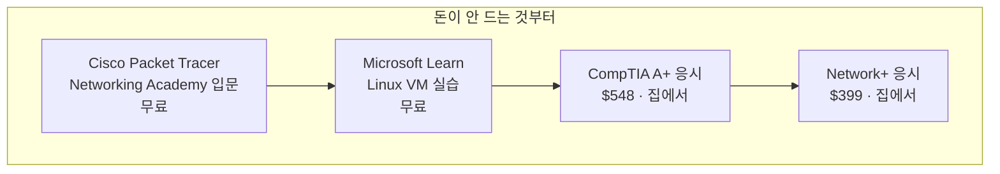

<!-- lang-switch -->
🇰🇷 **한국어** · [🇺🇸 English](start-now-remotely.en.md)
<!-- lang-switch -->

# 지금 원격으로 시작할 수 있는 것

**조사일**: 2026-08-30 (M6 실습 2)
**전제**: 지원할 문이 지금 닫혀 있다 — **기다리는 시간을 쓰는 방법**

## 왜 이 문서가 필요한가

M5·M4가 확인한 현재 상황이다.

| 경로            | 상태                               |
| ------------- | -------------------------------- |
| ⑤-a AWS WBLP  | ❌ **미국 공고 0건** (8/30 확인)         |
| 전기 견습 PSEJATC | ❌ **2026-05-01부터 접수 중단**, 재개일 미정 |
| ② BBCC        | ✅ 가을 코호트 — **이주·무수입 부담**         |

**두 개는 닫혀 있고 하나는 무겁다.** 그런데 닫힌 문 앞에서 기다리는 동안에도 할 수 있는 일이 있다.

BBCC 과정이 무엇을 목표로 하는지 보면 답이 나온다.

> *"Students gain the necessary skills to prepare for and take computer certifications in **CompTIA A+, Network+, Server+**, and **Microsoft**"*

**과정의 목적지가 자격증이다.** 그리고 그 자격증들은 **학교를 안 다녀도 딸 수 있다.**

## 후보 — 원격으로 취득 가능한 선행 자격

### ① CompTIA A+ — 가장 직접적

BBCC `CS 120 A+ Prep & Certification`이 정확히 이걸 준비한다.

| 항목 | 내용 |
|---|---|
| 시험 | **2과목** (Core 1 · Core 2) |
| 비용 | 과목당 **$253** · 합계 **$548** (2026 정가) |
| 응시 방식 | Pearson VUE **테스트센터 또는 집에서 온라인 감독(online proctored)** |
| 형식 | 90문항 · 90분 (객관식 + 수행형) |
| 할인 | **CompTIA Academic Store 학생 인증** · 현역/제대군인 |

**집에서 응시할 수 있다.** Moses Lake까지 갈 필요가 없다.

### ② CompTIA Network+ — 그다음

BBCC `CS 121 Network+ Prep & Certification`(1학점)이 대응한다.

| 항목 | 내용 |
|---|---|
| 시험 | N10-009, 1과목 |
| 비용 | 정가 **$399** (2026-06 인상). 공인 리셀러·번들 **$338~385** |
| 응시 방식 | 테스트센터 또는 **온라인 감독** |

### ③ Cisco Networking Academy — 무료 학습 + 가상 랩

BBCC 과정에서 CS 171·172·173이 Cisco 트랙이고 **총 18학점**으로 비중이 가장 크다.

- **Packet Tracer** — Cisco 공식 네트워크 시뮬레이터. **무료**
- Networking Academy 입문 과정 — 온라인 무료 수강 가능
- 실물 장비 없이 **가상 랩으로 실습**하는 것이 이 분야 업계 표준이다

**CS 171의 66시간 실습이 원격 가능할 가능성이 높다고 본 근거가 이것이다.**

### ④ Microsoft Learn — 무료

CS 205 Windows Server Administration 대응. 학습 경로가 전부 무료이고 자격증 응시만 유료다.

### ⑤ Linux — 무료

CS 206 대응. VM으로 집에서 서버 구축이 가능하다.

## 우선순위 — 무엇부터 할 것인가

**무료 학습을 먼저 하는 이유는 돈 때문만이 아니다.** 이 분야가 자기에게 맞는지를 **시험료를 내기 전에** 알 수 있다.

## ⚠️ 반드시 확인해야 할 것 — "인정되는가"

DoD가 요구하는 항목이다. **"딸 수 있다"와 "그게 학점으로 인정된다"는 다르다.**

| 질문 | 상태 |
|---|---|
| A+ 를 미리 따면 **CS 120 학점을 면제**받는가? | ❓ **미확인** |
| Network+ 를 미리 따면 CS 121 은? | ❓ **미확인** |
| Cisco NetAcad 이수가 CS 171 에 반영되는가? | ❓ **미확인** |
| 사전 학습 인정(prior learning credit) 제도가 있는가? | ❓ **미확인** |

BBCC 카탈로그에 이 과정 특정의 사전 학습 인정 규정을 찾지 못했다. **일반적으로 커뮤니티 칼리지에는 CPL(Credit for Prior Learning) 제도가 있지만, 이 과정에 적용되는지는 학교만 안다.**

> **인정 여부를 모른 채 자격증부터 따는 것이 손해는 아니다.** 학점으로 안 쳐줘도 자격증 자체가 이력이 되고, 과정 수업이 훨씬 쉬워진다. 다만 **"이걸 따면 과정이 짧아진다"고 계획을 세우면 안 된다.**

## 🔴 BBCC 문의 질문 — M6이 추가하는 4개

M5가 준비한 질문 6개에 **원격 관련 4개를 추가**한다. Tom Willingham · **509-793-2321** · tomwi@bigbend.edu

### M6 추가 질문

1. **`Data Center IT Specialist Certificate`(30학점)의 7과목이 온라인(OL) 또는 하이브리드(H)로 열립니까?** 과목별로 알려 주실 수 있나요?
2. **CS 103 (Intro to Computer Hardware & OS, 실습 66시간)** 은 실물 하드웨어를 다뤄야 합니까? 원격 수강이 가능합니까?
3. **work-based learning(현장 실습)은 필수입니까?** 필수라면 Moses Lake 지역 데이터센터에서만 가능합니까, 아니면 **거주지(시애틀 근교) 사업장에서도** 가능합니까?
4. **CompTIA A+·Network+ 를 미리 취득하면 해당 과목 학점이 인정**됩니까? 사전 학습 인정 제도가 있습니까?

### 질문 순서를 이렇게 두는 이유

**1번의 답이 나머지를 바꾼다.** 7과목이 전부 온라인이면 이주 문제가 사라지고, 전혀 안 되면 3·4번은 의미가 줄어든다.

**3번이 가장 중요할 수 있다.** M5가 확인한 거리 구조가 **교육은 멀고(180마일) 고용은 가깝다(Kent·Renton 20~25마일)** 였다. 현장 실습을 거주지 근처에서 할 수 있다면 **가장 무거운 조건이 가장 가벼워진다.**

## 정리 — 지금 당장 할 수 있는 것

- [ ] **Cisco Packet Tracer 내려받아 입문 과정 시작** (무료, 오늘 가능)
- [ ] **Microsoft Learn · Linux VM 실습** (무료)
- [ ] 🔴 **BBCC 전화** — M5 질문 6개 + M6 질문 4개
- [ ] **CompTIA Academic Store 학생 할인 자격 확인** — 등록 전에도 되는지
- [ ] 알림 등록 2건 — PSEJATC 재개 · AWS WBLP 미국 공고

**앞의 두 개는 아무 허가도 필요 없다.** 전화 결과를 기다리는 동안 시작할 수 있는 유일한 항목이다.

## 참조

- BBCC 2026-2027 공식 카탈로그 PDF
- [CompTIA Exam Cost 2026 — A+ · Network+ · Security+](https://www.secuspark.com/blog/comptia-exam-cost-2026)
- [CompTIA Network+ (N10-009) Exam Cost 2026](https://www.examcert.app/blog/comptia-network-plus-exam-cost-2026/)
- [CompTIA A+ Certification 2026: Cost, Exam & Salary](https://www.certification.guru/certifications/comptia-a-certification/)
- [M5 contact-log](../../05-WA-Deep-Dive/guides/contact-log.md) — 기존 질문 6개
