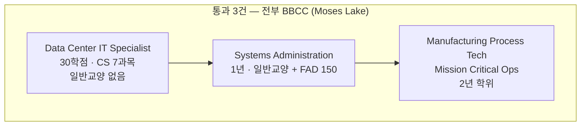

<!-- lang-switch -->
🇰🇷 **한국어** · [🇺🇸 English](screening-table.en.md)
<!-- lang-switch -->

# 전체 대입 결과

**대입일**: 2026-08-30 (M7 실습 2)
**기준**: [fit-criteria.md](../guides/fit-criteria.md) — 대입 **전에** 확정된 8항목

M1~M6에서 조사한 경로 **12개**를 전부 대입했다. 하나도 빼지 않는다 — 빼면 왜 뺐는지가 남지 않는다.

## 판정 요약

| 판정 | 개수 | 경로 |
|---|---:|---|
| ✅ **통과** | **3** | BBCC Data Center IT Specialist · BBCC Systems Administration · BBCC Manufacturing(Mission Critical) |
| ⏸ **대기** | **3** | AWS WBLP · PSEJATC 전기 견습 · TradesFutures/etA 경유 견습 |
| ❌ **탈락** | **6** | Meta AWA · AWS 견습 · AWS 인턴 · ADC · 사내 전환 · 일반 DCT 공고 |

## 전체 대입표

| # | 경로 | 1 요건 | 2 모집 | 3 통근 | 4·5 수입·기간 | 8 비용 | **판정** |
|---|---|---|---|---|---|---|---|
| 1 | **BBCC Data Center IT Specialist** (30학점) | ✅ | ✅ 가을 | ⚠️ 180mi | ✅ 1년 이내 무수입 | ❓ | **✅ 통과** |
| 2 | **BBCC Systems Administration** (Achievement) | ✅ | ✅ 가을 | ⚠️ 180mi | ✅ 1년 | ❓ | **✅ 통과** |
| 3 | **BBCC Manufacturing Process Tech** (Mission Critical) | ✅ | ✅ | ⚠️ 180mi | ⚠️ 2년 학위 | ❓ | **✅ 통과** (조건부) |
| 4 | ⑤-a AWS WBLP | ✅ | ❌ **미국 0건** | ✅ Kent 25mi | ✅ **유급** | ✅ 무료 | **⏸ 대기** |
| 5 | 트랙 A PSEJATC 전기 견습 | ✅ | ❌ **접수 중단** | ✅ Renton 25mi | ✅ **유급** | ✅ | **⏸ 대기** |
| 6 | ③④ TradesFutures/etA 경유 견습 | ✅ | ❓ 지부별 | ✅ | ✅ **유급** | ✅ | **⏸ 대기** |
| 7 | ① Meta AWA | ✅ | ✅ | ❌ **WA 없음** | ✅ 유급·보조 | ✅ 무료 | **❌ 탈락** |
| 8 | ⑥ AWS Technical Apprenticeship | ❌ **군 출신** | — | — | — | — | **❌ 탈락** |
| 9 | ⑤-b AWS College Internship | ❌ **재학생** | — | — | — | — | **❌ 탈락** |
| 10 | ⑤-c Amazon Dedicated Cloud | ❌ **보안 인가** | — | — | — | — | **❌ 탈락** |
| 11 | ⑤-d 사내 전환 | ❌ **재직자** | — | — | — | — | **❌ 탈락** |
| 12 | 일반 Data Center Technician 공고 | ❌ **2+년 경력** | — | — | — | — | **❌ 탈락** |

## 탈락 사유 — 전부 기록

### 7. ① Meta AWA — **항목 3(통근·체류)**

파일럿 4개 도시가 휴스턴·컬럼버스·인디애나폴리스·배턴루지다. **워싱턴주에 없다.** 편도 200마일 상한을 아득히 넘는다.

**아까운 탈락이다.** 무료 + 교통·주거·생활비 보조 + **수료 후 Meta 건설 현장 고용 보장** — 조건만 보면 이 조사에서 가장 좋다. 오직 지역 때문에 걸렸다.

> 🔄 **재검토 조건**: Meta 발표문에 *"first launch"* 라고 되어 있다. **확대 시 서부 포함 여부**를 확인한다. M4 매트릭스에 미확인으로 남겨 뒀다.

### 8. ⑥ AWS Technical Apprenticeship — **항목 1(진입 요건)**

M2 재조사에서 자격 대상이 **군 출신(veteran/military spouse)** 으로 확인됐다. 게다가 현 7개 트랙이 전부 클라우드 직군이고 **Data Center Technician이 목록에 없다.** 자격·직무 양쪽에서 해당 없음.

### 9. ⑤-b College Internship — **항목 1**

재학생 대상. 해당 없음.

### 10. ⑤-c Amazon Dedicated Cloud — **항목 1**

보안 인가(clearance) 보유자 대상. 해당 없음.

### 11. ⑤-d 사내 전환 — **항목 1**

Amazon 재직자 대상. 해당 없음.

### 12. 일반 DCT 공고 — **항목 1**

M5 실측: 일반 Data Center Technician 공고는 **2년 이상 경력**을 요구한다. **이것이 WBLP가 희소한 이유다** — WBLP는 그 문턱을 건너는 통로다.

## 대기 사유 — 탈락이 아니다

### 4. ⑤-a AWS WBLP — **항목 2(모집 시점)**

**요건·통근·수입 세 항목을 전부 통과한다.** 학위·경력 요건 없음, Kent WA 편도 25마일, 12개월 **유급** 후 직고용, 비용 없음.

**막는 것은 오직 공고가 없다는 것뿐이다.** M4가 8/30에 재조사한 결과 **미국 0건**(전 세계 3건 전부 해외)이다. M5(8/28) 시점의 Ohio 1건도 닫혔다.

> **기준으로만 보면 이것이 1순위다.** 문이 열리면 즉시 지원해야 한다. → 알림 등록 필수

### 5. PSEJATC 전기 견습 — **항목 2**

Renton 편도 25마일, **유급**, 신체 요구 수용 확인됨. **2026-05-01부터 신규 접수 중단**, 재개 30일 전 공지.

### 6. TradesFutures / etA 경유 견습 — **항목 2**

M4가 확인한 대로 ③④는 프로그램이 아니라 **네트워크·자금**이다. 실제 문은 지역 IBEW 지부가 연다. **지부별 확인이 안 됐다** — PSEJATC 외 다른 지부(Tacoma·Olympia 등)는 조사하지 않았다.

> **이 항목은 조사 부족이지 상태 불명이 아니다.** M8 전에 지부 목록을 확인해야 한다.

## 통과 3건 — 그런데 전부 같은 학교다

**통과가 전부 한 기관에 몰려 있다.** 이것은 선택지가 셋이라는 뜻이 아니라 **같은 문 안의 세 갈래**라는 뜻이다.

**그리고 세 건 모두 항목 3(통근)에 ⚠️가 붙어 있다.** 180마일이 상한(200마일) 안이라 통과했을 뿐, **주 3일 이상 체류가 필요하면 셋 다 동시에 탈락한다.**

> ### 🔴 이 대입의 결론은 단일 미확인 항목에 걸려 있다
>
> **M6 문의 질문 1·3번** — 7과목이 OL/H로 열리는가, 현장 실습을 거주지 근처에서 할 수 있는가.
>
> 답에 따라 **통과 3건이 전부 살거나 전부 죽는다.** 전화 한 통이 이 Topic의 분기점이다.

## 항목별로 아무도 거르지 않은 것

**항목 6(신체 요구)과 7(병행)은 12개 중 하나도 탈락시키지 않았다.**

이것이 정보다 — **사용자의 제약은 신체나 시간이 아니라 지역과 모집 시점에 있다.**

| 무엇이 걸렀나 | 건수 |
|---|---:|
| 항목 1 진입 요건 | **5** |
| 항목 2 모집 시점 | 3 (대기) |
| 항목 3 통근·체류 | 1 |
| 항목 4·5 수입·기간 | 0 |
| 항목 6 신체 · 7 병행 | **0** |
| 항목 8 비용 | 0 (전부 ❓) |

**진입 요건이 절반을 걸렀다.** 학위·경력·군 복무·보안 인가 — 이 넷이 이 분야의 실질 관문이다.

## 미확인이 판정에 영향을 준 곳

정직하게 표시한다.

- **비용(항목 8)이 통과 3건 전부 `❓`** — BBCC 등록금 실액이 M5부터 미확인이다. Microsoft 장학금이 커버한다고 하나 실액을 모른다. **$10,000 초과면 판정이 바뀐다**
- **TradesFutures/etA 지부별 상태** — 조사 부족
- **Meta AWA 확대 계획** — 서부 포함 시 재검토
