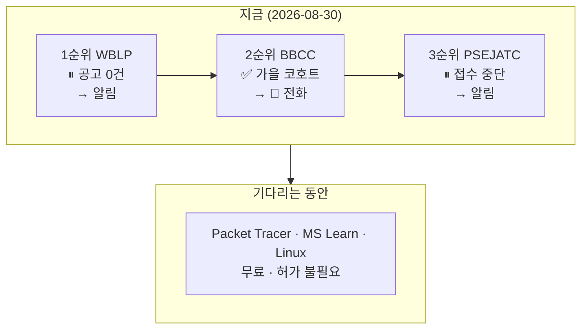

# Shortlist — 최종 3개와 트랙 결론

**확정일**: 2026-08-30 (M7 실습 2)
**대입 근거**: [screening-table.md](screening-table.md) · [fit-criteria.md](../guides/fit-criteria.md)

## Shortlist

순위는 **"지금 지원 가능한가"가 아니라 "기준 적합도"** 로 매겼다. 1순위가 지금 닫혀 있다는 사실이 그 자체로 중요한 정보이기 때문이다.

### 🥇 1순위 — ⑤-a AWS WBLP (Kent, WA)

| 항목 | 판정 |
|---|---|
| 진입 요건 | ✅ **학위·경력 요건 없음** (고졸·만 18세) |
| 통근 | ✅ **편도 25마일** (Kent·Renton) |
| 수입 | ✅ **12개월 유급** → AWS 직고용 |
| 비용 | ✅ 없음 |
| **모집** | ❌ **미국 공고 0건** (2026-08-30 확인) |

**8개 기준 중 7개를 통과하고 하나만 막혔다.** 그 하나가 공고 유무다.

**왜 1순위인가**: 일반 DCT 공고가 2년 경력을 요구하는데(M5), WBLP는 **그 문턱을 건너는 유일하게 확인된 통로**다. 게다가 훈련 중 수입이 있고 이사가 필요 없다. 조건상 다른 후보와 비교가 안 된다.

**행동**: 지원할 것이 없다. **알림 등록이 유일한 행동**이고, 문이 열리면 즉시 지원한다.

### 🥈 2순위 — BBCC `Data Center IT Specialist Certificate` (30학점)

| 항목 | 판정 |
|---|---|
| 진입 요건 | ✅ 없음 |
| 모집 | ✅ **가을 코호트 열림** |
| 통근 | ⚠️ **편도 180마일** — 주 3일 이상이면 탈락 |
| 수입·기간 | ✅ 1년 이내 무수입 (한도 12개월 내) |
| 비용 | ❓ **미확인** (Microsoft 장학금 커버 주장) |

**지금 지원할 수 있는 유일한 경로다.**

**왜 3순위가 아니라 2순위인가**: 같은 학교의 Systems Administration(1년)보다 **가볍다**. 일반교양이 없고 FAD 150(대면 CPR)도 없다 — **CS 7과목 30학점뿐**이다. 취업이 목표라면 짧은 쪽이 낫다.

**행동**: 🔴 **BBCC 전화** (질문 10개). 답에 따라 살거나 죽는다.

### 🥉 3순위 — PSEJATC 전기 견습 (Renton, WA)

| 항목 | 판정 |
|---|---|
| 진입 요건 | ✅ |
| 통근 | ✅ **편도 25마일** |
| 수입 | ✅ **유급** (등록 견습 — *"Apprenticeships are jobs!"*) |
| 기간 | 8,000시간 · 약 4~5년 (유급이므로 기간 제한 예외) |
| 신체 | ✅ 수용 확인 (2026-08-30) |
| **모집** | ❌ **2026-05-01부터 접수 중단**, 재개일 미정 |

**신체 요구를 수용한다는 답이 이 후보를 살렸다.** 수용 못 했으면 여기서 탈락이었다.

**행동**: 재개 알림 등록 (30일 전 공지).

## 순위 밖 — 왜 뺐는가

**BBCC Systems Administration (Achievement)** — 2순위의 상위 호환이지만 일반교양 + FAD 150(대면 CPR)이 붙어 **더 무겁다.** 2순위를 마친 뒤 이어서 할 수 있으므로 별도 후보로 세지 않는다.

**BBCC Manufacturing Process Technology (Mission Critical Ops)** — 2년 학위이고 IT가 아니라 **설비** 트랙이다. 임금($48~60k)은 더 높지만 무수입 2년은 항목 4(12개월)를 넘는다. **장학금으로 수입이 보전되면 재검토.**

**TradesFutures / etA 경유 견습** — 조사가 부족해 순위를 못 매겼다. PSEJATC 외 지부(Tacoma·Olympia 등)를 확인하지 않았다. **M8 전 필수 조사 항목.**

## 트랙 결론

> **기술직을 주 트랙으로, 숙련직을 유효한 예비 트랙으로 유지한다.**
>
> 기준 대입 결과 상위 3개 중 둘(WBLP·BBCC)이 **운영 기술직**이고, 그 이유는 취향이 아니라 구조다 — 기술직은 **거주지 20~25마일 안에 고용이 있고**(Kent·Renton), 진입 문턱이 학위·경력이 아니라 **채용 공고 유무**다. 반면 건설 숙련직은 **유급이라는 결정적 장점**에도 불구하고 워싱턴주에서 지금 문이 닫혀 있다(PSEJATC 5월부터). 신체 요구를 수용한다는 확인으로 숙련직이 배제되지 않았고, **오히려 PSEJATC가 재개하면 유급이라는 점 때문에 순위가 올라갈 수 있다.** 따라서 지금은 기술직 쪽으로 실행하되 숙련직 문을 닫지 않는다 — **두 트랙 모두 알림을 걸어 두고, 먼저 열리는 쪽으로 간다.**

## 이 shortlist의 구조적 특징

**1·3순위는 지원할 것이 없고, 2순위만 지금 지원 가능하다.**

**세 후보 중 둘이 '기다림'이라는 것이 이 Topic의 현재 상태다.** 그래서 M6이 찾은 **원격 선행 자격**이 실질적으로 중요해진다 — 기다림을 준비로 바꾸는 유일한 항목이다.

## 다음 행동 — 우선순위 순

1. 🔴 **BBCC 전화** (질문 10개) — 2순위의 생사가 걸려 있고, **오늘 할 수 있다**
2. **알림 등록 2건** — AWS WBLP 미국 공고 · PSEJATC 재개
3. **Cisco Packet Tracer 착수** — 무료·허가 불필요. 기다림을 준비로 바꾼다
4. **IBEW 지부 확인** — PSEJATC 외 Tacoma·Olympia 등 (M8 전)
5. **BBCC 등록금 실액 확인** — 항목 8이 전부 `❓`다

## 재검토 조건 — 언제 이 shortlist를 다시 짜는가

- **AWS WBLP 미국 공고 게시** → 1순위 즉시 실행, 나머지 보류
- **PSEJATC 재개 공지** → 3순위 재평가. 유급이라 순위가 오를 수 있다
- **BBCC 답변이 "주 3일 이상 대면 필수"** → **2순위 탈락.** shortlist가 전부 대기가 되며, 그때는 **기준이 과한지 조사가 부족한지**를 재검토한다 (M7 Self-Assessment 항목)
- **Meta AWA 서부 확대 발표** → 탈락 사유(지역)가 해소되므로 재대입
- **BBCC 등록금이 자부담 $10,000 초과** → 2순위 재검토
